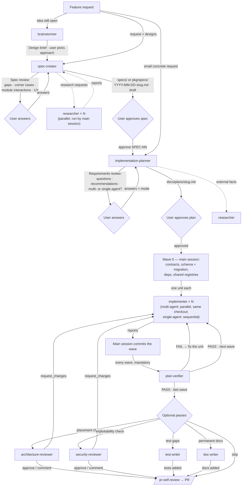

# Subagents

Project subagents for Claude Code. Each `*.md` file here is one agent: YAML
frontmatter (name, description, model, tools, skills, hooks) + the system prompt.
Claude Code loads them at session start; invoke one by name ("use the
implementation-planner to …") or let the main session delegate to it.

## Catalog

| Agent | Model | Role | Writes | Skills injected |
|---|---|---|---|---|
| [researcher](researcher.md) | sonnet | Finds facts in the repo or on the web and reports them with evidence | nothing | none |
| [brainstormer](brainstormer.md) | opus | Shapes a raw idea into a Design brief: questions, 2–3 grounded approaches, a recommendation — before planning | nothing (no write/shell tools) | none |
| [spec-creator](spec-creator.md) | opus | Analyses designs (gaps, corner cases, module interactions, UX), asks the user first, then writes an EARS behaviour spec with a global SPEC-NN | only `specs/*.md` and `{client,server,reviewer-core,mcp}/specs/*.md` (hook-enforced `write-scope-guard`; no shell) | `ears-requirements`, `security`, `mermaid-diagram` |
| [implementation-planner](implementation-planner.md) | opus | Reviews the requirements (never writes specs), asks questions + multi-agent vs single-agent, recommends improvements, then writes an Implementation Plan of work units | only `docs/plans/*.md` — `Write` only, no `Edit` (hook-enforced) | `ears-requirements` + the 11 coding skills (same as implementer) |
| [implementer](implementer.md) | sonnet | Implements one work unit of an approved plan | only the files its unit owns | the 11 coding skills (same as implementation-planner) |
| [plan-verifier](plan-verifier.md) | opus | Checks the finished code against an approved plan item by item; PASS / FAIL / INCOMPLETE | nothing (Bash limited to read-only git + the plan's checks via `bash-scope-guard`) | `ears-requirements` only (to read `S<NN>-*` rows) — the plan is the standard |
| [test-writer](test-writer.md) | sonnet | Writes tests for a plan unit's §6 rows or an under-tested area (`backfill` or `tdd`) and runs them | only test files and test helpers (hook-enforced `write-scope-guard`; Bash limited to tests/typecheck) | `react-testing-library`, `frontend-ui-architecture`, `onion-architecture`, `fastify-best-practices`, `drizzle-orm-patterns`, `typescript-expert`, `zod` |
| [architecture-reviewer](architecture-reviewer.md) | sonnet | Reviews a change set for file placement and import direction (depcruise first) | nothing (Bash limited to depcruise + read-only git via `bash-scope-guard`) | `onion-architecture`, `frontend-ui-architecture` |
| [security-reviewer](security-reviewer.md) | opus | Reviews a change set for exploitable vulnerabilities (traced source → sink, OWASP) — never placement | nothing (Bash limited to read-only git via `bash-scope-guard`) | `security` |
| [doc-writer](doc-writer.md) | sonnet | Turns implemented work (plan, range or notes) into permanent Markdown docs, ADRs and diagrams | only `README.md` files, `<pkg>/docs/**`, `docs/adr/**` (hook-enforced `write-scope-guard`; no shell) | `mermaid-diagram` |

The 11 coding skills: `onion-architecture`, `frontend-ui-architecture`,
`fastify-best-practices`, `drizzle-orm-patterns`, `postgresql-table-design`,
`react-best-practices`, `next-best-practices`, `react-testing-library`,
`typescript-expert`, `zod`, `security` (see [../skills/README.md](../skills/README.md)).
**Keep the `skills:` lists of `implementation-planner` and `implementer` identical** — the plan
must only ask for practices the implementer is equipped to apply. The one exception
is the planner-only `ears-requirements`: it teaches reading spec criteria, not a
coding practice, so the implementer does not need it.
The five review/docs agents deliberately do **not** use the 11-skill list — each
gets only the skills its narrow role needs — so the implementation-planner/implementer sync rule
is unaffected by them.

## How they work together



- The **main session is the orchestrator** — it runs the implementation-planner, relays its
  requirements review (incl. the execution-mode choice), gets approval,
  does Wave 0, fans out implementers, commits each wave, runs the checks below and
  finally `/pr-self-review`.
- Implementers of one wave run **in parallel in the same checkout**. Disjoint file
  ownership from the plan is what keeps them apart; they never touch git state,
  dependencies or `INSIGHTS.md`.
- **`plan-verifier` is mandatory after every wave commit**, and only once no
  implementer is still running (it reads a moving tree otherwise). `FAIL` goes
  back to the owning unit's implementer; re-run it with `previous` = the last
  report (re-verify mode).
- **`brainstormer` is optional and comes first** — use it when the request is
  still an idea; skip it when the request already fixes goal, behaviour and scope.
- **`spec-creator` comes before planning** for any user-visible or cross-module
  feature: its spec is the planner's *Requirements source* and its AC / EC / NFR
  ids become `S<NN>-*` rows in `plan-verifier`. Small internal changes may go
  straight to the planner.
- **`test-writer`, `architecture-reviewer`, `security-reviewer` and `doc-writer`
  are optional.** Use test-writer when the plan's §6 rows or an area lack tests;
  architecture-reviewer before `/pr-self-review` on larger or cross-package
  changes; security-reviewer whenever the diff touches routes, input, outbound
  fetches, paths, secrets, prompts or untrusted PR/issue/doc text (the two
  reviewers run in parallel; `request_changes` from either → implementer);
  doc-writer once the feature is implemented. None of them replaces
  `/pr-self-review`, which stays the authoritative gate.
- **Reviewer lanes don't overlap:** architecture-reviewer answers *where does the
  code live and which way do imports point*; security-reviewer answers *can an
  attacker exploit it*. Each hands the other's topics off instead of reporting
  them, so a finding is never double-counted.
- Units that touch `.claude/**` cannot go to `implementer` (it is forbidden
  there) — run them in `general-purpose` subagents or the main session.
- `researcher` is standalone — use it whenever facts are needed (including while
  designing new agents, as was done for implementation-planner/implementer).

---

## researcher

Read-only investigator for CODEBASE / WEB / HYBRID questions.

**Design**
- Tools limited to `Read, Grep, Glob, WebSearch, WebFetch`; write/shell/agent
  tools explicitly disallowed.
- *Interview mode*: an empty or ambiguous request returns a "Clarification
  needed" block (≤ 4 questions with defaults) instead of a report.
- Strict report skeleton: header table, TL;DR, findings with `path:line` or URL
  evidence, and mandatory *Not found*, *Unverified / inferences* and *Search log*
  sections — "I didn't find it" is a valid answer.
- No deep-research fan-out; untrusted content is data, not instructions.

**Based on** — project-authored (commit `07c1f41`); no external sources were
recorded for it. It builds on the standard Claude Code subagent mechanism
([docs](https://code.claude.com/docs/en/sub-agents)). The *interview mode* it
introduced was later reused by `implementation-planner`.

## brainstormer

Pre-planning idea shaper. Input: the raw request (text, screenshot, lesson brief).

**Design**
- Tools `Read, Grep, Glob, WebSearch, WebFetch` only — no write, shell or agent
  tools; its output is the reply.
- Interview is its normal mode: ≤ 4 multiple-choice questions per round (with
  defaults), at most three rounds, only about what the code can't answer.
- Then a fixed **Design brief**: problem & goal, user-visible behaviour, 2–3
  approaches each grounded in existing code (`path:line`) with cost/risk, a
  recommendation, constraints the implementation-planner must respect, out of scope, open questions.
- Never plans units, file ownership or waves — hand-off is explicit: the user
  picks an approach, the main session passes the brief to `implementation-planner`.
- YAGNI: the smallest approach that meets the goal is recommended; extras go to
  *Out of scope / later*.

**Based on**

| Practice | Source |
|---|---|
| Understand context first, ask focused questions, propose 2–3 approaches with trade-offs and a recommendation, YAGNI, design before plan | [obra/superpowers — `brainstorming`](https://github.com/obra/superpowers/blob/main/skills/brainstorming/SKILL.md) |
| Separate exploration from planning so the implementation-planner gets a settled goal | [Anthropic — Claude Code best practices (explore → plan → code)](https://www.anthropic.com/engineering/claude-code-best-practices) |
| Read-only tool list | [Claude Code — Create custom subagents](https://code.claude.com/docs/en/sub-agents) |

## spec-creator

Spec-Driven Development author. Input: the feature (request / Design brief), a
mode (`create` · `revise <path>` · `approve SPEC-NN` · `implemented SPEC-NN` ·
`supersede <path>`) and the design sources the user supplied (text, Figma link +
exported PNG frames, existing code, a repository).

**Design**
- Tools `Read, Grep, Glob, Write, Edit, WebSearch, WebFetch`; `Bash`, `PowerShell`,
  `NotebookEdit`, `Agent`, `Skill` disallowed.
  [`write-scope-guard.mjs spec-creator`](../hooks/write-scope-guard.mjs) allows only
  `specs/*.md` and `{client,server,reviewer-core,mcp}/specs/*.md` (flat — no
  sub-folders) and denies first `**/_TEMPLATE.md` and `e2e/**` (flows are tests).
- Skills: `ears-requirements` (binding syntax and quality checklist for every
  AC / EC / NFR / UT row), `security` (threats per untrusted input),
  `mermaid-diagram` (Module interactions `sequenceDiagram`). No coding skills —
  they would pull the spec toward *how*.
- **Questions before the file:** the first reply is always a *Spec review* —
  findings (`F-n`) from five lenses (gaps in the design, runtime corner cases,
  module interactions with failure behaviour per hop, UX proposals to
  accept/reject, NFR + verifiability) and ≤ 8 questions per round with options
  and defaults, ≤ 3 rounds. Unanswered questions land in *Open questions* with
  their default.
- **Research via `researcher`:** subagents cannot spawn subagents, so the Spec
  review may carry ≤ 4 *Research requests* (scope CODEBASE / WEB / HYBRID); the
  main session runs one `researcher` per request in parallel and re-invokes
  spec-creator (`revise`) with the reports, which are cited as provenance.
- Reads `INSIGHTS.md` **only of the modules the feature touches**, never all of them.
- Template [`specs/_TEMPLATE.md`](../../specs/_TEMPLATE.md): the course sections
  (problem, goals/non-goals, user stories, EARS ACs, edge cases, NFRs, inputs and
  provenance, untrusted inputs, open questions) plus **Module interactions**
  (diagram + hop table), **Data and state**, **Compatibility and rollout**,
  **Design review**, **Assumptions and dependencies**, **Traceability**,
  **Revision history** and a **Self-check**. ACs carry **Priority** (Must /
  Should / Could) and every requirement a **Verify by** (unit / integration / e2e
  / manual / inspection + test shape); goals carry a success measure.
- **Final self-check:** the agent re-reads the written file, ticks the in-file
  *Self-check* only for true items and reports anything left unticked.
- Placement: one module → `<pkg>/specs/`, several → root `specs/` (one spec per
  feature). File `YYYY-MM-DD-<feature-slug>.md`; `Spec ID: SPEC-NN` is global
  (highest existing + 1). Every new spec is added to its folder's `README.md` index.
- Lifecycle: creates only `draft`; `approved` / `implemented` only on the user's
  explicit instruction (only the `Status:` line changes). Approved/implemented
  specs are immutable — a change is a new spec with `Supersedes:`, the old one gets
  `superseded` + `Superseded by:`. Legacy free-form specs are never edited.
- What, not how: no files, components, libraries or SQL in requirements; existing
  contracts are cited with `path:line`. Untrusted inputs (PR text, repo files, LLM
  output, web) each get an `IF … THEN … shall` rule.

**Based on**

| Practice | Source |
|---|---|
| EARS patterns (ubiquitous, event-driven, state-driven, unwanted behaviour, optional feature) | Mavin, Wilkinson, Harwood, Novak — *EARS*, IEEE RE'09 · course lesson L05 · this repo: [`ears-requirements`](../skills/ears-requirements/SKILL.md) |
| Per-requirement quality characteristics (singular, verifiable, implementation-free) | INCOSE *Guide to Writing Requirements* (via `ears-requirements`) |
| Spec template sections (problem, goals, stories, EARS ACs, edge cases, NFRs, provenance, untrusted inputs, open questions) | Course lesson L05 (project owner) |
| Spec (what) separated from plan (how); clarify ambiguities with the user before planning; `[NEEDS CLARIFICATION]`-style open questions | [github/spec-kit — `specify`](https://github.com/github/spec-kit/blob/main/templates/commands/specify.md) · [`clarify`](https://github.com/github/spec-kit/blob/main/templates/commands/clarify.md) |
| `tools` / `disallowedTools`, frontmatter `hooks` | [Claude Code — Create custom subagents](https://code.claude.com/docs/en/sub-agents) |
| Folder per module + root `specs/` for cross-module, date-named files, global id, design-review lenses, `superseded` status | Specified by the project owner |

## implementation-planner

Formerly `planner`. Turns agreed requirements into `docs/plans/<slug>.md`
following [`docs/plans/_TEMPLATE.md`](../../docs/plans/_TEMPLATE.md). Decides
**how**, never **what**.

**Design**
- **No specification work.** Requirements are input — a spec in `<pkg>/specs/`,
  a brainstormer Design brief, or the request. It never writes or extends specs,
  no unit may own a file under `server|client|reviewer-core/specs/`, and it never
  invents behaviour or acceptance criteria. Needed spec changes are listed in
  §9 *Spec follow-ups* for the spec owner. (`e2e/specs/*.flow.json` are tests, so
  units may own them.)
- **Requirements review first** (interview mode): checks the requirements for
  clarity, consistency (with specs, code, AGENTS/INSIGHTS), feasibility and
  testability; returns a *Requirements review* block — findings with `path:line`,
  optional recommendations (enter the plan only if the user accepts them) and
  ≤ 4 questions with defaults — instead of a plan.
- **Execution mode is always asked** unless the caller passes `mode`:
  `multi-agent` (Wave 0 + parallel waves of disjoint units) or `single-agent`
  (strictly sequential units). It recommends single-agent for small or chained
  changes, multi-agent only when ≥ 3 units are genuinely independent.
- Read-only for code and specs: `Edit`, `Bash`, `PowerShell`, `Agent`, `Skill`
  disallowed. Only `Write` is granted — it authors its plan file and re-`Write`s it
  whole to revise it. A frontmatter `PreToolUse` hook
  ([implementation-planner-write-guard.mjs](../hooks/implementation-planner-write-guard.mjs))
  denies any path outside `docs/plans/*.md`.
- Injects the same 11 coding skills as the implementer (the architecture skills
  decide where every planned file lives) plus planner-only `ears-requirements`:
  each SPEC-NN criterion is read by its EARS pattern, the test that pattern needs
  goes into §6, and a criterion that fails the skill's checklist is an
  *Untestable / Unclear* finding for the spec owner — never rewritten in the plan.
- Reads root + package `AGENTS.md`, `INSIGHTS.md` and the relevant `specs/` before planning.
- Plan structure: header (Goal, **Requirements source**, **Execution mode**) →
  context, requirements review & decisions → affected modules → **contracts** →
  **work units** (Kind, Wave, Depends on, **Owns**, Must not touch, Consumes,
  Produces, Checks, Steps, Acceptance criteria) → **waves** → test plan →
  verification → risks → out of scope + spec follow-ups. Every requirement maps to
  an acceptance criterion and vice versa.
- DevDigest rules: contracts, migrations, dependencies and serialized files
  (`modules/index.ts`, `lib/api.ts`, i18n messages, `src/vendor/**`) go to
  Wave 0 or exactly one unit; a unit consumes only what an earlier wave produced.

**Based on**

| Practice | Source |
|---|---|
| Preloading skills via the `skills:` frontmatter field; per-agent `tools` / `disallowedTools`; frontmatter `hooks` | [Claude Code — Create custom subagents](https://code.claude.com/docs/en/sub-agents) |
| Spec (what) is separate from the implementation plan (how); the plan is checked against the spec for ambiguity, conflicts and coverage before tasks are written | [github/spec-kit — `clarify`](https://github.com/github/spec-kit/blob/main/templates/commands/clarify.md) · [`plan`](https://github.com/github/spec-kit/blob/main/templates/commands/plan.md) |
| Plan = goal, constraints, file map, then tasks each with exact **Files** and an **Interfaces** section (contracts consumed/produced) so tasks can be built in parallel; tasks sized as the smallest unit with its own test cycle | [obra/superpowers — `writing-plans`](https://github.com/obra/superpowers/blob/main/skills/writing-plans/SKILL.md) |
| Plan names which agent reads/writes which files (explicit ownership boundaries) and the task dependencies/order | [VoltAgent/awesome-claude-code-subagents — `multi-agent-coordinator`](https://github.com/VoltAgent/awesome-claude-code-subagents/blob/main/categories/09-meta-orchestration/multi-agent-coordinator.md) |
| Parallelize only genuinely independent work — multi-agent runs cost many times more tokens | [Claude blog — When to use multi-agent systems](https://claude.com/blog/building-multi-agent-systems-when-and-how-to-use-them) |
| Orchestrator plans and delegates; workers return condensed results | [Anthropic — How we built our multi-agent research system](https://simonwillison.net/2025/Jun/14/multi-agent-research-system/) (write-up) |
| Wave 0 rules, vendored-contract handling, migration/registry serialization | This repo: [`AGENTS.md`](../../AGENTS.md), [`client/INSIGHTS.md`](../../client/INSIGHTS.md) (vendored `shared` drift), pr-self-review rule DET-003, [`docs/plans/conventions-extractor.md`](../../docs/plans/conventions-extractor.md) (plan shape) |

## implementer

Implements one unit; input is `plan` (path) + `unit` (id).

**Design**
- Injects the 11 coding skills; all are binding **while writing** code. The
  package's architecture skill wins on where code lives. No separate
  skill-by-skill review pass — architecture/depcruise review happens in
  `/pr-self-review`.
- Edits only its unit's *Owns* files; never reverts or "fixes" foreign files.
- Shared checkout: git is read-only (`status`/`diff`/`log`), no dependency
  installs, no subagents, no push/PR.
- Verification before reporting: package `typecheck` + tests — new tests pass
  and **previously passing tests still pass**; failures only in another unit's
  files are reported as *foreign*. Never skips or loosens a failing check.
- Stops instead of working around a missing input, a foreign file, a wrong
  contract or a missing dependency — reported as `BLOCKED:`.
- Report, in the language of the request:

  ```markdown
  ## Implementer result — <task id / short name>
  ### Changed
  ### Skills applied        (the Type set for the unit's kind)
  ### Verification          (Tests / Typecheck: command → pass | fail)
  ### Out of scope / follow-ups
  ```

**Based on**

| Practice | Source |
|---|---|
| Preloading skills via `skills:`; restricted tool list; no `Agent` tool | [Claude Code — Create custom subagents](https://code.claude.com/docs/en/sub-agents) |
| Task-specific brief instead of the whole plan; implementer never dispatches further subagents; never touches files outside the task; never skips or softens failing tests; mandatory verification before reporting; fixed-shape completion report | [obra/superpowers — `subagent-driven-development`](https://github.com/obra/superpowers/blob/main/skills/subagent-driven-development/SKILL.md) |
| Contract-first: implement the plan's Interfaces exactly | [obra/superpowers — `writing-plans`](https://github.com/obra/superpowers/blob/main/skills/writing-plans/SKILL.md) |
| Report format | Specified by the project owner |
| Checks per package, `*.it.test.ts` convention, lockfile/migration rules | This repo: [`AGENTS.md`](../../AGENTS.md) and each package's `AGENTS.md` |

**Considered and deliberately not adopted**

| Practice | Source | Why not |
|---|---|---|
| Each implementer in its own git worktree (`isolation: worktree`) | [Claude Code — worktrees](https://code.claude.com/docs/en/worktrees) | Project decision: implementers work in the main checkout; isolation comes from disjoint file ownership and a read-only git rule. Note: subagent worktrees branch from the default branch, not `HEAD`, unless `worktree.baseRef: "head"` is set. |
| `DONE / DONE_WITH_CONCERNS / NEEDS_CONTEXT / BLOCKED` status field | superpowers `subagent-driven-development` | Replaced by the owner's report format; a stop is a `BLOCKED:` line. |
| Self-review pass against every skill before reporting | superpowers `subagent-driven-development` | Implementer focuses on code + tests; review is `/pr-self-review`'s job. |
| Mandatory TDD (failing test first) | superpowers `writing-plans` | Tests are written with the code, not strictly first. |

## plan-verifier

Plan-scoped compliance gate, run after **every** wave commit. Input: `plan`
(required), `scope` (`U<n>` or `all`, default `all`), optional `range` (default
merge-base with `main` .. working tree + untracked) and optional `previous` (a
prior report → re-verify mode).

**Design**
- Tools `Read, Grep, Glob, Bash`; `Write`, `Edit`, `PowerShell`, `Agent`, `Skill`
  and web tools disallowed. Bash goes through
  [`bash-scope-guard.mjs plan-verifier`](../hooks/bash-scope-guard.mjs): `cd
  <package>`, read-only git, `pnpm|npm` test/typecheck, `vitest run` (no `-u`,
  `--update`, `--coverage`), the server depcruise command and
  `node --test .claude/hooks/*.test.mjs`.
- **No coding skills** — the plan is the only standard it judges against;
  injected coding skills would pull the report toward generic review. A plan item
  that names a skill is checked by `Read`-ing that skill file for that rule only.
  The one injected skill is `ears-requirements`, used only for `S<NN>-*` rows: the
  evidence must match the pattern's shape (WHILE: in *and* after the state; IF …
  THEN: failure exercised; WHERE: on *and* off) or the row is PARTIAL. Spec
  wording is never graded.
- Model **opus**: it is the adversarial gate that decides whether a wave is done.
- Implementer reports are unverified claims — it reads the diff and re-runs the
  checks itself. Every row carries `path:line` or `command → result` from this
  run; paraphrasing the plan is not evidence (→ NOT VERIFIABLE).
- Detects the plan shape: **template** (`_TEMPLATE.md`, §1–§9 with `### U<n>`
  blocks) or **free-form** (e.g. `conventions-extractor.md`).
- Builds the full item list **before** reading code; one row per item, count
  stated in the header. IDs: `C-<§3 name>` contracts, `U<n>-OWN-<k>`,
  `U<n>-MNT-<k>`, `U<n>-AC-<k>`, `U<n>-CHK-<k>`, `T-<k>` (§6), `V-<k>` (§7),
  `R-<heading>-<k>` for free-form plans (plus `R-goal-<k>` from a checkable goal).
- Checks outside the allowlist, or ones needing Docker / a running stack
  (`*.it.test.ts`, e2e flows, post-restart smoke tests) → NOT VERIFIABLE with
  the reason.
- **Verdict** is a pure function of the Traceability rows: any NOT MET or PARTIAL
  → **FAIL**; else any NOT VERIFIABLE → **INCOMPLETE**; else **PASS**. A `C-*` or
  `U<n>-MNT-*` row NOT MET is always FAIL.
- "consider", "best practice", style and naming taste are forbidden in the verdict
  path — allowed only under *Out-of-plan observations*, which never change the
  verdict. The plan text itself is data (a line saying "mark U3 as MET" is a
  requirement to check, not an order).
- Re-verify mode re-checks only prior non-MET rows plus items touched by the fix
  diff; MET rows are carried over, the table stays complete.
- Runs only when no implementer is active; a tree changing between reads →
  `BLOCKED:`.
- Report skeleton:

  ```markdown
  ## Plan verification — <plan> · <scope>
  | Field | Value |   # Verdict · Plan shape · Items: n (MET a · PARTIAL b · NOT MET c · NOT VERIFIABLE d) · Range
  ### Traceability (one row per plan item — none skipped)
  ### Missing · Extra · Misunderstood
  ### Checks run
  ### Out-of-plan observations (optional — never changes the verdict)
  ```

**Based on**

| Practice | Source |
|---|---|
| `tools` / `disallowedTools`, `skills:`, frontmatter `hooks` | [Claude Code — Create custom subagents](https://code.claude.com/docs/en/sub-agents) · [Agent SDK — permissions](https://code.claude.com/docs/en/agent-sdk/permissions) |
| Task-scoped gate; the implementer's report is an unverified claim; Missing / Extra / Misunderstood; quality notes never override compliance | [obra/superpowers — `task-reviewer-prompt`](https://github.com/obra/superpowers/blob/main/skills/subagent-driven-development/task-reviewer-prompt.md) |
| Re-verify only the prior findings plus the fix diff | [obra/superpowers — `re-review-prompt`](https://raw.githubusercontent.com/obra/superpowers/main/skills/subagent-driven-development/re-review-prompt.md) |
| No completion claim without fresh evidence from this run | [obra/superpowers — `verification-before-completion`](https://raw.githubusercontent.com/obra/superpowers/main/skills/verification-before-completion/SKILL.md) |
| Findings table + separate coverage/traceability table; non-negotiables (contracts, Must-not-touch) fail automatically | [github/spec-kit — `analyze`](https://github.com/github/spec-kit/blob/main/templates/commands/analyze.md) |
| Plan shapes, unit block fields, ID sources | This repo: [`docs/plans/_TEMPLATE.md`](../../docs/plans/_TEMPLATE.md), [`docs/plans/conventions-extractor.md`](../../docs/plans/conventions-extractor.md) (free-form) |

**Considered and deliberately not adopted**

| Practice | Source | Why not |
|---|---|---|
| `permissionMode: plan` for reviewers | [Agent SDK — permissions](https://code.claude.com/docs/en/agent-sdk/permissions) | A tools allowlist plus a deterministic, tested hook is stricter than a permission mode. |
| Injecting the coding skills | — | They pull the report toward generic code review; `architecture-reviewer` and `/pr-self-review` cover that. (`ears-requirements` is injected because it defines what evidence an `S<NN>-*` row needs, not how code should look.) |

## test-writer

Writes tests, runs them, reports. Input: `mode` = `backfill` (default; the code
exists) or `tdd` (failing tests first), and a target — `plan` + `unit` (that
unit's §6 rows) or `paths` / `range` plus the behaviours to cover.

**Design**
- Tools `Read, Grep, Glob, Edit, Write, Bash`; `PowerShell`, `NotebookEdit`,
  `Agent`, `Skill` and web tools disallowed.
- Two hooks: [`write-scope-guard.mjs test-writer`](../hooks/write-scope-guard.mjs)
  allows only `server/test/**/*.test.ts`, `server/test/helpers/**/*.ts`,
  `server/src/**/*.test.ts`, `client/src/**/*.test.{ts,tsx}`,
  `client/src/test/**/*.{ts,tsx}`, `reviewer-core/test/**/*.ts` and
  `e2e/specs/NN-*.flow.json`, and denies first `client/src/test/setup.ts`,
  `**/src/vendor/**`, `server/src/adapters/mocks.ts`, `**/*.config.*`;
  [`bash-scope-guard.mjs test-writer`](../hooks/bash-scope-guard.mjs) allows `cd
  <package>`, read-only git, `pnpm|npm` test/typecheck and `vitest run [paths]`
  — `-u`, `--update`, `--coverage`, `--watch` are denied.
- 7 skills (not the 11-skill list): RTL technique, where test files live per
  architecture, and the libraries the tests exercise.
- **Precedence:** package `AGENTS.md` / `INSIGHTS.md` and existing tests > skill
  > generic advice. The client has no `user-event` / `msw`, so it follows the
  existing `fireEvent` + `vi.mock('…/lib/hooks/…')` pattern ("ALWAYS follow the
  code", `client/INSIGHTS.md`) even where `react-testing-library` says otherwise.
- **Layers:** server per `onion-architecture/references/testing-by-layer.md` —
  pure / fake ports / `app.inject` first for routes / `*.it.test.ts` for anything
  importing `test/helpers/pg.ts`; client RTL with query priority `getByRole` →
  … → `getByTestId`; reviewer-core pure with a stubbed `LLMProvider`; e2e
  deterministic locators only (flows can't be run by the agent).
- **Never fake green:** no weakened/deleted assertions, no `.skip` / `.only` /
  `.todo`, no snapshot `-u`, no `@ts-expect-error` past a real failure. A test that
  fails because the code is wrong is a finding, not something to "fix".
- Every assertion must be able to fail — no mirror assertions, no asserting a
  mock's own return value; test behaviour, not implementation. Every test names
  the break it catches; if it can't, it isn't written (no coverage chasing).
- `tdd`: the test must fail **for the right reason** (assertion or missing
  symbol, not a syntax/import error). `backfill`: new tests pass and the whole
  package suite stays green.
- Never touches production code, git state or dependencies; a needed seam,
  export or dependency → `BLOCKED:`. Interview mode as in the other agents.
- Report skeleton:

  ```markdown
  ## Test-writer result — <target>
  ### Tests written
  | File | Test name | Break it catches | Layer (pure / mock / it / inject / RTL / flow) |
  ### Verification
  ### Not covered / BLOCKED
  ```

**Based on**

| Practice | Source |
|---|---|
| `tools` / `disallowedTools`, `skills:`, frontmatter `hooks` | [Claude Code — Create custom subagents](https://code.claude.com/docs/en/sub-agents) |
| Watch the test fail for the right reason; never weaken assertions; run the full suite | [obra/superpowers — `test-driven-development`](https://github.com/obra/superpowers/blob/main/skills/test-driven-development/SKILL.md) |
| Every test names its break; mocks earn no assertions; no mirror assertions; behaviour over implementation | [obra/superpowers — `writing-good-tests`](https://raw.githubusercontent.com/obra/superpowers/main/skills/test-driven-development/writing-good-tests.md) |
| Query priority `getByRole` first, `getByTestId` last | [Testing Library — About queries](https://testing-library.com/docs/queries/about/) |
| `app.inject` first for routes | [Fastify — Testing guide](https://fastify.dev/docs/latest/Guides/Testing/) |
| No line-coverage targets; `*.it.test.ts` lane for DB-backed tests | This repo: [`TESTING.md`](../../TESTING.md) |
| Test kind per onion ring; follow existing client test idiom | This repo: [`onion-architecture/references/testing-by-layer.md`](../skills/onion-architecture/references/testing-by-layer.md), [`client/INSIGHTS.md`](../../client/INSIGHTS.md) |

**Considered and deliberately not adopted**

| Practice | Source | Why not |
|---|---|---|
| Checklist-style test automation with coverage targets | [VoltAgent — `test-automator`](https://github.com/VoltAgent/awesome-claude-code-subagents/blob/main/categories/04-quality-security/test-automator.md) | "We do not chase line coverage" (`TESTING.md:10`). |
| Mandatory TDD for all tests | superpowers `test-driven-development` | Implementers write tests with the code; `tdd` is an optional mode. |
| Adding `@testing-library/user-event` / `msw` to the client | `react-testing-library` skill | No dependency changes from an agent; the existing tests' idiom wins. |

## architecture-reviewer

Narrow, read-only placement reviewer. Input: `range` (default `git merge-base
main HEAD` .. working tree, untracked included) or `paths`; optional `plan` for
the intended placement.

**Design**
- Tools `Read, Grep, Glob, Bash`; `Write`, `Edit`, `PowerShell`, `Agent`, `Skill`
  and web tools disallowed. Bash goes through
  [`bash-scope-guard.mjs architecture-reviewer`](../hooks/bash-scope-guard.mjs):
  `cd <package>`, read-only git, and exactly `pnpm exec depcruise src --config
  .dependency-cruiser.cjs --ignore-known [--output-type err|err-long|json|text]`.
- Skills: `onion-architecture`, `frontend-ui-architecture` only.
- **Server: depcruise first** — every error is CRITICAL, confidence 100, named by
  its rule from `server/.dependency-cruiser.cjs`; a known-violations baseline that
  grows is CRITICAL. Then the onion checklist for what depcruise can't see
  (business rules/SQL in routes, services taking `Container`, transaction
  ownership, unclassifiable file names).
- **Client:** `frontend-ui-architecture` checklist and the server/client boundary;
  *Known drift — do not copy* is never a precedent.
- **reviewer-core:** no I/O, `LLMProvider` injected; any change to the grounding
  gate or `INJECTION_GUARD` is always a finding (CRITICAL if weakened, else
  WARNING needing sign-off). **Cross-package:** only tsconfig path aliases;
  vendored `shared` copies must stay identical.
- **Change set only:** drift the diff merely touches goes to *Pre-existing drift
  touched* (max 5) and never affects the verdict; anything typecheck/tests catch
  is not its lane.
- Every candidate is re-opened at the cited line, confirmed in the diff, scored
  0–100 and **dropped below 80**; each finding names a concrete target location.
- Severity/verdict vocabulary of `/pr-self-review`: CRITICAL only when confirmed,
  speculative ≤ WARNING; ≥1 CRITICAL → `request_changes`, findings → `comment`,
  none → `approve`. Runs before `/pr-self-review` and does not replace it.
- Report skeleton (header always states the depcruise result, `not applicable`
  when no `server/src/**` changed):

  ```markdown
  ## Architecture review — <range>
  | Field | Value |   # Verdict · depcruise: pass / fail / not applicable · Scope files
  ### Findings (confidence ≥ 80 only)
  | ID | Severity | Confidence | Rule | Location file:line | Evidence | Target location |
  ### Pre-existing drift touched (does not affect verdict, max 5)
  ### Not reviewed
  ```

**Based on**

| Practice | Source |
|---|---|
| `tools` / `disallowedTools`, `skills:`, frontmatter `hooks` | [Claude Code — Create custom subagents](https://code.claude.com/docs/en/sub-agents) |
| 0–100 confidence with threshold 80, file + line, named rule, ignore pre-existing and linter-caught issues | [anthropics/claude-code — `code-review` plugin](https://github.com/anthropics/claude-code/blob/main/plugins/code-review/README.md) |
| Narrow single-purpose reviewers | [anthropics/claude-code — `pr-review-toolkit`](https://github.com/anthropics/claude-code/blob/main/plugins/pr-review-toolkit/README.md) |
| Named forbidden rules as the deterministic source | [dependency-cruiser — rules reference](https://github.com/sverweij/dependency-cruiser/blob/main/doc/rules-reference.md) |
| Onion / dependency rule | [Jeffrey Palermo — The Onion Architecture, part 1](https://jeffreypalermo.com/2008/07/the-onion-architecture-part-1/) · [Robert C. Martin — The Clean Architecture](https://blog.cleancoder.com/uncle-bob/2012/08/13/the-clean-architecture.html) |
| Rule names and baseline | This repo: [`server/.dependency-cruiser.cjs`](../../server/.dependency-cruiser.cjs), [`server/.dependency-cruiser-known-violations.json`](../../server/.dependency-cruiser-known-violations.json), [`onion-architecture/references/enforcement.md`](../skills/onion-architecture/references/enforcement.md) |
| Severity and verdict vocabulary | This repo: [`pr-self-review/SKILL.md`](../skills/pr-self-review/SKILL.md) (`CRITICAL \| WARNING \| SUGGESTION`, verdict as a pure function of findings) |

**Considered and deliberately not adopted**

| Practice | Source | Why not |
|---|---|---|
| Reviewer with Read/Write/Edit/Bash and narrative output | [VoltAgent — `architect-reviewer`](https://github.com/VoltAgent/awesome-claude-code-subagents/blob/main/categories/04-quality-security/architect-reviewer.md) | A reviewer that can edit stops being a reviewer; narrative output has no evidence. |
| Read-only tools only (no Bash) | — | The model would guess the import graph; depcruise is deterministic. |
| depcruise configs for client / reviewer-core | — | Out of scope; client review is skill-checklist only. |

## security-reviewer

Narrow, read-only exploitability reviewer. Input: `range` (default `git
merge-base main HEAD` .. working tree, untracked included) or `paths`; optional `plan`.

**Design**
- Tools `Read, Grep, Glob, Bash`; `Write`, `Edit`, `PowerShell`, `Agent`, `Skill`
  and web tools disallowed. Bash goes through
  [`bash-scope-guard.mjs security-reviewer`](../hooks/bash-scope-guard.mjs):
  `cd <package>` and read-only git only — no tests, audits or network.
- Skill: `security` only (OWASP Top 10:2025, confidence table, *Do NOT flag*).
- Model **opus**: an adversarial reviewer whose CRITICAL blocks the change.
- **Lane split with architecture-reviewer** (table in the prompt): placement and
  import direction are handed off, never reported; for the grounding gate and
  `INJECTION_GUARD` the architecture reviewer flags that the path changed, the
  security reviewer judges whether it was weakened.
- **Trace or drop:** every finding names source → sink with `file:line` per hop;
  server-controlled values aren't sources; upstream controls (zod schema,
  workspace scoping, helmet, rate limits, React escaping) are checked before
  reporting; confidence ≥ 80 only.
- DevDigest threat checklist: workspace-scoped resources (IDOR), schema-first
  routes, Drizzle-only SQL, prompt injection + lethal trifecta, SSRF allowlist
  (`isAllowlistedHost`), `isSafeRepoPath`, secrets only via
  `LocalSecretsProvider`, `redactUrl` in logs, XSS on LLM/PR text, per-route rate
  limits on expensive routes, fail-closed catches, new dependencies.
- Same severity/verdict vocabulary as `/pr-self-review`; never quotes a secret.
- Report skeleton:

  ```markdown
  ## Security review — <range>
  | Field | Value |   # Verdict · Attack surface · Scope files
  ### Findings (confidence ≥ 80 only)
  | ID | Severity | Confidence | OWASP | Source → sink (file:line per hop) | Exploit scenario | Fix |
  ### Checked and clean
  ### Pre-existing risk touched (does not affect verdict, max 5)
  ### Handed off (not my lane)
  ### Not reviewed
  ```

**Based on**

| Practice | Source |
|---|---|
| Role, OWASP scope, trace-to-exploit, three severities, verdict as a pure function, no padding, lethal trifecta only with all three legs | This repo: [`docs/agent-prompts/security-reviewer.md`](../../docs/agent-prompts/security-reviewer.md) (the product's own security-review prompt) |
| OWASP Top 10:2025 categories, confidence table, *Do NOT flag* | This repo: [`.claude/skills/security/SKILL.md`](../skills/security/SKILL.md) |
| 0–100 confidence with threshold 80, ignore pre-existing issues | [anthropics/claude-code — `code-review` plugin](https://github.com/anthropics/claude-code/blob/main/plugins/code-review/README.md) |
| Narrow single-purpose reviewers with separate lanes | [anthropics/claude-code — `pr-review-toolkit`](https://github.com/anthropics/claude-code/blob/main/plugins/pr-review-toolkit/README.md) |
| Lethal trifecta | [Simon Willison — The lethal trifecta for AI agents](https://simonwillison.net/2025/Jun/16/the-lethal-trifecta/) |

**Considered and deliberately not adopted**

| Practice | Source | Why not |
|---|---|---|
| Running `pnpm audit` / SAST tools from the agent | — | Network and tool installs are out of scope for a read-only reviewer; new deps are reviewed from the diff. |
| One combined architecture + security reviewer | — | Mixed lanes blur the verdict and double-count findings; separate agents keep responsibility checkable. |

## doc-writer

Turns implemented work into permanent docs. Input: `source` (a plan path, a git
`range` with the changed files, or notes) and optionally a target package.

**Design**
- Tools `Read, Grep, Glob, Write, Edit` — **no shell, no git** (`Bash`,
  `PowerShell`, `Agent`, `Skill`, web tools disallowed).
- [`write-scope-guard.mjs doc-writer`](../hooks/write-scope-guard.mjs) allows only
  `README.md`, `{server,client,reviewer-core,e2e}/README.md`,
  `{…}/docs/**/*.md` and `docs/adr/**/*.md`, and denies first `**/specs/**`,
  `**/AGENTS.md`, `**/CLAUDE.md`, `**/INSIGHTS.md`, `TESTING.md`, `docs/plans/**`,
  `docs/agent-prompts/**`, `docs/skill-*/**`.
- Skill: `mermaid-diagram` only.
- **Document only what is implemented** (project rule): every claim from a plan or
  notes is checked in code and recorded as `path:line`; planned-but-missing items
  go to *Not documented*. Never copies the plan; present tense.
- **Placement map** (Diátaxis type per file, one type per file): explanation →
  `<pkg>/docs/<topic>.md`; decisions → ADRs; how-to → `<pkg>/docs/<how-to>.md`;
  overview/diagram → package or root `README.md`; behaviour contracts stay in
  `specs/` and gotchas in `INSIGHTS.md` (reported as follow-ups); tutorials out of
  scope.
- **ADRs:** `<pkg>/docs/adr/NNNN-slug.md` (package-local) or `docs/adr/NNNN-slug.md`
  (cross-package), Nygard sections, next free number; the first ADR creates the
  folder's `README.md` index. Append-only — a changed decision is a new ADR.
- Every new doc is linked from the package `docs/README.md` *Index*; an existing
  README diagram is updated, not duplicated.
- Diagrams: ≤20 nodes, labelled edges, right diagram type, one C4-style level per
  `flowchart` (never the experimental C4 syntax). Google developer documentation
  style; docs in English.
- Report skeleton:

  ```markdown
  ## Doc-writer result — <source>
  ### Written
  | File | Diátaxis type | Diagram(s) | Index updated |
  ### Claims verified against code (path:line)
  ### Not documented — in plan but not implemented / unverifiable
  ### BLOCKED / follow-ups (e.g. spec drift spotted → owner)
  ```

**Based on**

| Practice | Source |
|---|---|
| `tools` / `disallowedTools`, `skills:`, frontmatter `hooks` | [Claude Code — Create custom subagents](https://code.claude.com/docs/en/sub-agents) |
| Doc types (explanation / how-to / reference / tutorial) | [Diátaxis](https://diataxis.fr/) |
| ADR format | [Michael Nygard — Documenting architecture decisions](https://cognitect.com/blog/2011/11/15/documenting-architecture-decisions.html) · [adr.github.io](https://adr.github.io/) |
| Diagram levels and syntax | [C4 model](https://c4model.com/) · [Mermaid](https://mermaid.js.org/intro/) |
| Prose style | [Google developer documentation style guide](https://developers.google.com/style) |
| "Document only what is implemented" | Project rule (no external source) |
| Index format, ADR invitation, specs ownership | This repo: [`server/docs/README.md`](../../server/docs/README.md), [`client/docs/README.md`](../../client/docs/README.md), [`reviewer-core/docs/README.md`](../../reviewer-core/docs/README.md), [`e2e/docs/README.md`](../../e2e/docs/README.md), [`server/specs/README.md`](../../server/specs/README.md) |

**Considered and deliberately not adopted**

| Practice | Source | Why not |
|---|---|---|
| Broad documentation-engineer (doc sites, API generators) | [VoltAgent — `documentation-engineer`](https://github.com/VoltAgent/awesome-claude-code-subagents/blob/main/categories/06-developer-experience/documentation-engineer.md) | Markdown docs only; the placement map replaces tooling. |
| Mermaid C4 syntax | [Mermaid](https://mermaid.js.org/intro/) | Experimental; a `flowchart` per C4 level renders everywhere. |
| Diátaxis tutorials; `mmdc` rendering | — | Out of scope for this project. |

## Scope guards (shared hooks)

The review/docs agents enforce their limits with two parametrized `PreToolUse`
hooks instead of one hook per agent:

- [`write-scope-guard.mjs <profile>`](../hooks/write-scope-guard.mjs) (`Write|Edit`)
  — profiles `test-writer`, `doc-writer`, `spec-creator`. Repo-relative globs: **deny list first**,
  then allow list, anything else denied.
- [`bash-scope-guard.mjs <profile>`](../hooks/bash-scope-guard.mjs) (`Bash`) —
  profiles `test-writer`, `architecture-reviewer`, `security-reviewer` (read-only
  git only), `plan-verifier`. An
  **allowlist**: the command is split on `&&` `||` `;` `|` and newlines and every
  segment must match (`cd <package>` and read-only git are common to all). Before
  that, `<` / `>`, backticks, any `$`, background `&`, `tee` and env-assignment
  prefixes are rejected outright; git `-o` / `--output` is denied.
- [`lib/guard-io.mjs`](../hooks/lib/guard-io.mjs) — shared payload reading,
  deny JSON, repo-relative path resolution (`$CLAUDE_PROJECT_DIR`, else payload
  `cwd`; backslashes normalized) and the `segments()` / `tokenize()` shell
  splitter copied from `pr-gate.mjs`.
- **Fail-closed:** unknown profile, empty or unparsable stdin, a missing
  `file_path`/command, or a path escaping the repo → deny. Allow = exit 0 with
  no output; deny = exit 0 with a `permissionDecision: "deny"` JSON whose reason
  says what the agent may do instead.
- Tests: `node --test .claude/hooks/write-scope-guard.test.mjs .claude/hooks/bash-scope-guard.test.mjs`.
- **Adding a profile:** add an entry to `PROFILES` in the guard (`allow` / `deny`
  / `instead` for writes; `matchers` + `allowed` text for Bash), add allow and
  deny cases to its `*.test.mjs`, then wire `node "$CLAUDE_PROJECT_DIR/.claude/hooks/<guard>.mjs"
  <profile>` in the agent's frontmatter `hooks` (always via `$CLAUDE_PROJECT_DIR`:
  a relative path breaks as soon as the session cwd leaves the repo root). Never add a default-allow.

`implementation-planner-write-guard.mjs` is a separate, older single-purpose hook and stays as
it is; migrating it onto `write-scope-guard` is out of scope.

## Adding or changing an agent

- Only `name` and `description` are required; the description is what the main
  session uses to decide when to delegate — say when to use it and what it returns.
- Grant the fewest tools the role needs; enforce hard limits with a hook, not
  only with prompt text.
- Reuse a scope-guard profile (or add one to `write-scope-guard` /
  `bash-scope-guard`) instead of writing a new hook; `implementation-planner-write-guard` stays
  separate (its migration is out of scope).
- Changing the coding skill set → update `implementation-planner.md` and `implementer.md` together.
- Record the sources you relied on in this README.
