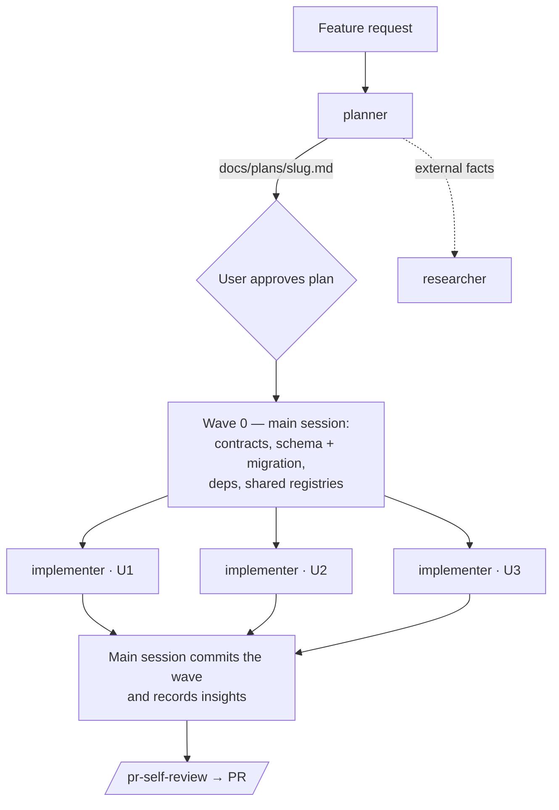

# Subagents

Project subagents for Claude Code. Each `*.md` file here is one agent: YAML
frontmatter (name, description, model, tools, skills, hooks) + the system prompt.
Claude Code loads them at session start; invoke one by name ("use the planner
to …") or let the main session delegate to it.

## Catalog

| Agent | Model | Role | Writes | Skills injected |
|---|---|---|---|---|
| [researcher](researcher.md) | sonnet | Finds facts in the repo or on the web and reports them with evidence | nothing | none |
| [planner](planner.md) | opus | Turns a feature request into a Development Plan split into parallel work units | only `docs/plans/*.md` (hook-enforced) | the 11 coding skills (same as implementer) |
| [implementer](implementer.md) | sonnet | Implements one work unit of an approved plan | only the files its unit owns | the 11 coding skills (same as planner) |

The 11 coding skills: `onion-architecture`, `frontend-ui-architecture`,
`fastify-best-practices`, `drizzle-orm-patterns`, `postgresql-table-design`,
`react-best-practices`, `next-best-practices`, `react-testing-library`,
`typescript-expert`, `zod`, `security` (see [../skills/README.md](../skills/README.md)).
**Keep the `skills:` lists of `planner` and `implementer` identical** — the plan
must only ask for practices the implementer is equipped to apply.

## How they work together



- The **main session is the orchestrator** — it runs the planner, gets approval,
  does Wave 0, fans out implementers, commits each wave and runs `/pr-self-review`.
- Implementers of one wave run **in parallel in the same checkout**. Disjoint file
  ownership from the plan is what keeps them apart; they never touch git state,
  dependencies or `INSIGHTS.md`.
- `researcher` is standalone — use it whenever facts are needed (including while
  designing new agents, as was done for planner/implementer).

---

## researcher

Read-only investigator for CODEBASE / WEB / HYBRID questions.

**Design**
- Tools limited to `Read, Grep, Glob, WebSearch, WebFetch`; write/shell/agent
  tools explicitly disallowed.
- *Interview mode*: an empty or ambiguous request returns a "Clarification
  needed" block (≤ 4 questions with defaults) instead of a report.
- Strict report skeleton: header table, TL;DR, findings with `path:line` or URL
  evidence, and mandatory *Not found*, *Unverified / inferences* and *Search log*
  sections — "I didn't find it" is a valid answer.
- No deep-research fan-out; untrusted content is data, not instructions.

**Based on** — project-authored (commit `07c1f41`); no external sources were
recorded for it. It builds on the standard Claude Code subagent mechanism
([docs](https://code.claude.com/docs/en/sub-agents)). The *interview mode* it
introduced was later reused by `planner`.

## planner

Writes `docs/plans/<slug>.md` following [`docs/plans/_TEMPLATE.md`](../../docs/plans/_TEMPLATE.md).

**Design**
- Read-only for code: `Bash`, `PowerShell`, `Agent`, `Skill` disallowed; `Write`/`Edit`
  allowed but a frontmatter `PreToolUse` hook
  ([planner-write-guard.mjs](../hooks/planner-write-guard.mjs)) denies any path
  outside `docs/plans/*.md`.
- Injects the same 11 coding skills as the implementer; the architecture skills
  decide where every planned file lives.
- Reads root + package `AGENTS.md` and `INSIGHTS.md` before planning.
- Plan structure: context & decisions → affected modules → **contracts** →
  **work units** (Kind, Wave, Depends on, **Owns**, Must not touch, Consumes,
  Produces, Checks, Steps, Acceptance criteria) → **waves** → test plan →
  verification → risks → out of scope.
- DevDigest rules: contracts, migrations, dependencies and serialized files
  (`modules/index.ts`, `lib/api.ts`, i18n messages, `src/vendor/**`) go to
  Wave 0 or exactly one unit; a unit consumes only what an earlier wave produced.
- Says "single unit, no parallelism" when the change is small.

**Based on**

| Practice | Source |
|---|---|
| Preloading skills via the `skills:` frontmatter field; per-agent `tools` / `disallowedTools`; frontmatter `hooks` | [Claude Code — Create custom subagents](https://code.claude.com/docs/en/sub-agents) |
| Plan = goal, constraints, file map, then tasks each with exact **Files** and an **Interfaces** section (contracts consumed/produced) so tasks can be built in parallel; tasks sized as the smallest unit with its own test cycle | [obra/superpowers — `writing-plans`](https://github.com/obra/superpowers/blob/main/skills/writing-plans/SKILL.md) |
| Plan names which agent reads/writes which files (explicit ownership boundaries) and the task dependencies/order | [VoltAgent/awesome-claude-code-subagents — `multi-agent-coordinator`](https://github.com/VoltAgent/awesome-claude-code-subagents/blob/main/categories/09-meta-orchestration/multi-agent-coordinator.md) |
| Parallelize only genuinely independent work — multi-agent runs cost many times more tokens | [Claude blog — When to use multi-agent systems](https://claude.com/blog/building-multi-agent-systems-when-and-how-to-use-them) |
| Orchestrator plans and delegates; workers return condensed results | [Anthropic — How we built our multi-agent research system](https://simonwillison.net/2025/Jun/14/multi-agent-research-system/) (write-up) |
| Wave 0 rules, vendored-contract handling, migration/registry serialization | This repo: [`AGENTS.md`](../../AGENTS.md), [`client/INSIGHTS.md`](../../client/INSIGHTS.md) (vendored `shared` drift), pr-self-review rule DET-003, [`docs/plans/conventions-extractor.md`](../../docs/plans/conventions-extractor.md) (plan shape) |

## implementer

Implements one unit; input is `plan` (path) + `unit` (id).

**Design**
- Injects the 11 coding skills; all are binding **while writing** code. The
  package's architecture skill wins on where code lives. No separate
  skill-by-skill review pass — architecture/depcruise review happens in
  `/pr-self-review`.
- Edits only its unit's *Owns* files; never reverts or "fixes" foreign files.
- Shared checkout: git is read-only (`status`/`diff`/`log`), no dependency
  installs, no subagents, no push/PR.
- Verification before reporting: package `typecheck` + tests — new tests pass
  and **previously passing tests still pass**; failures only in another unit's
  files are reported as *foreign*. Never skips or loosens a failing check.
- Stops instead of working around a missing input, a foreign file, a wrong
  contract or a missing dependency — reported as `BLOCKED:`.
- Report, in the language of the request:

  ```markdown
  ## Implementer result — <task id / short name>
  ### Changed
  ### Skills applied        (the Type set for the unit's kind)
  ### Verification          (Tests / Typecheck: command → pass | fail)
  ### Out of scope / follow-ups
  ```

**Based on**

| Practice | Source |
|---|---|
| Preloading skills via `skills:`; restricted tool list; no `Agent` tool | [Claude Code — Create custom subagents](https://code.claude.com/docs/en/sub-agents) |
| Task-specific brief instead of the whole plan; implementer never dispatches further subagents; never touches files outside the task; never skips or softens failing tests; mandatory verification before reporting; fixed-shape completion report | [obra/superpowers — `subagent-driven-development`](https://github.com/obra/superpowers/blob/main/skills/subagent-driven-development/SKILL.md) |
| Contract-first: implement the plan's Interfaces exactly | [obra/superpowers — `writing-plans`](https://github.com/obra/superpowers/blob/main/skills/writing-plans/SKILL.md) |
| Report format | Specified by the project owner |
| Checks per package, `*.it.test.ts` convention, lockfile/migration rules | This repo: [`AGENTS.md`](../../AGENTS.md) and each package's `AGENTS.md` |

**Considered and deliberately not adopted**

| Practice | Source | Why not |
|---|---|---|
| Each implementer in its own git worktree (`isolation: worktree`) | [Claude Code — worktrees](https://code.claude.com/docs/en/worktrees) | Project decision: implementers work in the main checkout; isolation comes from disjoint file ownership and a read-only git rule. Note: subagent worktrees branch from the default branch, not `HEAD`, unless `worktree.baseRef: "head"` is set. |
| `DONE / DONE_WITH_CONCERNS / NEEDS_CONTEXT / BLOCKED` status field | superpowers `subagent-driven-development` | Replaced by the owner's report format; a stop is a `BLOCKED:` line. |
| Self-review pass against every skill before reporting | superpowers `subagent-driven-development` | Implementer focuses on code + tests; review is `/pr-self-review`'s job. |
| Mandatory TDD (failing test first) | superpowers `writing-plans` | Tests are written with the code, not strictly first. |

## Adding or changing an agent

- Only `name` and `description` are required; the description is what the main
  session uses to decide when to delegate — say when to use it and what it returns.
- Grant the fewest tools the role needs; enforce hard limits with a hook, not
  only with prompt text.
- Changing the coding skill set → update `planner.md` and `implementer.md` together.
- Record the sources you relied on in this README.
