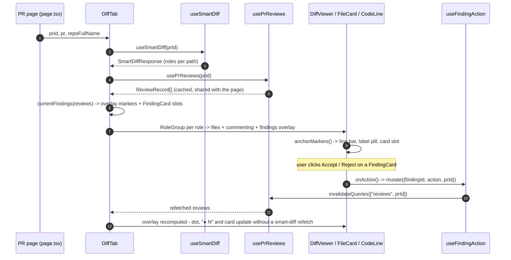

# Files changed: Smart Diff role groups and the findings overlay

How the PR detail page's "Files changed" tab groups the diff by reviewer role
and overlays the PR's current review findings directly on the changed lines.
Read alongside [`ui-architecture.md`](./ui-architecture.md) for the general
data-flow and component conventions this feature follows.

## Component tree

`DiffTab` (`client/src/app/repos/[repoId]/pulls/[number]/_components/DiffTab/DiffTab.tsx:30-145`)
is the route-scoped container; `page.tsx` renders it with three props —
`prId`, `pr`, `repoFullName` — and nothing else
(`.../pulls/[number]/page.tsx:167`):

- `SmartDiffHeader` — eyebrow, "N files · +A −D" summary from `pr.files_count`
  / `pr.additions` / `pr.deletions`, the order toggle and the show/hide
  comments button (`_components/SmartDiffHeader/SmartDiffHeader.tsx:14-63`).
- `OrderToggle` — a `role="radiogroup"` of two `role="radio"` buttons, local
  state only, no URL persistence (`_components/OrderToggle/OrderToggle.tsx:11-45`).
- `RoleGroup` — one collapsible role section: coloured swatch, label,
  description, "● N" flagged-file count, file count, and the group's files
  rendered through `DiffViewer` (`_components/RoleGroup/RoleGroup.tsx:15-65`).
- `DiffViewer` → `FileCard` → `CodeLine` (`client/src/components/diff-viewer/`)
  — the shared, route-agnostic diff renderer; `DiffTab` is the only caller
  that fills its optional `findings` prop with real data.

## Grouping: server roles joined onto GitHub's file order

`useSmartDiff(prId)` fetches `GET /pulls/:id/smart-diff`
(`client/src/lib/hooks/smart-diff.ts:15-21`, query key `["smart-diff", prId]`).
`buildRoleGroups(files, smartDiff)` then joins each server-assigned role onto
`pr.files` in its existing order, groups in `SmartDiffRole.options` order with
empty groups omitted, and puts any path missing from the response into `core`
— e.g. after a race with a detail refresh that rewrote `pr_files`
(`.../DiffTab/helpers.ts:38-55`). This keeps the *file order inside a group*
sourced from the client's already-loaded `pr.files`, not from the smart-diff
response.

Each role's display metadata — label, description, swatch colour, and
whether it starts collapsed — is a static table:
`docs`/`boilerplate` start collapsed, the rest start expanded
(`.../DiffTab/constants.ts:23-54`).

## Current findings: the same rule as the server, computed client-side

`currentFindings(reviews)` mirrors the server's rule so the UI needs no extra
request: for reviews given newest-first, keep the first (= latest) review per
`agent_id` (an agent-less review is its own bucket), flatten their findings,
and drop any with `dismissed_at` set (`.../DiffTab/helpers.ts:12-25`).
`DiffTab` restricts this list to paths that are actually in `pr.files` before
building the overlay (`DiffTab.tsx:62-66`). `pathsWithFindings` /
`countFlaggedFiles` turn that list into the per-file dot and the group's
"● N" count (`.../DiffTab/helpers.ts:57-65`, rendered in
`RoleGroup.tsx:46-56`).

Because `usePrReviews(prId)` uses the same `["reviews", prId]` query the PR
page already loads (`client/src/lib/hooks/reviews.ts:51-57`), and
`useFindingAction`'s mutation invalidates that exact key on success
(`reviews.ts:139-158`), accepting or rejecting a finding updates the dot, the
"● N" count and the inline card with **no smart-diff refetch** — only the
`reviews` query re-runs.

## Rendering an overlay: dot, line bar, inline card

`DiffTab` builds a `DiffFindingOverlay` — one marker per current finding, each
carrying a pre-rendered `<FindingCard>` as its `card` slot
(`DiffTab.tsx:69-92`). `DiffViewer` stays agnostic of what a finding is: it
just passes `findings` down to each `FileCard`, now keyed by `path` instead of
index so groups can reorder without losing open/closed state
(`client/src/components/diff-viewer/DiffViewer/DiffViewer.tsx:17-37`).

Inside `FileCard` (`client/src/components/diff-viewer/FileCard/FileCard.tsx`):
- `markersForPath` selects this file's markers, most severe first
  (`findings.ts:31-37`, rank table in `constants.ts:11-15`).
- a red dot renders next to the path — distinct from the GitHub comment
  counter — whenever the file has at least one marker
  (`FileCard.tsx:87-94`).
- `anchorMarkers` splits markers into ones whose line is a rendered RIGHT
  (`add`/`ctx`) line versus everything else — a finding on a line outside the
  patch, or a file with no patch at all (`findings.ts:44-62`, called at
  `FileCard.tsx:71-77`).
- anchored markers are passed to `CodeLine`, which renders a severity-coloured
  left bar plus a right-aligned label pill ("blocker"/"warning"/"suggestion",
  from `shell.diffViewer.lineLabel.*`) on the flagged row, and each marker's
  card slot indented directly beneath it
  (`client/src/components/diff-viewer/CodeLine/CodeLine.tsx:46-92`,
  label mapping in `constants.ts:18-22`).
- unanchored markers render in a trailing `UnanchoredFindings` block titled
  `shell.diffViewer.findingsOutsideDiff`, the same pattern as
  `OutdatedComments` (`UnanchoredFindings/UnanchoredFindings.tsx:11-22`,
  `FileCard.tsx:125`).

## Order toggle and the error fallback

`order` is local `DiffTab` state, default `"smart"`
(`.../DiffTab/constants.ts:6-8`, `DiffTab.tsx:36`). When `useSmartDiff`
errors, `DiffTab` forces `effectiveOrder` to `"original"` and disables the
toggle, so the tab always falls back to the flat `pr.files` order — with the
findings overlay still applied — instead of blocking on the grouping request
(`DiffTab.tsx:96,111-116,140-142`).

Full endpoint/UI behaviour contracts belong in `client/specs/` — see
*Follow-ups* in the doc-writer report for the drift this doc surfaces.
