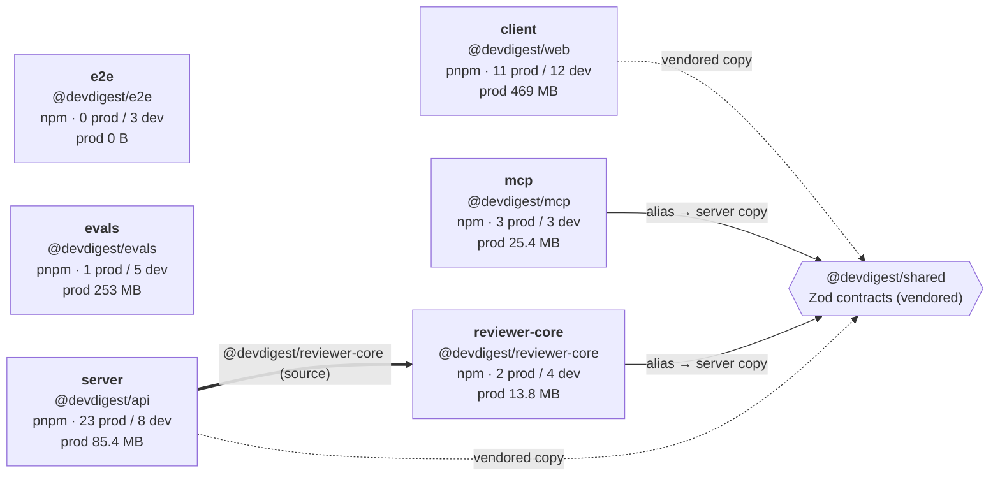

# Dependency report — 2026-10-08

> 6 packages · 75 direct dependencies · findings **P0 18 · P1 34 · P2 21 · P3 71**  
> audit: run · outdated: run · baseline: none · snapshot: `docs/dependencies/snapshots/2026-10-08.json`

## 1. Summary

**Verdict: at risk** — 18 P0 and 34 P1 findings from the automated rules; after verification 13 P0 remain (5 lowered to P1, see §10), plus 1 unused prod dependency (F041).

- **Biggest risk:** runtime frameworks with critical/high advisories in the prod tree — `next` 15.5.19 (critical, 12 advisories, F001), `fastify` 5.8.5 (F018, F017, F016), `simple-git` 3.36.0, which runs on every imported repo (critical, F013, F012), `drizzle-orm` 0.38.4 (SQL identifier escaping, F014), `@modelcontextprotocol/sdk` 1.30.1 in mcp (F010).
- **Cheapest security win:** `next` (>=15.5.27) and `fastify` (>=5.12.5) are fixed inside the declared `^` range — one `pnpm update` each (F001, F018).
- **Biggest size win:** a clean reinstall of mcp, reviewer-core and server reclaims 159.9 MB of unreachable files (75.1 MB + 72.4 MB + 12.4 MB; F065, F068, F070).
- **Dev tooling:** `vitest` 2.x carries critical advisories in all five tested packages (F019, F024, F032, F036, F043); the fix (>=4.1.11) is a major bump, effort M.
- **Not checked:** nothing skipped — audit and outdated ran for all 6 packages. Reachability of transitive advisories was judged from lockfile parents and source imports, not by executing code.

## 2. Component map

How the repo's packages depend on each other (tsconfig path aliases and vendored contracts — not npm installs).

## 3. Weight map

Top 6 production dependencies per package by installed closure size (dev dependencies when a package has no production ones). Closure = the package plus everything it pulls in.

```mermaid
flowchart LR
  subgraph client_w["client"]
    direction LR
    client_root(["client<br/>prod 469 MB"])
    client_root -->|"308 MB"| client__next_intl["next-intl<br/>31 pkgs"]:::heavy
    client_root -->|"305 MB"| client__next["next<br/>20 pkgs"]:::heavy
    client_root -->|"115 MB"| client__mermaid["mermaid<br/>111 pkgs"]:::heavy
    client_root -->|"27.4 MB"| client__lucide_react["lucide-react<br/>2 pkgs"]:::heavy
    client_root -->|"17.7 MB"| client__recharts["recharts<br/>44 pkgs"]
    client_root -->|"7.2 MB"| client__react_dom["react-dom<br/>3 pkgs"]
  end
  subgraph e2e_w["e2e"]
    direction LR
    e2e_root(["e2e<br/>dev only 36.7 MB"])
    e2e_root -->|"22.5 MB"| e2e__typescript["typescript<br/>1 pkgs"]
    e2e_root -->|"11.7 MB"| e2e__tsx["tsx<br/>3 pkgs"]
    e2e_root -->|"2.4 MB"| e2e___types_node["@types/node<br/>2 pkgs"]
  end
  subgraph evals_w["evals"]
    direction LR
    evals_root(["evals<br/>prod 253 MB"])
    evals_root -->|"253 MB"| evals___anthropic_ai_claude_agent_sdk["@anthropic-ai/claude-agent-sdk<br/>101 pkgs"]:::heavy
  end
  subgraph mcp_w["mcp"]
    direction LR
    mcp_root(["mcp<br/>prod 25.4 MB"])
    mcp_root -->|"13.7 MB"| mcp___modelcontextprotocol_sdk["@modelcontextprotocol/sdk<br/>92 pkgs"]
    mcp_root -->|"11.7 MB"| mcp__tsx["tsx<br/>3 pkgs"]
    mcp_root -->|"3.4 MB"| mcp__zod["zod<br/>1 pkgs"]
  end
  subgraph reviewer_core_w["reviewer-core"]
    direction LR
    reviewer_core_root(["reviewer-core<br/>prod 13.8 MB"])
    reviewer_core_root -->|"13.8 MB"| reviewer_core__openai["openai<br/>40 pkgs"]
    reviewer_core_root -->|"3.4 MB"| reviewer_core__zod["zod<br/>1 pkgs"]
  end
  subgraph server_w["server"]
    direction LR
    server_root(["server<br/>prod 85.4 MB"])
    server_root -->|"21.4 MB"| server__js_tiktoken["js-tiktoken<br/>2 pkgs"]:::heavy
    server_root -->|"13.8 MB"| server__openai["openai<br/>40 pkgs"]
    server_root -->|"10.6 MB"| server__octokit["octokit<br/>33 pkgs"]
    server_root -->|"10.6 MB"| server__fastify_type_provider_zod["fastify-type-provider-zod<br/>51 pkgs"]
    server_root -->|"8.1 MB"| server__drizzle_orm["drizzle-orm<br/>2 pkgs"]
    server_root -->|"7.4 MB"| server___anthropic_ai_sdk["@anthropic-ai/sdk<br/>39 pkgs"]
  end
  classDef heavy fill:#fde2e1,stroke:#c0392b,color:#000
```

## 4. Size overview

| Package | Manager | Prod / dev deps | Lockfile pkgs | Prod footprint | Full footprint | node_modules on disk | Unreachable |
|---|---|---|---|---|---|---|---|
| client | pnpm | 11 / 12 | 536 | 469 MB | 560 MB | 561 MB | 890 KB |
| e2e | npm | 0 / 3 | 32 | 0 B | 36.7 MB | 36.7 MB | 9.7 KB |
| evals | pnpm | 1 / 5 | 237 | 253 MB | 315 MB | 315 MB | 340 KB |
| mcp | npm | 3 / 3 | 214 | 25.4 MB | 74.8 MB | 150 MB | **75.1 MB** |
| reviewer-core | npm | 2 / 4 | 158 | 13.8 MB | 72.6 MB | 145 MB | **72.4 MB** |
| server | pnpm | 23 / 8 | 558 | 85.4 MB | 213 MB | 226 MB | **12.4 MB** |

_Prod footprint_ = what a production-only install puts on disk. _Unreachable_ = bytes in node_modules that no declared dependency reaches (leftovers, other managers).

## 5. Dependencies by type

| Type | Declarations | Distinct packages | Own size (sum) | Used in | Examples |
|---|---|---|---|---|---|
| Framework / runtime | 12 | 12 | 148 MB | client, mcp, server | next, next-intl, react, react-dom |
| Build / dev tooling | 15 | 6 | 139 MB | client, e2e, evals, mcp, reviewer-core, server | @vitejs/plugin-react, typescript, tsx, gray-matter |
| UI / rendering | 8 | 8 | 106 MB | client | lucide-react, mermaid, react-markdown, recharts |
| AI / LLM SDK | 5 | 4 | 34.0 MB | evals, reviewer-core, server | @anthropic-ai/claude-agent-sdk, openai, @anthropic-ai/sdk, js-tiktoken |
| Database / ORM | 3 | 3 | 15.5 MB | server | drizzle-orm, postgres, drizzle-kit |
| Type definitions | 8 | 3 | 14.3 MB | client, e2e, evals, mcp, reviewer-core, server | @types/node, @types/react, @types/react-dom |
| Validation / contracts | 4 | 1 | 13.7 MB | client, mcp, reviewer-core, server | zod |
| Testing | 10 | 6 | 11.8 MB | client, evals, mcp, reviewer-core, server | @testing-library/jest-dom, @testing-library/react, jsdom, vitest |
| Code analysis / parsing | 4 | 4 | 3.1 MB | server | @ast-grep/napi, @vscode/ripgrep, graphology, graphology-metrics |
| External API clients | 3 | 3 | 1.8 MB | client, server | @tanstack/react-query, octokit, simple-git |
| Utility | 3 | 3 | 893 KB | server | dotenv, fflate, p-queue |

## 6. Per-package dependencies

### client — `@devdigest/web`

pnpm · 23 direct · 438 installed packages reachable · prod 469 MB · full 560 MB

Dependency table

| Dependency | Kind | Type | Specifier | Installed | Own | Closure (pkgs) | Exclusive | Usage | License |
|---|---|---|---|---|---|---|---|---|---|
| `next-intl` | prod | Framework / runtime | ^3.26.0 | 3.26.5 | 356 KB | 308 MB (31) | 2.0 MB | prod 102, test 49, cfg 1 | MIT |
| `next` | prod | Framework / runtime | ^15.1.3 | 15.5.19 | 133 MB | 305 MB (20) | 0 B | prod 26, test 4, cfg 2, bin next, peer of next-intl | MIT |
| `mermaid` | prod | UI / rendering | ^11.15.0 | 11.15.0 | 72.8 MB | 115 MB (111) | 113 MB | prod 2, test 2 | MIT |
| `vitest` | dev | Testing | ^2.1.8 | 2.1.9 | 1.6 MB | 49.4 MB (107) | 3.5 MB | test 70, cfg 1, bin vitest | MIT |
| `@vitejs/plugin-react` | dev | Build / dev tooling | ^4.3.4 | 4.7.0 | 58.9 KB | 44.1 MB (64) | 9.1 MB | cfg 1 | MIT |
| `lucide-react` | prod | UI / rendering | ^0.469.0 | 0.469.0 | 27.3 MB | 27.4 MB (2) | 27.3 MB | prod 1 | ISC |
| `typescript` | dev | Build / dev tooling | ^5.7.2 | 5.9.3 | 22.5 MB | 22.5 MB (1) | 22.5 MB | bin tsc | Apache-2.0 |
| `recharts` | prod | UI / rendering | ^2.15.0 | 2.15.4 | 4.4 MB | 17.7 MB (44) | 7.7 MB | prod 2 | MIT |
| `@tailwindcss/postcss` | dev | UI / rendering | ^4.0.0 | 4.3.0 | 97.4 KB | 16.9 MB (23) | 5.4 MB | cfg 1 | MIT |
| `jsdom` | dev | Testing | ^25.0.1 | 25.0.1 | 3.0 MB | 13.2 MB (60) | 0 B | cfg 1, peer of vitest | MIT |
| `@testing-library/react` | dev | Testing | ^16.1.0 | 16.3.2 | 329 KB | 12.5 MB (22) | 3.4 MB | test 54 | MIT |
| `react-dom` | prod | Framework / runtime | ^19.0.0 | 19.2.7 | 7.0 MB | 7.2 MB (3) | 0 B | prod 1, peer of next | MIT |
| `react-markdown` | prod | UI / rendering | ^9.0.3 | 9.1.0 | 50.7 KB | 4.4 MB (85) | 902 KB | prod 2 | MIT |
| `zod` | prod | Validation / contracts | ^3.24.1 | 3.25.76 | 3.4 MB | 3.4 MB (1) | 3.4 MB | prod 13 | MIT |
| `@tanstack/react-query` | prod | External API clients | ^5.62.8 | 5.101.0 | 839 KB | 3.2 MB (3) | 3.0 MB | prod 17, test 6 | MIT |
| `@types/node` | dev | Type definitions | ^22.10.0 | 22.19.19 | 2.3 MB | 2.4 MB (2) | 0 B | types for node | MIT |
| `remark-gfm` | prod | UI / rendering | ^4.0.0 | 4.0.1 | 21.5 KB | 2.3 MB (68) | 538 KB | prod 2 | MIT |
| `@types/react-dom` | dev | Type definitions | ^19.0.2 | 19.2.3 | 29.4 KB | 1.6 MB (3) | 0 B | types for react-dom | MIT |
| `@types/react` | dev | Type definitions | ^19.0.2 | 19.2.16 | 398 KB | 1.6 MB (2) | 0 B | types for react | MIT |
| `@testing-library/jest-dom` | dev | Testing | ^6.6.3 | 6.9.1 | 294 KB | 1021 KB (10) | 1014 KB | test 1 | MIT |
| `tailwindcss` | dev | UI / rendering | ^4.0.0 | 4.3.0 | 737 KB | 737 KB (1) | 0 B | cfg 2 | MIT |
| `postcss` | dev | UI / rendering | ^8.4.49 | 8.5.15 | 201 KB | 376 KB (4) | 0 B | **none found** | MIT |
| `react` | prod | Framework / runtime | ^19.0.0 | 19.2.7 | 168 KB | 168 KB (1) | 0 B | prod 242, test 7, peer of @tanstack/react-query | MIT |

### e2e — `@devdigest/e2e`

npm · 3 direct · 6 installed packages reachable · prod 0 B · full 36.7 MB

Dependency table

| Dependency | Kind | Type | Specifier | Installed | Own | Closure (pkgs) | Exclusive | Usage | License |
|---|---|---|---|---|---|---|---|---|---|
| `typescript` | dev | Build / dev tooling | ^5.7.2 | 5.9.3 | 22.5 MB | 22.5 MB (1) | 22.5 MB | bin tsc | Apache-2.0 |
| `tsx` | dev | Build / dev tooling | ^4.19.2 | 4.22.4 | 506 KB | 11.7 MB (3) | 11.7 MB | bin tsx | MIT |
| `@types/node` | dev | Type definitions | ^22.10.0 | 22.19.21 | 2.3 MB | 2.4 MB (2) | 2.4 MB | types for node | MIT |

### evals — `@devdigest/evals`

pnpm · 6 direct · 159 installed packages reachable · prod 253 MB · full 315 MB

Dependency table

| Dependency | Kind | Type | Specifier | Installed | Own | Closure (pkgs) | Exclusive | Usage | License |
|---|---|---|---|---|---|---|---|---|---|
| `@anthropic-ai/claude-agent-sdk` | prod | AI / LLM SDK | ^0.3.198 | 0.3.198 | 3.5 MB | 253 MB (101) | 253 MB | prod 1 | SEE LICENSE IN README.md |
| `vitest` | dev | Testing | ^2.1.0 | 2.1.9 | 1.6 MB | 26.7 MB (46) | 24.2 MB | prod 4, test 1, cfg 1, bin vitest | MIT |
| `typescript` | dev | Build / dev tooling | ^5.6.0 | 5.9.3 | 22.5 MB | 22.5 MB (1) | 22.5 MB | bin tsc | Apache-2.0 |
| `tsx` | dev | Build / dev tooling | ^4.19.0 | 4.22.4 | 506 KB | 11.8 MB (3) | 11.8 MB | prod 2, bin tsx | MIT |
| `@types/node` | dev | Type definitions | ^22.0.0 | 22.20.0 | 2.3 MB | 2.4 MB (2) | 0 B | types for node | MIT |
| `gray-matter` | dev | Build / dev tooling | ^4.0.3 | 4.0.3 | 37.7 KB | 812 KB (10) | 812 KB | prod 1 | MIT |

### mcp — `@devdigest/mcp`

npm · 6 direct · 140 installed packages reachable · prod 25.4 MB · full 74.8 MB

Dependency table

| Dependency | Kind | Type | Specifier | Installed | Own | Closure (pkgs) | Exclusive | Usage | License |
|---|---|---|---|---|---|---|---|---|---|
| `vitest` | dev | Testing | ^2.1.9 | 2.1.9 | 1.6 MB | 26.9 MB (46) | 24.4 MB | test 18, cfg 1, bin vitest | MIT |
| `typescript` | dev | Build / dev tooling | ^5.9.3 | 5.9.3 | 22.5 MB | 22.5 MB (1) | 22.5 MB | bin tsc | Apache-2.0 |
| `@modelcontextprotocol/sdk` | prod | Framework / runtime | ^1.30.1 | 1.30.1 | 4.1 MB | 13.7 MB (92) | 10.2 MB | prod 2, test 3 | MIT |
| `tsx` | prod | Build / dev tooling | ^4.23.15 | 4.23.15 | 388 KB | 11.7 MB (3) | 11.7 MB | prod 1 | MIT |
| `zod` | prod | Validation / contracts | ^3.25.76 | 3.25.76 | 3.4 MB | 3.4 MB (1) | 0 B | prod 3, test 1, cfg 1, peer of @modelcontextprotocol/sdk | MIT |
| `@types/node` | dev | Type definitions | ^22.20.4 | 22.20.4 | 2.3 MB | 2.4 MB (2) | 0 B | types for node | MIT |

### reviewer-core — `@devdigest/reviewer-core`

npm · 6 direct · 88 installed packages reachable · prod 13.8 MB · full 72.6 MB

Dependency table

| Dependency | Kind | Type | Specifier | Installed | Own | Closure (pkgs) | Exclusive | Usage | License |
|---|---|---|---|---|---|---|---|---|---|
| `vitest` | dev | Testing | ^2.1.8 | 2.1.9 | 1.6 MB | 26.9 MB (46) | 24.5 MB | test 5, cfg 1, bin vitest | MIT |
| `typescript` | dev | Build / dev tooling | ^5.7.2 | 5.9.3 | 22.5 MB | 22.5 MB (1) | 22.5 MB | bin tsc | Apache-2.0 |
| `openai` | prod | AI / LLM SDK | ^4.77.0 | 4.104.0 | 4.0 MB | 13.8 MB (40) | 8.0 MB | prod 2, test 1, bin openai | Apache-2.0 |
| `tsx` | dev | Build / dev tooling | ^4.19.2 | 4.23.13 | 520 KB | 11.8 MB (3) | 11.8 MB | bin tsx | MIT |
| `zod` | prod | Validation / contracts | ^3.24.1 | 3.25.76 | 3.4 MB | 3.4 MB (1) | 0 B | prod 2, cfg 1, peer of openai | MIT |
| `@types/node` | dev | Type definitions | ^22.10.0 | 22.20.3 | 2.3 MB | 2.4 MB (2) | 0 B | types for node | MIT |

### server — `@devdigest/api`

pnpm · 31 direct · 425 installed packages reachable · prod 85.4 MB · full 213 MB

Dependency table

| Dependency | Kind | Type | Specifier | Installed | Own | Closure (pkgs) | Exclusive | Usage | License |
|---|---|---|---|---|---|---|---|---|---|
| `@testcontainers/postgresql` | dev | Testing | ^10.16.0 | 10.28.0 | 17.8 KB | 45.4 MB (158) | 17.8 KB | test 1 | MIT |
| `testcontainers` | dev | Testing | ^10.16.0 | 10.28.0 | 379 KB | 45.4 MB (157) | 0 B | **none found** | MIT |
| `drizzle-kit` | dev | Database / ORM | ^0.30.1 | 0.30.6 | 7.4 MB | 28.8 MB (23) | 28.7 MB | cfg 2, bin drizzle-kit | MIT |
| `vitest` | dev | Testing | ^2.1.8 | 2.1.9 | 1.6 MB | 26.6 MB (46) | 24.2 MB | prod 1, test 96, cfg 1, bin vitest | MIT |
| `typescript` | dev | Build / dev tooling | ^5.7.2 | 5.9.3 | 22.5 MB | 22.5 MB (1) | 22.5 MB | bin tsc | Apache-2.0 |
| `js-tiktoken` | prod | AI / LLM SDK | ^1.0.21 | 1.0.21 | 21.4 MB | 21.4 MB (2) | 21.4 MB | prod 1, cfg 1 | MIT |
| `openai` | prod | AI / LLM SDK | ^4.77.0 | 4.104.0 | 4.0 MB | 13.8 MB (40) | 4.0 MB | prod 12, test 19, cfg 1, bin openai | Apache-2.0 |
| `tsx` | dev | Build / dev tooling | ^4.19.2 | 4.22.4 | 506 KB | 11.7 MB (3) | 11.7 MB | prod 2, bin tsx | MIT |
| `octokit` | prod | External API clients | ^4.0.3 | 4.1.4 | 50.0 KB | 10.6 MB (33) | 10.5 MB | prod 2, cfg 1 | MIT |
| `fastify-type-provider-zod` | prod | Framework / runtime | ^4.0.2 | 4.0.2 | 24.6 KB | 10.6 MB (51) | 239 KB | prod 17, cfg 1 | MIT |
| `drizzle-orm` | prod | Database / ORM | ^0.38.3 | 0.38.4 | 7.8 MB | 8.1 MB (2) | 7.8 MB | prod 41, test 12, cfg 1 | Apache-2.0 |
| `@anthropic-ai/sdk` | prod | AI / LLM SDK | ^0.33.1 | 0.33.1 | 1.0 MB | 7.4 MB (39) | 1.0 MB | prod 1, test 1, cfg 1 | MIT |
| `fastify-sse-v2` | prod | Framework / runtime | ^4.2.1 | 4.2.2 | 21.1 KB | 7.3 MB (64) | 108 KB | prod 1, cfg 1 | MIT |
| `@ast-grep/napi` | prod | Code analysis / parsing | 0.43.0 | 0.43.0 | 352 KB | 7.2 MB (2) | 7.2 MB | prod 1, cfg 1 | MIT |
| `fastify` | prod | Framework / runtime | ^5.2.0 | 5.8.5 | 2.6 MB | 6.9 MB (48) | 0 B | prod 21, test 5, cfg 1, peer of fastify-sse-v2 | MIT |
| `@vscode/ripgrep` | prod | Code analysis / parsing | ^1.15.9 | 1.18.0 | 4.3 KB | 5.2 MB (2) | 5.2 MB | prod 1, cfg 1 | MIT |
| `dependency-cruiser` | prod | Build / dev tooling | ^17.4.3 | 17.4.3 | 963 KB | 4.3 MB (43) | 4.0 MB | prod 1, test 1, cfg 1, bin depcruise | MIT |
| `zod` | prod | Validation / contracts | ^3.24.1 | 3.25.76 | 3.4 MB | 3.4 MB (1) | 0 B | prod 26, test 1, peer of fastify-type-provider-zod | MIT |
| `graphology` | prod | Code analysis / parsing | ^0.26.0 | 0.26.0 | 2.6 MB | 2.7 MB (3) | 2.6 MB | prod 1 | MIT |
| `@types/node` | dev | Type definitions | ^22.10.0 | 22.19.19 | 2.3 MB | 2.4 MB (2) | 0 B | types for node | MIT |
| `simple-git` | prod | External API clients | ^3.27.0 | 3.36.0 | 929 KB | 1.1 MB (7) | 1.0 MB | prod 2, test 3, cfg 1 | MIT |
| `graphology-metrics` | prod | Code analysis / parsing | ^2.4.0 | 2.4.0 | 123 KB | 812 KB (9) | 717 KB | prod 1 | MIT |
| `pino-pretty` | dev | Build / dev tooling | ^13.0.0 | 13.1.3 | 240 KB | 788 KB (19) | 508 KB | prod 1 | MIT |
| `fflate` | prod | Utility | ^0.8.3 | 0.8.3 | 778 KB | 778 KB (1) | 778 KB | prod 1, test 1 | MIT |
| `@fastify/cors` | prod | Framework / runtime | ^10.0.2 | 10.1.0 | 113 KB | 567 KB (4) | 487 KB | prod 1 | MIT |
| `@fastify/rate-limit` | prod | Framework / runtime | ^11.0.0 | 11.0.0 | 203 KB | 302 KB (4) | 212 KB | prod 1 | MIT |
| `postgres` | prod | Database / ORM | ^3.4.5 | 3.4.9 | 293 KB | 293 KB (1) | 0 B | prod 2, cfg 1, peer of drizzle-orm | Unlicense |
| `@fastify/helmet` | prod | Framework / runtime | ^13.0.2 | 13.0.2 | 67.8 KB | 211 KB (3) | 169 KB | prod 1 | MIT |
| `@fastify/autoload` | prod | Framework / runtime | ^6.0.3 | 6.3.1 | 171 KB | 171 KB (1) | 171 KB | **none found** | MIT |
| `p-queue` | prod | Utility | ^8.0.1 | 8.1.1 | 40.1 KB | 126 KB (3) | 126 KB | prod 3 | MIT |
| `dotenv` | prod | Utility | ^16.4.7 | 16.6.1 | 74.8 KB | 74.8 KB (1) | 74.8 KB | prod 3, cfg 1 | BSD-2-Clause |

_Own_ = the package folder alone. _Closure_ = with all transitive deps. _Exclusive_ = what disappears if only this dependency is removed (shared transitive deps excluded). Sizes are install sizes on disk, **not** browser bundle sizes.

## 7. Shared across packages

| Dependency | Packages | Versions (specifier → installed) | Drift |
|---|---|---|---|
| `@types/node` | 6 | client: ^22.10.0 → 22.19.19 (dev) e2e: ^22.10.0 → 22.19.21 (dev) evals: ^22.0.0 → 22.20.0 (dev) mcp: ^22.20.4 → 22.20.4 (dev) reviewer-core: ^22.10.0 → 22.20.3 (dev) server: ^22.10.0 → 22.19.19 (dev) | **minor** |
| `typescript` | 6 | client: ^5.7.2 → 5.9.3 (dev) e2e: ^5.7.2 → 5.9.3 (dev) evals: ^5.6.0 → 5.9.3 (dev) mcp: ^5.9.3 → 5.9.3 (dev) reviewer-core: ^5.7.2 → 5.9.3 (dev) server: ^5.7.2 → 5.9.3 (dev) | aligned |
| `tsx` | 5 | e2e: ^4.19.2 → 4.22.4 (dev) evals: ^4.19.0 → 4.22.4 (dev) mcp: ^4.23.15 → 4.23.15 reviewer-core: ^4.19.2 → 4.23.13 (dev) server: ^4.19.2 → 4.22.4 (dev) | **minor** |
| `vitest` | 5 | client: ^2.1.8 → 2.1.9 (dev) evals: ^2.1.0 → 2.1.9 (dev) mcp: ^2.1.9 → 2.1.9 (dev) reviewer-core: ^2.1.8 → 2.1.9 (dev) server: ^2.1.8 → 2.1.9 (dev) | aligned |
| `zod` | 4 | client: ^3.24.1 → 3.25.76 mcp: ^3.25.76 → 3.25.76 reviewer-core: ^3.24.1 → 3.25.76 server: ^3.24.1 → 3.25.76 | aligned |
| `openai` | 2 | reviewer-core: ^4.77.0 → 4.104.0 server: ^4.77.0 → 4.104.0 | aligned |

## 8. Duplicate versions inside a package

| Package | Dependency | Versions | Redundant size | Tree |
|---|---|---|---|---|
| client | `@formatjs/intl-localematcher` | 0.5.10, 0.6.2 | 390 KB | prod |
| client | `layout-base` | 1.0.2, 2.0.1 | 295 KB | prod |
| client | `dom-accessibility-api` | 0.5.16, 0.6.3 | 251 KB | dev only |
| client | `d3-shape` | 1.3.7, 3.2.0 | 226 KB | prod |
| client | `postcss` | 8.4.31, 8.5.15 | 192 KB | prod |
| client | `aria-query` | 5.3.0, 5.3.2 | 172 KB | dev only |
| client | `commander` | 7.2.0, 8.3.0 | 141 KB | prod |
| client | `d3-array` | 2.12.1, 3.2.4 | 133 KB | prod |
| evals | `@esbuild/win32-x64` | 0.21.5, 0.28.1 | 9.5 MB | dev only |
| evals | `esbuild` | 0.21.5, 0.28.1 | 130 KB | dev only |
| evals | `content-type` | 1.0.5, 2.0.0 | 10.2 KB | prod |
| mcp | `@esbuild/win32-x64` | 0.21.5, 0.28.2 | 9.5 MB | prod |
| mcp | `esbuild` | 0.21.5, 0.28.2 | 130 KB | prod |
| mcp | `content-type` | 1.0.5, 2.1.0 | 10.2 KB | prod |
| reviewer-core | `@esbuild/win32-x64` | 0.21.5, 0.28.2 | 9.5 MB | dev only |
| reviewer-core | `@types/node` | 18.19.130, 22.20.3 | 2.0 MB | prod |
| reviewer-core | `esbuild` | 0.21.5, 0.28.2 | 130 KB | dev only |
| reviewer-core | `undici-types` | 5.26.5, 6.21.0 | 71.3 KB | prod |
| server | `@esbuild/win32-x64` | 0.18.20, 0.19.12, 0.21.5, 0.28.0 | 27.9 MB | dev only |
| server | `@types/node` | 18.19.130, 22.19.19 | 2.0 MB | prod |
| server | `esbuild` | 0.18.20, 0.19.12, 0.21.5, 0.28.0 | 389 KB | dev only |
| server | `mnemonist` | 0.39.8, 0.40.0 | 371 KB | prod |
| server | `readable-stream` | 2.3.8, 3.6.2, 4.7.0 | 207 KB | prod |
| server | `@grpc/proto-loader` | 0.7.15, 0.8.1 | 119 KB | dev only |
| server | `buffer` | 5.7.1, 6.0.3 | 80.6 KB | prod |
| server | `@types/ssh2` | 0.5.52, 1.15.5 | 73.6 KB | dev only |

## 9. Security & freshness

**client — vulnerabilities**

| Package | Worst severity | Advisories | Direct | Tree | Examples | Fixed in |
|---|---|---|---|---|---|---|
| next | critical | 12 | yes | **prod** | Next.js: Denial of Service in App Router using Server Actions; Next.js: Server-Side Request Forgery in Server Actions on custom servers; Next.js: Cache confusion of response bodies for requests with bodies | >=15.5.27 |
| vitest | critical | 2 | yes | dev only | When Vitest UI server is listening, arbitrary file can be read and executed; Vitest: Path Traversal / Arbitrary File Read via @vitest/mocker Redirect Mock | >=4.1.11 |
| tinypool | critical | 2 | no | dev only | Tinypool: Prototype Pollution gadget in worker options leads to Remote Code Execution; Tinypool: Prototype Pollution Gadget to RCE in run() options | >=2.1.2 |
| postcss | high | 4 | yes | **prod** | PostCSS has XSS via Unescaped </style> in its CSS Stringify Output; PostCSS: Arbitrary file read and information disclosure via attacker-controlled sourceMappingURL in CSS comments; PostCSS: incomplete fix of GHSA-6g55-p6wh-862q — attacker-controlled sourceMappingURL reads arbitrary .map files when `from` is unset | >=8.5.23 |
| sharp | high | 3 | no | **prod** | sharp inherited vulnerabilities in libvips: CVE-2026-33327, CVE-2026-33328, CVE-2026-35590, CVE-2026-35591; sharp: Vulnerabilities in libheif: GHSA-g89c-p67h-r497 and GHSA-2jg2-4ch7-h545; sharp : Vulnerability in librsvg dependency CVE-2026-96889 | >=0.35.5 |
| nanoid | high | 2 | no | **prod** | nanoid: non-secure generators can loop indefinitely with negative size; nanoid: custom generators can loop indefinitely when size is zero | >=3.3.18 |
| source-map-js | high | 1 | no | **prod** | source-map-js allows event-loop denial of service through indexed source-map section offsets | >=1.2.2 |
| vite | high | 3 | no | dev only | Vite Vulnerable to Path Traversal in Optimized Deps `.map` Handling; launch-editor: NTLMv2 hash disclosure via UNC path handling on Windows; vite: `server.fs.deny` bypass on Windows alternate paths | >=6.4.3 |
| form-data | high | 1 | no | dev only | form-data: CRLF injection in form-data via unescaped multipart field names and filenames | >=4.0.6 |
| browserslist | high | 2 | no | dev only | Browserslist: Unbounded memory growth (no cache eviction) via distinct query results, leading to eventual OOM; Browserslist: Uncaught crash / prototype write via untrusted browserslist-stats.json custom stats (normalizeStats) | >=4.28.7 |
| next-intl | moderate | 2 | yes | **prod** | next-intl has an open redirect vulnerability; next-intl has prototype pollution with `experimental.messages.precompile` via attacker-controlled translation catalog keys | >=4.9.2 |
| dompurify | moderate | 5 | no | **prod** | DOMPurify: Permanent `ALLOWED_ATTR` pollution via `setConfig()` bypassing the hook clone-guard (incomplete fix of the 3.4.7 hook-pollution patch); DOMPurify: Trusted Types policy survives `clearConfig()` and can poison later `RETURN_TRUSTED_TYPE` output; DOMPurify: IN_PLACE hook removal leaves a detached subtree executable, causing XSS | >=3.4.9 |
| mermaid | moderate | 5 | yes | **prod** | Mermaid configuration APIs allow prototype pollution; Mermaid allows CSS injection applying to sibling elements of the diagram; Mermaid Architecture diagrams are vulnerable to prototype pollution | >=11.16.1 |
| esbuild | moderate | 1 | no | dev only | esbuild enables any website to send any requests to the development server and read the response | >=0.25.0 |
| @vitest/mocker | moderate | 1 | no | dev only | Vitest: Path Traversal / Arbitrary File Read via @vitest/mocker Redirect Mock | >=4.1.11 |
| baseline-browser-mapping | moderate | 1 | no | dev only | baseline-browser-mapping process termination on invalid input causes denial of service | >=2.11.0 |
| katex | low | 1 | no | **prod** | KaTeX: Existing prototype pollution can bypass trust restrictions | >=0.18.2 |

**client — outdated**

| Package | Current | Wanted | Latest | Deprecated |
|---|---|---|---|---|
| @tailwindcss/postcss | 4.3.0 | 4.3.0 | 4.3.3 |  |
| @testing-library/react | 16.3.2 | 16.3.2 | 16.3.3 |  |
| postcss | 8.5.15 | 8.5.15 | 8.5.29 |  |
| tailwindcss | 4.3.0 | 4.3.0 | 4.3.3 |  |
| @tanstack/react-query | 5.101.0 | 5.101.0 | 5.104.1 |  |
| @types/react | 19.2.16 | 19.2.16 | 19.3.0 |  |
| @types/react-dom | 19.2.3 | 19.2.3 | 19.3.0 |  |
| react | 19.2.7 | 19.2.7 | 19.3.0 |  |
| react-dom | 19.2.7 | 19.2.7 | 19.3.0 |  |
| @testing-library/jest-dom | 6.9.1 | 6.9.1 | 7.0.1 |  |
| @types/node | 22.19.19 | 22.19.19 | 26.6.4 |  |
| @vitejs/plugin-react | 4.7.0 | 4.7.0 | 6.1.2 |  |
| jsdom | 25.0.1 | 25.0.1 | 30.1.2 |  |
| lucide-react | 0.469.0 | 0.469.0 | 1.52.0 |  |
| mermaid | 11.15.0 | 11.15.0 | 12.1.0 |  |
| next | 15.5.19 | 15.5.19 | 16.4.0 |  |
| next-intl | 3.26.5 | 3.26.5 | 4.14.9 |  |
| react-markdown | 9.1.0 | 9.1.0 | 10.1.0 |  |
| recharts | 2.15.4 | 2.15.4 | 3.10.1 |  |
| typescript | 5.9.3 | 5.9.3 | 7.0.2 |  |
| vitest | 2.1.9 | 2.1.9 | 5.0.3 |  |
| zod | 3.25.76 | 3.25.76 | 4.6.5 |  |

**e2e — vulnerabilities**

| Package | Worst severity | Advisories | Direct | Tree | Examples | Fixed in |
|---|---|---|---|---|---|---|
| esbuild | low | 1 | no | dev only | esbuild allows arbitrary file read when running the development server on Windows | available |

**e2e — outdated**

| Package | Current | Wanted | Latest | Deprecated |
|---|---|---|---|---|
| @types/node | 22.19.21 | 22.20.5 | 26.6.4 |  |
| tsx | 4.22.4 | 4.23.15 | 4.23.15 |  |
| typescript | 5.9.3 | 5.9.3 | 7.0.2 |  |

**evals — vulnerabilities**

| Package | Worst severity | Advisories | Direct | Tree | Examples | Fixed in |
|---|---|---|---|---|---|---|
| proxy-addr | critical | 1 | no | **prod** | proxy-addr vulnerable to IP spoofing via IPv4-mapped IPv6 trust subnet | >=2.0.8 |
| vitest | critical | 2 | yes | dev only | When Vitest UI server is listening, arbitrary file can be read and executed; Vitest: Path Traversal / Arbitrary File Read via @vitest/mocker Redirect Mock | >=4.1.11 |
| tinypool | critical | 2 | no | dev only | Tinypool: Prototype Pollution gadget in worker options leads to Remote Code Execution; Tinypool: Prototype Pollution Gadget to RCE in run() options | >=2.1.2 |
| fast-uri | high | 8 | no | **prod** | fast-uri vulnerable to host confusion via literal backslash authority delimiter; fast-uri vulnerable to host confusion via backslash authority introducer; fast-uri vulnerable to host confusion via skipped IDN canonicalization on scheme-relative references | >=3.1.8 |
| ip-address | high | 7 | no | **prod** | ip-address: Address4 decodes leading-zero octets as decimal while resolvers decode them as octal, allowing SSRF and trust-boundary bypass; ip-address: a CIDR suffix on the parsed address suppresses special-use classification and can bypass SSRF and trust-boundary checks; ip-address: misclassification of IPv4-mapped/NAT64 IPv6 addresses can bypass SSRF and trust-boundary checks | >=10.7.1 |
| @modelcontextprotocol/sdk | high | 1 | no | **prod** | MCP TypeScript SDK: OAuth client could send credentials to an authorization server chosen by the MCP server | >=1.31.0 |
| vite | high | 3 | no | dev only | Vite Vulnerable to Path Traversal in Optimized Deps `.map` Handling; launch-editor: NTLMv2 hash disclosure via UNC path handling on Windows; vite: `server.fs.deny` bypass on Windows alternate paths | >=6.4.3 |
| postcss | high | 2 | no | dev only | PostCSS: incomplete fix of GHSA-6g55-p6wh-862q — attacker-controlled sourceMappingURL reads arbitrary .map files when `from` is unset; PostCSS: Path Traversal in Previous Source Map Auto-Loading (sourceMappingURL) leads to Arbitrary .map File Disclosure | >=8.5.23 |
| js-yaml | high | 2 | no | dev only | JS-YAML: Quadratic CPU consumption in !!omap resolution (3.x and 4.x) — CVE-2026-59870 fix not backported; js-yaml: maxTotalMergeKeys does not limit CPU use for empty merge sources | >=3.15.2 |
| nanoid | high | 2 | no | dev only | nanoid: non-secure generators can loop indefinitely with negative size; nanoid: custom generators can loop indefinitely when size is zero | >=3.3.18 |
| source-map-js | high | 1 | no | dev only | source-map-js allows event-loop denial of service through indexed source-map section offsets | >=1.2.2 |
| hono | moderate | 8 | no | **prod** | Hono: ReDoS in CORS middleware via Access-Control-Request-Headers; Hono: `memo()` retains SSR output across requests, leading to cross-user data disclosure; Hono: Proxy Helper does not remove response headers listed in the `Connection` header | >=4.13.7 |
| @hono/node-server | moderate | 1 | no | **prod** | Node.js Adapter for Hono: Path traversal in `serve-static` on Windows via encoded backslash (`%5C`) | >=1.19.15 |
| qs | moderate | 2 | no | **prod** | qs array-limit bypass via bracket-key comma parsing; qs: Denial of Service via Attacker Controlled isBuffer | >=6.16.0 |
| esbuild | moderate | 1 | no | dev only | esbuild enables any website to send any requests to the development server and read the response | >=0.25.0 |
| @vitest/mocker | moderate | 1 | no | dev only | Vitest: Path Traversal / Arbitrary File Read via @vitest/mocker Redirect Mock | >=4.1.11 |
| sprintf-js | moderate | 1 | no | dev only | sprintf-js vulnerable to denial of service through unbounded precision specifiers | none |

**evals — outdated**

| Package | Current | Wanted | Latest | Deprecated |
|---|---|---|---|---|
| @anthropic-ai/claude-agent-sdk | 0.3.198 | 0.3.198 | 0.3.292 |  |
| tsx | 4.22.4 | 4.22.4 | 4.23.15 |  |
| @types/node | 22.20.0 | 22.20.0 | 26.6.4 |  |
| typescript | 5.9.3 | 5.9.3 | 7.0.2 |  |
| vitest | 2.1.9 | 2.1.9 | 5.0.3 |  |

**mcp — vulnerabilities**

| Package | Worst severity | Advisories | Direct | Tree | Examples | Fixed in |
|---|---|---|---|---|---|---|
| tinypool | critical | 1 | no | dev only | Tinypool: Prototype Pollution gadget in worker options leads to Remote Code Execution; Tinypool: Prototype Pollution Gadget to RCE in run() options | vitest@5.0.3 (major) |
| vitest | critical | 1 | yes | dev only | @vitest/mocker; When Vitest UI server is listening, arbitrary file can be read and executed | vitest@5.0.3 (major) |
| @modelcontextprotocol/sdk | high | 1 | yes | **prod** | MCP TypeScript SDK: OAuth client could send credentials to an authorization server chosen by the MCP server | available |
| source-map-js | high | 1 | no | dev only | source-map-js allows event-loop denial of service through indexed source-map section offsets | available |
| vite | high | 1 | no | dev only | Vite Vulnerable to Path Traversal in Optimized Deps `.map` Handling; launch-editor: NTLMv2 hash disclosure via UNC path handling on Windows | vitest@5.0.3 (major) |
| esbuild | moderate | 1 | no | **prod** | esbuild enables any website to send any requests to the development server and read the response | vitest@5.0.3 (major) |
| @vitest/mocker | moderate | 1 | no | dev only | Vitest: Path Traversal / Arbitrary File Read via @vitest/mocker Redirect Mock; vite | vitest@5.0.3 (major) |
| vite-node | moderate | 1 | no | dev only | vite | vitest@5.0.3 (major) |

**mcp — outdated**

| Package | Current | Wanted | Latest | Deprecated |
|---|---|---|---|---|
| @modelcontextprotocol/sdk | 1.30.1 | 1.32.1 | 1.32.1 |  |
| @types/node | 22.20.4 | 22.20.5 | 26.6.4 |  |
| typescript | 5.9.3 | 5.9.3 | 7.0.2 |  |
| vitest | 2.1.9 | 2.1.9 | 5.0.3 |  |
| zod | 3.25.76 | 3.25.76 | 4.6.5 |  |

**reviewer-core — vulnerabilities**

| Package | Worst severity | Advisories | Direct | Tree | Examples | Fixed in |
|---|---|---|---|---|---|---|
| tinypool | critical | 1 | no | dev only | Tinypool: Prototype Pollution gadget in worker options leads to Remote Code Execution; Tinypool: Prototype Pollution Gadget to RCE in run() options | vitest@5.0.3 (major) |
| vitest | critical | 1 | yes | dev only | @vitest/mocker; When Vitest UI server is listening, arbitrary file can be read and executed | vitest@5.0.3 (major) |
| form-data | high | 1 | no | **prod** | form-data: CRLF injection in form-data via unescaped multipart field names and filenames | available |
| nanoid | high | 1 | no | dev only | nanoid: non-secure generators can loop indefinitely with negative size; nanoid: custom generators can loop indefinitely when size is zero | available |
| postcss | high | 1 | no | dev only | PostCSS: incomplete fix of GHSA-6g55-p6wh-862q — attacker-controlled sourceMappingURL reads arbitrary .map files when `from` is unset; PostCSS: Path Traversal in Previous Source Map Auto-Loading (sourceMappingURL) leads to Arbitrary .map File Disclosure | available |
| source-map-js | high | 1 | no | dev only | source-map-js allows event-loop denial of service through indexed source-map section offsets | available |
| vite | high | 1 | no | dev only | Vite Vulnerable to Path Traversal in Optimized Deps `.map` Handling; launch-editor: NTLMv2 hash disclosure via UNC path handling on Windows | vitest@5.0.3 (major) |
| @vitest/mocker | moderate | 1 | no | dev only | Vitest: Path Traversal / Arbitrary File Read via @vitest/mocker Redirect Mock; vite | vitest@5.0.3 (major) |
| esbuild | moderate | 1 | no | dev only | esbuild enables any website to send any requests to the development server and read the response; esbuild allows arbitrary file read when running the development server on Windows | vitest@5.0.3 (major) |
| vite-node | moderate | 1 | no | dev only | vite | vitest@5.0.3 (major) |

**reviewer-core — outdated**

| Package | Current | Wanted | Latest | Deprecated |
|---|---|---|---|---|
| @types/node | 22.20.3 | 22.20.5 | 26.6.4 |  |
| openai | 4.104.0 | 4.104.0 | 7.30.1 |  |
| tsx | 4.23.13 | 4.23.15 | 4.23.15 |  |
| typescript | 5.9.3 | 5.9.3 | 7.0.2 |  |
| vitest | 2.1.9 | 2.1.9 | 5.0.3 |  |
| zod | 3.25.76 | 3.25.76 | 4.6.5 |  |

**server — vulnerabilities**

| Package | Worst severity | Advisories | Direct | Tree | Examples | Fixed in |
|---|---|---|---|---|---|---|
| @simple-git/argv-parser | critical | 1 | no | **prod** | simple-git: `VISUAL` editor environment variable is omitted from unsafe editor detection | >=2.0.1 |
| simple-git | critical | 3 | yes | **prod** | simple-git unsafe-operation guard does not block trailer command configuration; simple-git allows command execution through unblocked Git configuration includes; simple-git: unsafe-operations plugin bypass via git long-option abbreviation (--receive-p/--exe) -> command execution (residual of CVE-2026-28291) | >=4.0.1 |
| shell-quote | critical | 2 | no | dev only | shell-quote: Quadratic-complexity Denial of Service in `parse()` (CWE-407); shell-quote: `quote()` command injection via a line terminator in a token after a `{ comment }` token | >=1.9.0 |
| vitest | critical | 2 | yes | dev only | When Vitest UI server is listening, arbitrary file can be read and executed; Vitest: Path Traversal / Arbitrary File Read via @vitest/mocker Redirect Mock | >=4.1.11 |
| tinypool | critical | 2 | no | dev only | Tinypool: Prototype Pollution gadget in worker options leads to Remote Code Execution; Tinypool: Prototype Pollution Gadget to RCE in run() options | >=2.1.2 |
| drizzle-orm | high | 1 | yes | **prod** | Drizzle ORM has SQL injection via improperly escaped SQL identifiers | >=0.45.2 |
| form-data | high | 1 | no | **prod** | form-data: CRLF injection in form-data via unescaped multipart field names and filenames | >=4.0.6 |
| fast-uri | high | 8 | no | **prod** | fast-uri vulnerable to host confusion via literal backslash authority delimiter; fast-uri vulnerable to host confusion via backslash authority introducer; fast-uri vulnerable to server-side request forgery via malformed IPv6 normalization | >=3.1.8 |
| find-my-way | high | 1 | no | **prod** | find-my-way: DDoS with HTTP2 | >=9.7.0 |
| fastify | high | 7 | yes | **prod** | fastify vulnerable to schema validation bypass via root primitive coercion mismatch; fastify vulnerable to X-Forwarded-* spoofing under trustProxy hop-count; fastify vulnerable to Denial of Service via unhandled exception on HTTP/2 trailer responses | >=5.12.5 |
| undici | high | 13 | no | dev only | Undici has an unbounded decompression chain in HTTP responses on Node.js Fetch API via Content-Encoding leads to resource exhaustion; Undici has an HTTP Request/Response Smuggling issue; Undici has Unbounded Memory Consumption in WebSocket permessage-deflate Decompression | >=6.28.1 |
| vite | high | 3 | no | dev only | Vite Vulnerable to Path Traversal in Optimized Deps `.map` Handling; launch-editor: NTLMv2 hash disclosure via UNC path handling on Windows; vite: `server.fs.deny` bypass on Windows alternate paths | >=6.4.3 |
| brace-expansion | high | 6 | no | dev only | brace-expansion: DoS via exponential-time expansion of consecutive non-expanding {} groups; brace-expansion: DoS via unbounded expansion length causing an out-of-memory process crash; brace-expansion: DoS via unbounded intermediate arrays, bypassing the CVE-2026-14257 mitigation | >=2.1.7 |
| postcss | high | 2 | no | dev only | PostCSS: incomplete fix of GHSA-6g55-p6wh-862q — attacker-controlled sourceMappingURL reads arbitrary .map files when `from` is unset; PostCSS: Path Traversal in Previous Source Map Auto-Loading (sourceMappingURL) leads to Arbitrary .map File Disclosure | >=8.5.23 |
| nanoid | high | 2 | no | dev only | nanoid: non-secure generators can loop indefinitely with negative size; nanoid: custom generators can loop indefinitely when size is zero | >=3.3.18 |
| @grpc/grpc-js | high | 2 | no | dev only | @grpc/grpc-js: In certain configurations, getAuthContext can return unauthorized certificates as though they were authorized; @grpc/grpc-js: The server transmits some error messages thrown by method handlers to the client in status messages | >=1.14.5 |
| @fastify/busboy | high | 2 | no | dev only | @fastify/busboy vulnerable to Denial of Service via prototype-named multipart part header; @fastify/busboy vulnerable to CRLF injection via multipart Content-Disposition filename and name | >=3.2.2 |
| source-map-js | high | 1 | no | dev only | source-map-js allows event-loop denial of service through indexed source-map section offsets | >=1.2.2 |
| esbuild | moderate | 2 | no | dev only | esbuild enables any website to send any requests to the development server and read the response; esbuild allows arbitrary file read when running the development server on Windows | >=0.28.1 |
| uuid | moderate | 1 | no | dev only | uuid: Missing buffer bounds check in v3/v5/v6 when buf is provided | >=11.1.1 |
| protobufjs | moderate | 2 | no | dev only | protobufjs : Schema-derived names can shadow runtime-significant properties; protobufjs: Denial of Service via infinite loop in .proto option parsing | >=7.6.5 |
| @vitest/mocker | moderate | 1 | no | dev only | Vitest: Path Traversal / Arbitrary File Read via @vitest/mocker Redirect Mock | >=4.1.11 |
| fast-copy | moderate | 1 | no | dev only | fast-copy: Stack exhaustion in fast-copy when copying deeply-nested values | >=4.1.0 |

**server — outdated**

| Package | Current | Wanted | Latest | Deprecated |
|---|---|---|---|---|
| graphology-metrics | 2.4.0 | 2.4.0 | 2.4.2 |  |
| @anthropic-ai/sdk | 0.33.1 | 0.33.1 | 0.131.0 |  |
| @ast-grep/napi | 0.43.0 | 0.43.0 | 0.45.3 |  |
| @fastify/autoload | 6.3.1 | 6.3.1 | 6.5.0 |  |
| @fastify/helmet | 13.0.2 | 13.0.2 | 13.1.1 |  |
| @fastify/rate-limit | 11.0.0 | 11.0.0 | 11.2.0 |  |
| drizzle-kit | 0.30.6 | 0.30.6 | 0.31.11 |  |
| drizzle-orm | 0.38.4 | 0.38.4 | 0.45.3 |  |
| fastify | 5.8.5 | 5.8.5 | 5.12.5 |  |
| pino-pretty | 13.1.3 | 13.1.3 | 13.2.0 |  |
| tsx | 4.22.4 | 4.22.4 | 4.23.15 |  |
| @fastify/cors | 10.1.0 | 10.1.0 | 11.3.0 |  |
| @testcontainers/postgresql | 10.28.0 | 10.28.0 | 12.2.0 |  |
| @types/node | 22.19.19 | 22.19.19 | 26.6.4 |  |
| dependency-cruiser | 17.4.3 | 17.4.3 | 18.5.0 |  |
| dotenv | 16.6.1 | 16.6.1 | 18.0.6 |  |
| fastify-type-provider-zod | 4.0.2 | 4.0.2 | 7.0.0 |  |
| octokit | 4.1.4 | 4.1.4 | 5.0.5 |  |
| openai | 4.104.0 | 4.104.0 | 7.30.0 |  |
| p-queue | 8.1.1 | 8.1.1 | 9.3.3 |  |
| simple-git | 3.36.0 | 3.36.0 | 4.0.2 |  |
| testcontainers | 10.28.0 | 10.28.0 | 12.2.0 |  |
| typescript | 5.9.3 | 5.9.3 | 7.0.2 |  |
| vitest | 2.1.9 | 2.1.9 | 5.0.3 |  |
| zod | 3.25.76 | 3.25.76 | 4.6.5 |  |

## 10. Findings (automated)

Produced by deterministic rules (see `references/priority-rules.md`). The agent verifies each before it enters the action plan.

| ID | P | Rule | Package | Dependency | Finding | Evidence |
|---|---|---|---|---|---|---|
| F001 | P0 | vulnerability | client | `next` | Next.js: Denial of Service in App Router using Server Actions; Next.js: Server-Side Request Forgery in Server Actions on custom servers; Next.js: Cache confusion of response bodies for requests with bodies | critical · 12 advisories · direct · prod tree · fix: >=15.5.27 |
| F002 | P0 | vulnerability | client | `postcss` | PostCSS has XSS via Unescaped </style> in its CSS Stringify Output; PostCSS: Arbitrary file read and information disclosure via attacker-controlled sourceMappingURL in CSS comments; PostCSS: incomplete fix of GHSA-6g55-p6wh-862q — attacker-controlled sourceMappingURL reads arbitrary .map files when `from` is unset | high · 4 advisories · direct · prod tree · fix: >=8.5.23 |
| F003 | P0 | vulnerability | client | `sharp` | sharp inherited vulnerabilities in libvips: CVE-2026-33327, CVE-2026-33328, CVE-2026-35590, CVE-2026-35591; sharp: Vulnerabilities in libheif: GHSA-g89c-p67h-r497 and GHSA-2jg2-4ch7-h545; sharp : Vulnerability in librsvg dependency CVE-2026-96889 | high · 3 advisories · transitive · prod tree · fix: >=0.35.5 |
| F004 | P0 | vulnerability | client | `nanoid` | nanoid: non-secure generators can loop indefinitely with negative size; nanoid: custom generators can loop indefinitely when size is zero | high · 2 advisories · transitive · prod tree · fix: >=3.3.18 |
| F005 | P0 | vulnerability | client | `source-map-js` | source-map-js allows event-loop denial of service through indexed source-map section offsets | high · 1 advisory · transitive · prod tree · fix: >=1.2.2 |
| F006 | P0 | vulnerability | evals | `proxy-addr` | proxy-addr vulnerable to IP spoofing via IPv4-mapped IPv6 trust subnet | critical · 1 advisory · transitive · prod tree · fix: >=2.0.8 |
| F007 | P0 | vulnerability | evals | `fast-uri` | fast-uri vulnerable to host confusion via literal backslash authority delimiter; fast-uri vulnerable to host confusion via backslash authority introducer; fast-uri vulnerable to host confusion via skipped IDN canonicalization on scheme-relative references | high · 8 advisories · transitive · prod tree · fix: >=3.1.8 |
| F008 | P0 | vulnerability | evals | `ip-address` | ip-address: Address4 decodes leading-zero octets as decimal while resolvers decode them as octal, allowing SSRF and trust-boundary bypass; ip-address: a CIDR suffix on the parsed address suppresses special-use classification and can bypass SSRF and trust-boundary checks; ip-address: misclassification of IPv4-mapped/NAT64 IPv6 addresses can bypass SSRF and trust-boundary checks | high · 7 advisories · transitive · prod tree · fix: >=10.7.1 |
| F009 | P0 | vulnerability | evals | `@modelcontextprotocol/sdk` | MCP TypeScript SDK: OAuth client could send credentials to an authorization server chosen by the MCP server | high · 1 advisory · transitive · prod tree · fix: >=1.31.0 |
| F010 | P0 | vulnerability | mcp | `@modelcontextprotocol/sdk` | MCP TypeScript SDK: OAuth client could send credentials to an authorization server chosen by the MCP server | high · 1 advisory · direct · prod tree · fix: available |
| F011 | P0 | vulnerability | reviewer-core | `form-data` | form-data: CRLF injection in form-data via unescaped multipart field names and filenames | high · 1 advisory · transitive · prod tree · fix: available |
| F012 | P0 | vulnerability | server | `@simple-git/argv-parser` | simple-git: `VISUAL` editor environment variable is omitted from unsafe editor detection | critical · 1 advisory · transitive · prod tree · fix: >=2.0.1 |
| F013 | P0 | vulnerability | server | `simple-git` | simple-git unsafe-operation guard does not block trailer command configuration; simple-git allows command execution through unblocked Git configuration includes; simple-git: unsafe-operations plugin bypass via git long-option abbreviation (--receive-p/--exe) -> command execution (residual of CVE-2026-28291) | critical · 3 advisories · direct · prod tree · fix: >=4.0.1 |
| F014 | P0 | vulnerability | server | `drizzle-orm` | Drizzle ORM has SQL injection via improperly escaped SQL identifiers | high · 1 advisory · direct · prod tree · fix: >=0.45.2 |
| F015 | P0 | vulnerability | server | `form-data` | form-data: CRLF injection in form-data via unescaped multipart field names and filenames | high · 1 advisory · transitive · prod tree · fix: >=4.0.6 |
| F016 | P0 | vulnerability | server | `fast-uri` | fast-uri vulnerable to host confusion via literal backslash authority delimiter; fast-uri vulnerable to host confusion via backslash authority introducer; fast-uri vulnerable to server-side request forgery via malformed IPv6 normalization | high · 8 advisories · transitive · prod tree · fix: >=3.1.8 |
| F017 | P0 | vulnerability | server | `find-my-way` | find-my-way: DDoS with HTTP2 | high · 1 advisory · transitive · prod tree · fix: >=9.7.0 |
| F018 | P0 | vulnerability | server | `fastify` | fastify vulnerable to schema validation bypass via root primitive coercion mismatch; fastify vulnerable to X-Forwarded-* spoofing under trustProxy hop-count; fastify vulnerable to Denial of Service via unhandled exception on HTTP/2 trailer responses | high · 7 advisories · direct · prod tree · fix: >=5.12.5 |
| F019 | P1 | vulnerability | client | `vitest` | When Vitest UI server is listening, arbitrary file can be read and executed; Vitest: Path Traversal / Arbitrary File Read via @vitest/mocker Redirect Mock | critical · 2 advisories · direct · dev only · fix: >=4.1.11 |
| F020 | P1 | vulnerability | client | `tinypool` | Tinypool: Prototype Pollution gadget in worker options leads to Remote Code Execution; Tinypool: Prototype Pollution Gadget to RCE in run() options | critical · 2 advisories · transitive · dev only · fix: >=2.1.2 |
| F021 | P1 | vulnerability | client | `vite` | Vite Vulnerable to Path Traversal in Optimized Deps `.map` Handling; launch-editor: NTLMv2 hash disclosure via UNC path handling on Windows; vite: `server.fs.deny` bypass on Windows alternate paths | high · 3 advisories · transitive · dev only · fix: >=6.4.3 |
| F022 | P1 | vulnerability | client | `form-data` | form-data: CRLF injection in form-data via unescaped multipart field names and filenames | high · 1 advisory · transitive · dev only · fix: >=4.0.6 |
| F023 | P1 | vulnerability | client | `browserslist` | Browserslist: Unbounded memory growth (no cache eviction) via distinct query results, leading to eventual OOM; Browserslist: Uncaught crash / prototype write via untrusted browserslist-stats.json custom stats (normalizeStats) | high · 2 advisories · transitive · dev only · fix: >=4.28.7 |
| F024 | P1 | vulnerability | evals | `vitest` | When Vitest UI server is listening, arbitrary file can be read and executed; Vitest: Path Traversal / Arbitrary File Read via @vitest/mocker Redirect Mock | critical · 2 advisories · direct · dev only · fix: >=4.1.11 |
| F025 | P1 | vulnerability | evals | `tinypool` | Tinypool: Prototype Pollution gadget in worker options leads to Remote Code Execution; Tinypool: Prototype Pollution Gadget to RCE in run() options | critical · 2 advisories · transitive · dev only · fix: >=2.1.2 |
| F026 | P1 | vulnerability | evals | `vite` | Vite Vulnerable to Path Traversal in Optimized Deps `.map` Handling; launch-editor: NTLMv2 hash disclosure via UNC path handling on Windows; vite: `server.fs.deny` bypass on Windows alternate paths | high · 3 advisories · transitive · dev only · fix: >=6.4.3 |
| F027 | P1 | vulnerability | evals | `postcss` | PostCSS: incomplete fix of GHSA-6g55-p6wh-862q — attacker-controlled sourceMappingURL reads arbitrary .map files when `from` is unset; PostCSS: Path Traversal in Previous Source Map Auto-Loading (sourceMappingURL) leads to Arbitrary .map File Disclosure | high · 2 advisories · transitive · dev only · fix: >=8.5.23 |
| F028 | P1 | vulnerability | evals | `js-yaml` | JS-YAML: Quadratic CPU consumption in !!omap resolution (3.x and 4.x) — CVE-2026-59870 fix not backported; js-yaml: maxTotalMergeKeys does not limit CPU use for empty merge sources | high · 2 advisories · transitive · dev only · fix: >=3.15.2 |
| F029 | P1 | vulnerability | evals | `nanoid` | nanoid: non-secure generators can loop indefinitely with negative size; nanoid: custom generators can loop indefinitely when size is zero | high · 2 advisories · transitive · dev only · fix: >=3.3.18 |
| F030 | P1 | vulnerability | evals | `source-map-js` | source-map-js allows event-loop denial of service through indexed source-map section offsets | high · 1 advisory · transitive · dev only · fix: >=1.2.2 |
| F031 | P1 | vulnerability | mcp | `tinypool` | Tinypool: Prototype Pollution gadget in worker options leads to Remote Code Execution; Tinypool: Prototype Pollution Gadget to RCE in run() options | critical · 1 advisory · transitive · dev only · fix: vitest@5.0.3 (major) |
| F032 | P1 | vulnerability | mcp | `vitest` | @vitest/mocker; When Vitest UI server is listening, arbitrary file can be read and executed | critical · 1 advisory · direct · dev only · fix: vitest@5.0.3 (major) |
| F033 | P1 | vulnerability | mcp | `source-map-js` | source-map-js allows event-loop denial of service through indexed source-map section offsets | high · 1 advisory · transitive · dev only · fix: available |
| F034 | P1 | vulnerability | mcp | `vite` | Vite Vulnerable to Path Traversal in Optimized Deps `.map` Handling; launch-editor: NTLMv2 hash disclosure via UNC path handling on Windows | high · 1 advisory · transitive · dev only · fix: vitest@5.0.3 (major) |
| F035 | P1 | vulnerability | reviewer-core | `tinypool` | Tinypool: Prototype Pollution gadget in worker options leads to Remote Code Execution; Tinypool: Prototype Pollution Gadget to RCE in run() options | critical · 1 advisory · transitive · dev only · fix: vitest@5.0.3 (major) |
| F036 | P1 | vulnerability | reviewer-core | `vitest` | @vitest/mocker; When Vitest UI server is listening, arbitrary file can be read and executed | critical · 1 advisory · direct · dev only · fix: vitest@5.0.3 (major) |
| F037 | P1 | vulnerability | reviewer-core | `nanoid` | nanoid: non-secure generators can loop indefinitely with negative size; nanoid: custom generators can loop indefinitely when size is zero | high · 1 advisory · transitive · dev only · fix: available |
| F038 | P1 | vulnerability | reviewer-core | `postcss` | PostCSS: incomplete fix of GHSA-6g55-p6wh-862q — attacker-controlled sourceMappingURL reads arbitrary .map files when `from` is unset; PostCSS: Path Traversal in Previous Source Map Auto-Loading (sourceMappingURL) leads to Arbitrary .map File Disclosure | high · 1 advisory · transitive · dev only · fix: available |
| F039 | P1 | vulnerability | reviewer-core | `source-map-js` | source-map-js allows event-loop denial of service through indexed source-map section offsets | high · 1 advisory · transitive · dev only · fix: available |
| F040 | P1 | vulnerability | reviewer-core | `vite` | Vite Vulnerable to Path Traversal in Optimized Deps `.map` Handling; launch-editor: NTLMv2 hash disclosure via UNC path handling on Windows | high · 1 advisory · transitive · dev only · fix: vitest@5.0.3 (major) |
| F041 | P1 | possibly-unused | server | `@fastify/autoload` | Declared in prod but no import, string reference, config or script usage was found. | no references found |
| F042 | P1 | vulnerability | server | `shell-quote` | shell-quote: Quadratic-complexity Denial of Service in `parse()` (CWE-407); shell-quote: `quote()` command injection via a line terminator in a token after a `{ comment }` token | critical · 2 advisories · transitive · dev only · fix: >=1.9.0 |
| F043 | P1 | vulnerability | server | `vitest` | When Vitest UI server is listening, arbitrary file can be read and executed; Vitest: Path Traversal / Arbitrary File Read via @vitest/mocker Redirect Mock | critical · 2 advisories · direct · dev only · fix: >=4.1.11 |
| F044 | P1 | vulnerability | server | `tinypool` | Tinypool: Prototype Pollution gadget in worker options leads to Remote Code Execution; Tinypool: Prototype Pollution Gadget to RCE in run() options | critical · 2 advisories · transitive · dev only · fix: >=2.1.2 |
| F045 | P1 | vulnerability | server | `undici` | Undici has an unbounded decompression chain in HTTP responses on Node.js Fetch API via Content-Encoding leads to resource exhaustion; Undici has an HTTP Request/Response Smuggling issue; Undici has Unbounded Memory Consumption in WebSocket permessage-deflate Decompression | high · 13 advisories · transitive · dev only · fix: >=6.28.1 |
| F046 | P1 | vulnerability | server | `vite` | Vite Vulnerable to Path Traversal in Optimized Deps `.map` Handling; launch-editor: NTLMv2 hash disclosure via UNC path handling on Windows; vite: `server.fs.deny` bypass on Windows alternate paths | high · 3 advisories · transitive · dev only · fix: >=6.4.3 |
| F047 | P1 | vulnerability | server | `brace-expansion` | brace-expansion: DoS via exponential-time expansion of consecutive non-expanding {} groups; brace-expansion: DoS via unbounded expansion length causing an out-of-memory process crash; brace-expansion: DoS via unbounded intermediate arrays, bypassing the CVE-2026-14257 mitigation | high · 6 advisories · transitive · dev only · fix: >=2.1.7 |
| F048 | P1 | vulnerability | server | `postcss` | PostCSS: incomplete fix of GHSA-6g55-p6wh-862q — attacker-controlled sourceMappingURL reads arbitrary .map files when `from` is unset; PostCSS: Path Traversal in Previous Source Map Auto-Loading (sourceMappingURL) leads to Arbitrary .map File Disclosure | high · 2 advisories · transitive · dev only · fix: >=8.5.23 |
| F049 | P1 | vulnerability | server | `nanoid` | nanoid: non-secure generators can loop indefinitely with negative size; nanoid: custom generators can loop indefinitely when size is zero | high · 2 advisories · transitive · dev only · fix: >=3.3.18 |
| F050 | P1 | vulnerability | server | `@grpc/grpc-js` | @grpc/grpc-js: In certain configurations, getAuthContext can return unauthorized certificates as though they were authorized; @grpc/grpc-js: The server transmits some error messages thrown by method handlers to the client in status messages | high · 2 advisories · transitive · dev only · fix: >=1.14.5 |
| F051 | P1 | vulnerability | server | `@fastify/busboy` | @fastify/busboy vulnerable to Denial of Service via prototype-named multipart part header; @fastify/busboy vulnerable to CRLF injection via multipart Content-Disposition filename and name | high · 2 advisories · transitive · dev only · fix: >=3.2.2 |
| F052 | P1 | vulnerability | server | `source-map-js` | source-map-js allows event-loop denial of service through indexed source-map section offsets | high · 1 advisory · transitive · dev only · fix: >=1.2.2 |
| F053 | P2 | heavy-prod-dep | client | `lucide-react` | Production dependency pulls 27.4 MB across 2 packages (exclusive 27.3 MB). | 1 prod files |
| F054 | P2 | heavy-prod-dep | client | `mermaid` | Production dependency pulls 115 MB across 111 packages (exclusive 113 MB). | 2 prod files · 2 test files |
| F055 | P2 | heavy-prod-dep | client | `next` | Production dependency pulls 305 MB across 20 packages (exclusive 0 B). | 26 prod files · 4 test files · 2 config/script/style files · bins: next · peer of next-intl |
| F056 | P2 | heavy-prod-dep | client | `next-intl` | Production dependency pulls 308 MB across 31 packages (exclusive 2.0 MB). | 102 prod files · 49 test files · 1 config/script/style files |
| F057 | P2 | possibly-unused | client | `postcss` | Declared in dev but no import, string reference, config or script usage was found. | also installed transitively via next |
| F058 | P2 | vulnerability | client | `next-intl` | next-intl has an open redirect vulnerability; next-intl has prototype pollution with `experimental.messages.precompile` via attacker-controlled translation catalog keys | moderate · 2 advisories · direct · prod tree · fix: >=4.9.2 |
| F059 | P2 | vulnerability | client | `dompurify` | DOMPurify: Permanent `ALLOWED_ATTR` pollution via `setConfig()` bypassing the hook clone-guard (incomplete fix of the 3.4.7 hook-pollution patch); DOMPurify: Trusted Types policy survives `clearConfig()` and can poison later `RETURN_TRUSTED_TYPE` output; DOMPurify: IN_PLACE hook removal leaves a detached subtree executable, causing XSS | moderate · 5 advisories · transitive · prod tree · fix: >=3.4.9 |
| F060 | P2 | vulnerability | client | `mermaid` | Mermaid configuration APIs allow prototype pollution; Mermaid allows CSS injection applying to sibling elements of the diagram; Mermaid Architecture diagrams are vulnerable to prototype pollution | moderate · 5 advisories · direct · prod tree · fix: >=11.16.1 |
| F061 | P2 | heavy-prod-dep | evals | `@anthropic-ai/claude-agent-sdk` | Production dependency pulls 253 MB across 101 packages (exclusive 253 MB). | 1 prod files |
| F062 | P2 | vulnerability | evals | `hono` | Hono: ReDoS in CORS middleware via Access-Control-Request-Headers; Hono: `memo()` retains SSR output across requests, leading to cross-user data disclosure; Hono: Proxy Helper does not remove response headers listed in the `Connection` header | moderate · 8 advisories · transitive · prod tree · fix: >=4.13.7 |
| F063 | P2 | vulnerability | evals | `@hono/node-server` | Node.js Adapter for Hono: Path traversal in `serve-static` on Windows via encoded backslash (`%5C`) | moderate · 1 advisory · transitive · prod tree · fix: >=1.19.15 |
| F064 | P2 | vulnerability | evals | `qs` | qs array-limit bypass via bracket-key comma parsing; qs: Denial of Service via Attacker Controlled isBuffer | moderate · 2 advisories · transitive · prod tree · fix: >=6.16.0 |
| F065 | P2 | stray-install | mcp | — | node_modules holds 75.1 MB that no declared dependency reaches (leftovers of another package manager: .ignored_tsx, .ignored_typescript, .ignored_vitest, .ignored_zod, .pnpm) — reinstall cleanly with npm ci. | .ignored_tsx, .ignored_typescript, .ignored_vitest, .ignored_zod, .pnpm |
| F066 | P2 | duplicate-versions | mcp | `@esbuild/win32-x64` | 2 versions installed side by side (9.5 MB redundant, in the production tree). | 0.21.5, 0.28.2 |
| F067 | P2 | vulnerability | mcp | `esbuild` | esbuild enables any website to send any requests to the development server and read the response | moderate · 1 advisory · transitive · prod tree · fix: vitest@5.0.3 (major) |
| F068 | P2 | stray-install | reviewer-core | — | node_modules holds 72.4 MB that no declared dependency reaches (leftovers of another package manager: .ignored_tsx, .ignored_typescript, .ignored_vitest, .pnpm) — reinstall cleanly with npm ci. | .ignored_tsx, .ignored_typescript, .ignored_vitest, .pnpm |
| F069 | P2 | duplicate-versions | reviewer-core | `@types/node` | 2 versions installed side by side (2.0 MB redundant, in the production tree). | 18.19.130, 22.20.3 |
| F070 | P2 | stray-install | server | — | node_modules holds 12.4 MB that no declared dependency reaches — reinstall cleanly with pnpm install --frozen-lockfile. | unreferenced packages |
| F071 | P2 | heavy-prod-dep | server | `js-tiktoken` | Production dependency pulls 21.4 MB across 2 packages (exclusive 21.4 MB). | 1 prod files · 1 config/script/style files |
| F072 | P2 | possibly-unused | server | `testcontainers` | Declared in dev but no import, string reference, config or script usage was found. | also installed transitively via @testcontainers/postgresql |
| F073 | P2 | duplicate-versions | server | `@types/node` | 2 versions installed side by side (2.0 MB redundant, in the production tree). | 18.19.130, 22.19.19 |
| F074 | P3 | vulnerability | client | `esbuild` | esbuild enables any website to send any requests to the development server and read the response | moderate · 1 advisory · transitive · dev only · fix: >=0.25.0 |
| F075 | P3 | vulnerability | client | `@vitest/mocker` | Vitest: Path Traversal / Arbitrary File Read via @vitest/mocker Redirect Mock | moderate · 1 advisory · transitive · dev only · fix: >=4.1.11 |
| F076 | P3 | vulnerability | client | `baseline-browser-mapping` | baseline-browser-mapping process termination on invalid input causes denial of service | moderate · 1 advisory · transitive · dev only · fix: >=2.11.0 |
| F077 | P3 | vulnerability | client | `katex` | KaTeX: Existing prototype pollution can bypass trust restrictions | low · 1 advisory · transitive · prod tree · fix: >=0.18.2 |
| F078 | P3 | outdated-major | client | `@testing-library/jest-dom` | A new major line is available (7.0.1). | 6.9.1 → 7.0.1 |
| F079 | P3 | outdated-major | client | `@types/node` | A new major line is available (26.6.4). | 22.19.19 → 26.6.4 |
| F080 | P3 | outdated-major | client | `@vitejs/plugin-react` | A new major line is available (6.1.2). | 4.7.0 → 6.1.2 |
| F081 | P3 | outdated-major | client | `jsdom` | A new major line is available (30.1.2). | 25.0.1 → 30.1.2 |
| F082 | P3 | outdated-major | client | `lucide-react` | A new major line is available (1.52.0). | 0.469.0 → 1.52.0 |
| F083 | P3 | outdated-major | client | `mermaid` | A new major line is available (12.1.0). | 11.15.0 → 12.1.0 |
| F084 | P3 | outdated-major | client | `next` | A new major line is available (16.4.0). | 15.5.19 → 16.4.0 |
| F085 | P3 | outdated-major | client | `next-intl` | A new major line is available (4.14.9). | 3.26.5 → 4.14.9 |
| F086 | P3 | outdated-major | client | `react-markdown` | A new major line is available (10.1.0). | 9.1.0 → 10.1.0 |
| F087 | P3 | outdated-major | client | `recharts` | A new major line is available (3.10.1). | 2.15.4 → 3.10.1 |
| F088 | P3 | outdated-major | client | `typescript` | A new major line is available (7.0.2). | 5.9.3 → 7.0.2 |
| F089 | P3 | outdated-major | client | `vitest` | A new major line is available (5.0.3). | 2.1.9 → 5.0.3 |
| F090 | P3 | outdated-major | client | `zod` | A new major line is available (4.6.5). | 3.25.76 → 4.6.5 |
| F091 | P3 | vulnerability | e2e | `esbuild` | esbuild allows arbitrary file read when running the development server on Windows | low · 1 advisory · transitive · dev only · fix: available |
| F092 | P3 | outdated-major | e2e | `@types/node` | A new major line is available (26.6.4). | 22.19.21 → 26.6.4 |
| F093 | P3 | outdated-major | e2e | `typescript` | A new major line is available (7.0.2). | 5.9.3 → 7.0.2 |
| F094 | P3 | duplicate-versions | evals | `@esbuild/win32-x64` | 2 versions installed side by side (9.5 MB redundant, dev tooling only). | 0.21.5, 0.28.1 |
| F095 | P3 | vulnerability | evals | `esbuild` | esbuild enables any website to send any requests to the development server and read the response | moderate · 1 advisory · transitive · dev only · fix: >=0.25.0 |
| F096 | P3 | vulnerability | evals | `@vitest/mocker` | Vitest: Path Traversal / Arbitrary File Read via @vitest/mocker Redirect Mock | moderate · 1 advisory · transitive · dev only · fix: >=4.1.11 |
| F097 | P3 | vulnerability | evals | `sprintf-js` | sprintf-js vulnerable to denial of service through unbounded precision specifiers | moderate · 1 advisory · transitive · dev only · fix: none |
| F098 | P3 | outdated-major | evals | `@types/node` | A new major line is available (26.6.4). | 22.20.0 → 26.6.4 |
| F099 | P3 | outdated-major | evals | `typescript` | A new major line is available (7.0.2). | 5.9.3 → 7.0.2 |
| F100 | P3 | outdated-major | evals | `vitest` | A new major line is available (5.0.3). | 2.1.9 → 5.0.3 |
| F101 | P3 | vulnerability | mcp | `@vitest/mocker` | Vitest: Path Traversal / Arbitrary File Read via @vitest/mocker Redirect Mock; vite | moderate · 1 advisory · transitive · dev only · fix: vitest@5.0.3 (major) |
| F102 | P3 | vulnerability | mcp | `vite-node` | vite | moderate · 1 advisory · transitive · dev only · fix: vitest@5.0.3 (major) |
| F103 | P3 | outdated-major | mcp | `@types/node` | A new major line is available (26.6.4). | 22.20.4 → 26.6.4 |
| F104 | P3 | outdated-major | mcp | `typescript` | A new major line is available (7.0.2). | 5.9.3 → 7.0.2 |
| F105 | P3 | outdated-major | mcp | `vitest` | A new major line is available (5.0.3). | 2.1.9 → 5.0.3 |
| F106 | P3 | outdated-major | mcp | `zod` | A new major line is available (4.6.5). | 3.25.76 → 4.6.5 |
| F107 | P3 | duplicate-versions | reviewer-core | `@esbuild/win32-x64` | 2 versions installed side by side (9.5 MB redundant, dev tooling only). | 0.21.5, 0.28.2 |
| F108 | P3 | vulnerability | reviewer-core | `@vitest/mocker` | Vitest: Path Traversal / Arbitrary File Read via @vitest/mocker Redirect Mock; vite | moderate · 1 advisory · transitive · dev only · fix: vitest@5.0.3 (major) |
| F109 | P3 | vulnerability | reviewer-core | `esbuild` | esbuild enables any website to send any requests to the development server and read the response; esbuild allows arbitrary file read when running the development server on Windows | moderate · 1 advisory · transitive · dev only · fix: vitest@5.0.3 (major) |
| F110 | P3 | vulnerability | reviewer-core | `vite-node` | vite | moderate · 1 advisory · transitive · dev only · fix: vitest@5.0.3 (major) |
| F111 | P3 | outdated-major | reviewer-core | `@types/node` | A new major line is available (26.6.4). | 22.20.3 → 26.6.4 |
| F112 | P3 | outdated-major | reviewer-core | `openai` | A new major line is available (7.30.1). | 4.104.0 → 7.30.1 |
| F113 | P3 | outdated-major | reviewer-core | `typescript` | A new major line is available (7.0.2). | 5.9.3 → 7.0.2 |
| F114 | P3 | outdated-major | reviewer-core | `vitest` | A new major line is available (5.0.3). | 2.1.9 → 5.0.3 |
| F115 | P3 | outdated-major | reviewer-core | `zod` | A new major line is available (4.6.5). | 3.25.76 → 4.6.5 |
| F116 | P3 | duplicate-versions | server | `@esbuild/win32-x64` | 4 versions installed side by side (27.9 MB redundant, dev tooling only). | 0.18.20, 0.19.12, 0.21.5, 0.28.0 |
| F117 | P3 | vulnerability | server | `esbuild` | esbuild enables any website to send any requests to the development server and read the response; esbuild allows arbitrary file read when running the development server on Windows | moderate · 2 advisories · transitive · dev only · fix: >=0.28.1 |
| F118 | P3 | vulnerability | server | `uuid` | uuid: Missing buffer bounds check in v3/v5/v6 when buf is provided | moderate · 1 advisory · transitive · dev only · fix: >=11.1.1 |
| F119 | P3 | vulnerability | server | `protobufjs` | protobufjs : Schema-derived names can shadow runtime-significant properties; protobufjs: Denial of Service via infinite loop in .proto option parsing | moderate · 2 advisories · transitive · dev only · fix: >=7.6.5 |
| F120 | P3 | vulnerability | server | `@vitest/mocker` | Vitest: Path Traversal / Arbitrary File Read via @vitest/mocker Redirect Mock | moderate · 1 advisory · transitive · dev only · fix: >=4.1.11 |
| F121 | P3 | vulnerability | server | `fast-copy` | fast-copy: Stack exhaustion in fast-copy when copying deeply-nested values | moderate · 1 advisory · transitive · dev only · fix: >=4.1.0 |
| F122 | P3 | outdated-major | server | `@anthropic-ai/sdk` | A new major line is available (0.131.0). | 0.33.1 → 0.131.0 |
| F123 | P3 | outdated-major | server | `@ast-grep/napi` | A new major line is available (0.45.3). | 0.43.0 → 0.45.3 |
| F124 | P3 | outdated-major | server | `drizzle-kit` | A new major line is available (0.31.11). | 0.30.6 → 0.31.11 |
| F125 | P3 | outdated-major | server | `drizzle-orm` | A new major line is available (0.45.3). | 0.38.4 → 0.45.3 |
| F126 | P3 | outdated-major | server | `@fastify/cors` | A new major line is available (11.3.0). | 10.1.0 → 11.3.0 |
| F127 | P3 | outdated-major | server | `@testcontainers/postgresql` | A new major line is available (12.2.0). | 10.28.0 → 12.2.0 |
| F128 | P3 | outdated-major | server | `@types/node` | A new major line is available (26.6.4). | 22.19.19 → 26.6.4 |
| F129 | P3 | outdated-major | server | `dependency-cruiser` | A new major line is available (18.5.0). | 17.4.3 → 18.5.0 |
| F130 | P3 | outdated-major | server | `dotenv` | A new major line is available (18.0.6). | 16.6.1 → 18.0.6 |
| F131 | P3 | outdated-major | server | `fastify-type-provider-zod` | A new major line is available (7.0.0). | 4.0.2 → 7.0.0 |
| F132 | P3 | outdated-major | server | `octokit` | A new major line is available (5.0.5). | 4.1.4 → 5.0.5 |
| F133 | P3 | outdated-major | server | `openai` | A new major line is available (7.30.0). | 4.104.0 → 7.30.0 |
| F134 | P3 | outdated-major | server | `p-queue` | A new major line is available (9.3.3). | 8.1.1 → 9.3.3 |
| F135 | P3 | outdated-major | server | `simple-git` | A new major line is available (4.0.2). | 3.36.0 → 4.0.2 |
| F136 | P3 | outdated-major | server | `testcontainers` | A new major line is available (12.2.0). | 10.28.0 → 12.2.0 |
| F137 | P3 | outdated-major | server | `typescript` | A new major line is available (7.0.2). | 5.9.3 → 7.0.2 |
| F138 | P3 | outdated-major | server | `vitest` | A new major line is available (5.0.3). | 2.1.9 → 5.0.3 |
| F139 | P3 | outdated-major | server | `zod` | A new major line is available (4.6.5). | 3.25.76 → 4.6.5 |
| F140 | P3 | version-drift | — | `@types/node` | minor version drift across packages. | client: ^22.10.0 (22.19.19) · e2e: ^22.10.0 (22.19.21) · evals: ^22.0.0 (22.20.0) · mcp: ^22.20.4 (22.20.4) · reviewer-core: ^22.10.0 (22.20.3) · server: ^22.10.0 (22.19.19) |
| F141 | P3 | version-drift | — | `tsx` | minor version drift across packages. | e2e: ^4.19.2 (4.22.4) · evals: ^4.19.0 (4.22.4) · mcp: ^4.23.15 (4.23.15) · reviewer-core: ^4.19.2 (4.23.13) · server: ^4.19.2 (4.22.4) |
| F142 | P3 | alias-pins-node_modules | mcp | `zod` | tsconfig path alias points into node_modules to force a single copy — a symptom of duplicate instances; keep versions aligned with the alias owner. | zod → ./node_modules/zod |
| F143 | P3 | alias-pins-node_modules | reviewer-core | `zod` | tsconfig path alias points into node_modules to force a single copy — a symptom of duplicate instances; keep versions aligned with the alias owner. | zod → ./node_modules/zod |
| F144 | P3 | alias-pins-node_modules | reviewer-core | `zod/*` | tsconfig path alias points into node_modules to force a single copy — a symptom of duplicate instances; keep versions aligned with the alias owner. | zod/* → ./node_modules/zod/* |

- F011, F015 — lowered P0 → P1: `form-data` 4.0.5 arrives only via `@types/node-fetch` of `openai` 4.x (reviewer-core, server); the CRLF bug needs attacker-controlled multipart field names, and neither package uploads files through the SDK. Closed by the `openai` major bump (F112, F133).
- F004, F005 — lowered P0 → P1: `nanoid` 3.3.12 and `source-map-js` are pulled by `postcss` and run only during `next build` / dev on the repo's own CSS; no runtime input reaches them.
- F009 — lowered P0 → P1: evals is a local harness (`vitest run`, never deployed); the MCP OAuth-client advisory needs a malicious remote MCP server that the evals never configure.
- F006, F007, F008 — kept P0 by rule, grouped with F009: all arrive through `@anthropic-ai/claude-agent-sdk` 0.3.198 in evals; one SDK bump (0.3.292 available, §9) addresses them.
- F010 — kept P0: mcp uses the SDK only as a stdio **server** (`mcp/src/server.ts` imports `McpServer`), so the OAuth-client path is likely unreachable — but the fix is an in-range `npm update`, so not worth arguing.
- F057 — false positive: `postcss` in client devDeps is the PostCSS host for `@tailwindcss/postcss` configured in `client/postcss.config.mjs`; it is also the direct copy F002 asks to update. Keep it.
- F072 — lowered P2 → P3: `testcontainers` is never imported (`server/test/helpers/pg.ts` imports only `@testcontainers/postgresql`), but it is installed transitively anyway — removing it fixes the manifest, not the disk.
- F053, F054 — lowered P2 → P3: `lucide-react` (27.4 MB) and `mermaid` (115 MB) are install size, not bundle size; lucide is tree-shaken, mermaid should be checked for lazy loading instead (§12).
- F055, F056 — no action: `next` and `next-intl` are the framework; their 305 MB / 308 MB closures overlap almost fully (exclusive 0 B / 2.0 MB).

## 11. Prioritized action plan

| # | P | Action | Findings | Impact | Effort | Command / change |
|---|---|---|---|---|---|---|
| 1 | P0 | Update `next` to >=15.5.27 (in range) and direct `postcss` to >=8.5.23; then check whether next's pinned `postcss@8.4.31` and `sharp@0.34.5` moved — if not, add `pnpm.overrides` with an advisory link | F001, F002, F003, F004, F005 | high | S | `cd client && pnpm update next postcss && pnpm why postcss sharp` |
| 2 | P0 | Update `fastify` to >=5.12.5 (in range); verify fixed `find-my-way` / `fast-uri` came with it | F018, F017, F016 | high | S | `cd server && pnpm update fastify && pnpm why find-my-way fast-uri` |
| 3 | P0 | Upgrade `simple-git` 3 → 4 (>=4.0.1) — it runs git against untrusted imported repos | F013, F012, F135 | high | M | `cd server && pnpm add simple-git@^4.0.1`, then `pnpm typecheck && pnpm test` |
| 4 | P0 | Upgrade `drizzle-orm` 0.38 → >=0.45.2 together with `drizzle-kit` (0.x minors can break APIs; existing migrations stay untouched) | F014, F124, F125 | high | M | `cd server && pnpm add drizzle-orm@^0.45.2 && pnpm add -D drizzle-kit@latest`, then `pnpm typecheck && pnpm test` |
| 5 | P0 | Update `@modelcontextprotocol/sdk` in mcp | F010 | high | S | `cd mcp && npm update @modelcontextprotocol/sdk && npm audit` |
| 6 | P0 | Bump `@anthropic-ai/claude-agent-sdk` in evals (0.3.198 → 0.3.292) to pull fixed MCP SDK / HTTP deps | F006, F007, F008, F009, F062, F063, F064 | high | S | `cd evals && pnpm update @anthropic-ai/claude-agent-sdk && pnpm audit` |
| 7 | P1 | Remove unused `@fastify/autoload` (modules are registered explicitly, see `server/src/modules/index.ts:26`) | F041 | med | S | `cd server && pnpm remove @fastify/autoload` |
| 8 | P1 | Upgrade `vitest` to >=4.1.11 in every tested package (closes the vite / tinypool / esbuild / @vitest/mocker chain) | F019–F021, F024–F026, F031–F036, F040, F043, F044, F046, F074, F075, F095, F096, F101, F102, F108–F110, F117, F120 | high | M | `cd <pkg> && pnpm add -D vitest@^4.1.11` (client, server, evals) · `cd <pkg> && npm install -D vitest@^4.1.11` (mcp, reviewer-core) |
| 9 | P1 | Upgrade `openai` 4 → current major in server and reviewer-core (drops `form-data` via node-fetch types) | F011, F015, F112, F133 | med | M | `cd server && pnpm add openai@latest` · `cd reviewer-core && npm install openai@latest` |
| 10 | P1 | After #8, refresh remaining transitive dev-only advisories (undici, brace-expansion, shell-quote, @grpc/grpc-js, @fastify/busboy via testcontainers; js-yaml, postcss, nanoid in evals/server/reviewer-core; form-data, browserslist in client) | F022, F023, F027–F030, F037–F039, F042, F045, F047–F052 | med | S | `cd server && pnpm update && pnpm audit` · `cd client && pnpm update && pnpm audit` · `cd evals && pnpm update && pnpm audit` · `cd reviewer-core && npm update && npm audit` |
| 11 | P2 | Clean reinstall packages holding leftovers of another manager | F065, F068, F070 | high (159.9 MB) | S | `cd mcp && rm -rf node_modules && npm ci` · same in reviewer-core · `cd server && rm -rf node_modules && pnpm install --frozen-lockfile` |
| 12 | P2 | Update client `next-intl` (>=4.9.2) and `mermaid` (>=11.16.1, pulls fixed `dompurify`) | F058, F059, F060 | med | S | `cd client && pnpm update next-intl mermaid` |
| 13 | P2 | Investigate `@types/node@18` duplicates — pulled by `openai` 4 / `@anthropic-ai/sdk` 0.33; expected to disappear after #9 and the SDK bump | F069, F073, F122 | low | S | `cd server && pnpm why @types/node` · `cd reviewer-core && npm ls @types/node` |
| 14 | P3 | Drop direct `testcontainers` (only `@testcontainers/postgresql` is imported) | F072 | low | S | `cd server && pnpm remove testcontainers` |
| 15 | P3 | Align `@types/node` and `tsx` floors across packages | F140, F141 | low | S | `cd <pkg> && pnpm add -D @types/node@^22.20.4 tsx@^4.23.15` (pnpm pkgs) · `npm install -D …` (npm pkgs) |

**After the plan:** 159.9 MB of unreachable `node_modules` reclaimed (#11); server prod footprint shrinks by 171 KB (#7, exclusive size of `@fastify/autoload`). The version bumps (#1–#6, #8, #9) change sizes in ways this snapshot cannot predict — re-run the collector after them.

## 12. Recommendations

**Security**
- 13 verified P0 findings sit in prod trees (§9); four of the six P0 groups close with in-range `update` commands (#1, #2, #5, #6) — do those before any major bump.
- `simple-git` processes untrusted repositories (F013); after the v4 upgrade keep its unsafe-operation guards enabled.
- Add a per-package `pnpm audit --prod` / `npm audit --omit=dev` CI step (no workspace root — one job per package), failing on high+ in prod only.

**Size & performance**
- 159.9 MB of the on-disk total is unreachable leftovers (F065, F068, F070) — the largest size win with zero code change.
- `mermaid` is 115 MB on disk across 111 packages (F054); confirm it is loaded via dynamic `import()` so pages that do not render diagrams do not ship it.
- `js-tiktoken` is 21.4 MB exclusive in server prod (F071); fine if exact token counting is needed, otherwise provider usage fields are cheaper.

**Consistency across packages**
- `vitest` 2.x is duplicated in five packages with the same critical chain (#8) — upgrade them in one PR so test behaviour stays consistent.
- `zod` resolves through tsconfig aliases into local `node_modules` in mcp and reviewer-core (F142–F144); keep one zod major in every package sharing the vendored contracts when acting on F090, F106, F115, F139.
- `@types/node` (6 ranges) and `tsx` (5 ranges) drift (F140, F141) — pick one floor.

**Hygiene & process**
- Re-run `collect.mjs --audit --outdated` after the plan; the next run diffs against `snapshots/2026-10-08.json` and shows what actually closed.
- 45 `outdated-major` P3 rows (§10) are a backlog — take them per package together with the vitest/openai bumps that touch the same tests.

## Method & caveats

- Sizes are measured on disk from the installed `node_modules` (symlinks followed once, nested `node_modules` excluded per package). Browser bundle size differs — tree-shaking removes most of e.g. an icon library.
- Usage is a static text scan of source, config, stylesheet, package scripts and CI files for the package name or its binaries. Dynamic `require(variable)` and plugin names built at runtime are invisible — treat `possibly-unused` as a lead, not a verdict.
- Internal edges come from `tsconfig.json` `paths`; this repo shares code through aliases and vendored copies, not workspace installs.
