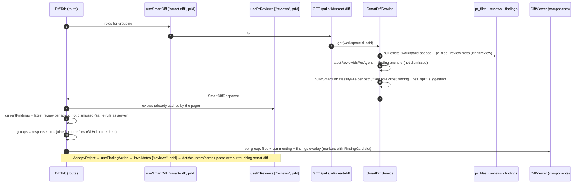

# Smart Diff — development plan

| Field | Value |
|---|---|
| Status | approved (2026-09-27) — user decisions: OQ1 hide dismissed; OQ2 **directory globs match at any depth** (changed from spec literal); OQ3 only `index.ts`/`index.js` are barrels; OQ4 keep "Reject". |
| Goal | On a PR's "Files changed" tab the reviewer sees files grouped by role (core → tests → wiring → docs → boilerplate, docs/boilerplate collapsed) with a Smart/Original order toggle, and sees the latest review's findings in the diff: "● N files with findings" per group, a red dot per file, and a severity-coloured line plus an inline FindingCard (Accept/Reject) under the flagged line. |
| Packages touched | server · client · e2e · shared (vendored, both copies) |

## 1. Context

### What exists today (verified)
- **Contract, unused.** `SmartDiffRole = z.enum(['core','wiring','boilerplate'])`, `SmartDiffFile {path, pseudocode_summary?, additions, deletions, finding_lines[]}`, `SmartDiffGroup`, `SmartDiff {groups, split_suggestion}` (`server/src/vendor/shared/contracts/brief.ts:80-113`, identical in `client/src/vendor/shared/contracts/brief.ts:80-113`); `SmartDiffResponse = SmartDiff` (`server/src/vendor/shared/contracts/review-api.ts:142-144`, same in the client copy). The only consumer is a contract test fixture (`server/test/contracts.test.ts:107-118`). Nothing switches on `SmartDiffRole`.
- **Module slot.** `server/src/modules/index.ts:24` names "intent/smart-diff" as a lesson module; registry at `:27-39`. No `modules/smart-diff/` exists.
- **Closest sibling module:** `intent` — thin route (`server/src/modules/intent/routes.ts:12-30`), plain-interface ports without ORM (`intent/ports.ts:35-74`), a repository that reads `pull_requests` workspace-scoped without owning it (`intent/repository.ts:15-49`), wired in the composition root with a `ContainerOverrides.<x>Repo` seam (`server/src/platform/container.ts:53-73`, `:165-195`).
- **PR files.** `pr_files (id uuid, pr_id, path, additions, deletions, patch)` — no position column (`server/src/db/schema/pulls.ts:36-45`). `GET /pulls/:id` refreshes them from GitHub by delete + insert in GitHub order (`server/src/modules/pulls/routes.ts:247-258`) and returns `detail.files`; offline it returns an unordered `select` (`pulls/routes.ts:286`).
- **Reviews/findings.** `reviewsForPull` returns every review newest-first by `created_at` (`server/src/modules/reviews/repository/review.repo.ts:57-74`); exposed as `GET /pulls/:id/reviews` (`server/src/modules/reviews/routes.ts:129-132`, `service.ts:160-174`). The PR list already uses **latest review per agent, union across agents** for its findings (`server/src/modules/pulls/routes.ts:156-193`). No indexes on `reviews.pr_id` / `findings.review_id` / `pr_files.pr_id` (`server/src/db/schema/reviews.ts` has no `index()`).
- **Client diff.** `DiffTab` builds `commenting: DiffCommentApi` and renders `<DiffViewer files commenting/>` under "Files changed · N files" with hard-coded English "Show/Hide comments" (`client/src/app/repos/[repoId]/pulls/[number]/_components/DiffTab/DiffTab.tsx:18-65`). `DiffViewer` maps files → `FileCard` **with `key={i}`** (`client/src/components/diff-viewer/DiffViewer/DiffViewer.tsx:27-29`). `FileCard` open state from `AUTO_EXPAND_MAX_LINES` (`FileCard.tsx:35-37`, `constants.ts:4` = 200), GitHub comment counter with `MessageSquare` (`FileCard.tsx:51-53`, `:67-74`). `CodeLine` renders threads/composer under a line (`CodeLine.tsx:12-84`). `parsePatch` (`helpers.ts:12-38`), `keysForLine` / `partitionThreads` keyed `${side}:${line}` (`comments.ts:63-106`). Public barrel exports only `DiffViewer` + `DiffCommentApi` (`diff-viewer/index.ts:3-4`). **Known drift:** `VersionDiffModal` imports `CodeLine` and `parsePatch` internals directly (`client/src/app/skills/[id]/_components/SkillEditor/_components/VersionsTab/_components/VersionDiffModal/VersionDiffModal.tsx:12-13`) and `src/test/smoke.test.tsx:27-45` renders `<DiffViewer files/>` — both must keep compiling unchanged.
- **Findings UI.** Route-scoped `FindingCard` (`.../_components/FindingCard/FindingCard.tsx:26-117`, props `f, focused?, defaultExpanded?, onAction?, pending?, repoFullName?, headSha?`); Accept/"Reject" labels (`client/messages/en/prReview.json:6-7`); wired in `FindingsPanel` via `useFindingAction` (`FindingsPanel/FindingsPanel.tsx:31,69-78`). Hooks: `usePrReviews` key `["reviews", prId]`, `useFindingAction` invalidates it (`client/src/lib/hooks/reviews.ts:51-57`, `:139-161`). Page derives `allFindings` from every review (`client/src/app/repos/[repoId]/pulls/[number]/page.tsx:72-78`) and renders `DiffTab` at `:167-174`.
- **Design tokens.** `SEV` (colour, bg, icon per severity) exported from `@devdigest/ui` (`client/src/vendor/ui/primitives/tokens.ts:6-14`, `primitives/index.ts:2`); `SeverityBadge` (`primitives/Badge.tsx:52-88`); CSS vars `--accent`, `--ok`, `--warn`, `--info`, `--text-secondary`, `--crit` (`client/src/vendor/ui/styles.css:17-35`). No segmented-control primitive (only `Toggle` boolean and underline `Tabs` in `vendor/ui/kit`).
- **i18n.** `prReview.smartDiff` block exists but is unused: `coreLabel "Core"`, `wiringLabel`, `boilerplateLabel`, `largeTitle`, `largeBody`, `filesCount`, `findingLines`, `groupedByRole` (`client/messages/en/prReview.json:63-72`); `shell.diffViewer.*` (`client/messages/en/shell.json:33-39`). Only the `en` locale exists.
- **Enforcement.** Depcruise: domain/constants/types are ring 1 and may not import ports/db/adapters/container (`server/.dependency-cruiser.cjs:36-40`, `:68-80`); container only from routes (`:106-115`); cross-module only via `index|ports|types.ts` (`:146-158`). Server `tsconfig` typechecks `src/**` only (`server/tsconfig.json:28`), so test files are compiled by vitest only. Zod serializer is installed (`server/src/app.ts:64-65`) but no module declares response schemas.
- **Seed / e2e.** PR #482 has 4 `pr_files` rows **without patches** and one agent-less review with findings on `src/config.ts:12` (CRITICAL) and `src/api/users.ts:45` (WARNING) (`server/src/db/seed.ts:272-354`). `e2e/specs/05-pr-diff.flow.json:10-12` clicks "Files changed" and waits for text `src/config.ts`. Flow 12 is reserved by the intent-layer plan (`docs/plans/intent-layer.md` U7); `e2e/specs/` currently ends at `11`.

INSIGHTS relied on: server 2026-09-27 (no `**/` inside `/** */` comments — TS2304), 2026-09-27 (ports may not import adapter interfaces), 2026-09-22 (plain row interfaces in `ports.ts`; no cross-module repository types), 2026-09-22 (seeded patches must be real hunks, verify with `parseUnifiedDiff`), 2026-09-21 (route tests need `MockAuthProvider`), 2026-09-19 (PR-list findings = latest review per agent); client 2026-09-20 (hooks call `api` directly), 2026-09-23 (vendored drift; e2e breaks on string changes; TS2742 in `styles.ts` — plain literals only), 2026-09-22 (`vendor/ui` is its own source).

### Data flow


### Decisions
1. **New server module `modules/smart-diff/`** (routes, service, ports, repository, constants, types, `domain/`, index), mirroring `intent`. *Rejected:* adding the route to flat `pulls/routes.ts` (direct `container.db` in routes, `pulls/routes.ts:225-317` — would grow known drift).
2. **Classifier is a pure ring-1 function** `classifyFile(path)` in `smart-diff/domain/classify-file.ts`; the glob lists and role order live in `smart-diff/constants.ts`; `smart-diff/index.ts` re-exports only pure symbols (`classifyFile`, `SMART_DIFF_ROLE_ORDER`, `SMART_DIFF_ROLE_GLOBS`, `buildSmartDiff`, types) and **never imports routes/service/repository**, so L08 can `import { classifyFile } from '../smart-diff/index.js'` without Fastify or Drizzle. *Rejected:* classifier in `@devdigest/shared` (a third hand-synced vendored edit; server-only need today).
3. **Hand-written glob → RegExp compiler** (`domain/path-glob.ts`), compiled once at module load, no dependency. Semantics in §3.3. *Rejected:* adding `picomatch` (dependency change = Wave 0 + lockfile; ~20 lines suffice); reusing intent's private `matchesGlob` (`intent/domain/references.ts:38`, cross-module internal + only two shapes).
4. **Rule order = first match wins: boilerplate → tests → wiring → docs → core.** Consequences recorded as test rows: `__tests__/__snapshots__/x.snap` → boilerplate, `.claude/skills/security/SKILL.md` → wiring, `e2e/README.md` → tests.
5. **Role display order = `SmartDiffRole` enum order** (`core, tests, wiring, docs, boilerplate`); `SMART_DIFF_ROLE_ORDER = SmartDiffRole.options` on the server, `SmartDiffRole.options` on the client. Empty groups omitted.
6. **"Current findings" = latest `kind='review'` review per agent (agent-less reviews share one bucket), union across agents, excluding dismissed findings** — identical to the PR-list rule (`pulls/routes.ts:156-193`). *Rejected:* single newest review overall (running agent B would hide agent A's findings); all reviews (re-running an agent would double every marker). Ties on `created_at` break by review id descending (deterministic).
7. **Client counters/overlay come from `usePrReviews`, grouping from the smart-diff route.** The client applies the same rule as Decision 6 in a pure helper, so Accept/Reject (`useFindingAction` invalidates `["reviews", prId]`, `reviews.ts:157-159`) updates dots, "● N", line bars and cards immediately with no extra request. The server's `finding_lines` implements the same rule (for API consumers / L08) but the UI does not render from it; parity is guaranteed by one rule written twice and tested on both sides. *Rejected:* rendering from server `finding_lines` (needs smart-diff invalidation on every finding action and run completion, and still lacks severity/title for the card).
8. **Dismissed ("Rejected") findings disappear from the diff** (no dot, no count, no bar, no card); they stay visible and reversible on the Agent runs tab. Accepted findings stay, rendered muted by the existing `FindingCard` (`FindingCard.tsx:50-52`). (Open question 1.)
9. **Order within a group = GitHub order from `pr.files`.** The client joins server roles onto `pr.files` by path and keeps `pr.files` order; any `pr.files` path missing from the response (race with a detail refresh that rewrote `pr_files`) falls into `core`. The server returns `pr_files` in read order (no position column; same query shape as `pulls/routes.ts:286`). *Rejected:* a `pr_files.position` migration (schema change for an order the client already has).
10. **diff-viewer stays agnostic of findings data**: `DiffViewer` gets an optional `findings?: DiffFindingOverlay` prop — markers `{id, path, line, severity, card: ReactNode}` where `card` is a slot filled by the route with its own `FindingCard` (frontend-ui-architecture: "cross the boundary with … `children` slots", `SKILL.md:125`). `FindingCard` stays route-scoped because both its consumers (FindingsPanel, DiffTab) are in the same route (rule 1: promote on a second *route*). diff-viewer may import `SEV`/`Icon` from `@devdigest/ui` and `Severity` from `@devdigest/shared` (vendor ← components). *Rejected:* promoting `FindingCard` to `src/components/` (moves 6 files for no second route); a `renderFinding()` function prop (reads as a render factory to `react-best-practices`).
11. **Line anchoring:** a marker anchors to the rendered `add`/`ctx` line whose `newNo === finding.start_line` (RIGHT side, same key space as `keysForLine`, `comments.ts:63-74`). Several findings on one line → bar/label use the most severe, cards stacked most-severe first. A finding whose line is not in the rendered patch (or the file has no patch — every seeded PR #482 file today) renders in a "Findings outside the changed lines" block at the end of the file body, like `OutdatedComments`; it still counts for the file dot and the group count.
12. **Line label text:** CRITICAL → "blocker", WARNING → "warning", SUGGESTION → "suggestion"; colour, background and icon from `SEV[severity]` (`tokens.ts:10-12`). File dot and "● N" use `var(--crit)` (red, no number on the file). No new palette.
13. **Group colours (existing tokens only):** core `var(--accent)`, tests `var(--ok)`, wiring `var(--warn)`, docs `var(--text-secondary)`, boilerplate `var(--info)`.
14. **Collapse defaults:** docs and boilerplate groups start collapsed, others expanded; files inside keep the `AUTO_EXPAND_MAX_LINES` rule unchanged. Files with findings are not force-expanded.
15. **Order toggle** is a small colocated `OrderToggle` (radiogroup of two buttons) inside `DiffTab/_components/`, state = local `useState('smart')` in `DiffTab` (not URL). *Rejected:* adding a `SegmentedControl` to `vendor/ui/kit` (single consumer; promote on the second). Switching order remounts file cards (their open state resets) — accepted.
16. **Header summary** "N files · +A −D" uses the PR totals (`pr.files_count`, `pr.additions`, `pr.deletions`) — matches the mock's "9 files · +247 −38" for PR #482. `DiffTab` props become `{ prId, pr, repoFullName }` (3 props instead of 4 → 8).
17. **Loading/error:** while smart-diff loads, grouped mode shows `Skeleton` rows; on error it shows an inline notice and renders Original order with the toggle disabled. Original order never waits for the route.
18. **`split_suggestion` minimal:** `too_big: false`, `total_lines = Σ(additions + deletions)` over `pr_files`, `proposed_splits: []`. `pseudocode_summary` omitted.
19. **Route returns the contract without a response schema**, following the sibling (`intent/routes.ts:17-20`); service return type is `SmartDiffResponse`.
20. **`DiffViewer` keys file cards by `path`**, not index (`DiffViewer.tsx:28`) — lists now reorder (react-best-practices, keys: CRITICAL).
21. **Seed extension (fresh DBs only):** inside the existing `if (!pr)` block of PR #482 add real patches and 4 more files (test, barrel, README, lock file) so e2e can assert grouping, collapse and an anchored "blocker" line deterministically.

### Open questions
Non-blocking — the plan proceeds with the default.
1. **Dismissed findings in the diff** — a) hide (default, Decision 8); b) keep the card muted but exclude it from dot/counters.
2. **RESOLVED (user, 2026-09-27): directory globs match at ANY depth** — the spec's `dist/**`, `build/**`, `docs/**`, `e2e/**`, `.github/**`, `.claude/**` are written as `**/dist/**` etc. in `SMART_DIFF_ROLE_GLOBS`, so `client/dist/a.js` → boilerplate, `server/docs/x.txt` → docs, `client/e2e/a.ts` → tests, `server/.claude/x.md` → wiring. Rationale: this repo is a multi-package monorepo (`client/`, `server/`, …) where root-only anchoring misses every package-level build/docs dir.
3. **Only `index.ts` / `index.js` are barrels** (spec literal): `index.tsx`, `index.mjs` → core. Default: keep.
4. **Button label** — the reused `FindingCard` says "Reject" for dismiss (`prReview.json:7`). Default: keep "Reject" (consistency with Agent runs).

## 2. Affected modules
| Package | Touched? | Why / what changes | Architecture rule that applies |
|---|---|---|---|
| server | yes | New `modules/smart-diff/` (constants, types, domain/{path-glob,classify-file,current-findings,build-smart-diff}, ports, repository, service, routes, index); `container.ts` getter + `smartDiffRepo` override; registry entry; seed extension | onion: routes ring 4 (thin, `getContext` → service); service ring 2 with `SmartDiffDeps` (no `Container`); domain/constants/types ring 1 (pure, no ports import); repository ring 3 is the only Drizzle file; other modules import only `smart-diff/index.ts`; depcruise baseline must not grow |
| client | yes | `lib/hooks/smart-diff.ts`; diff-viewer findings overlay (dot, line bar + label, card slot, unanchored block, path keys); route `DiffTab` rewrite + `_components/{SmartDiffHeader,RoleGroup,OrderToggle}`; `page.tsx` props; i18n | frontend-ui-architecture: data via hook → `api`; shared `components/diff-viewer` never imports `app/**`; feature UI in route `_components/<PascalCase>/` with `index.ts`; constants/helpers/styles files; next-intl strings |
| reviewer-core | no | — | grounding gate and `INJECTION_GUARD` untouched |
| e2e | yes | new `specs/13-smart-diff.flow.json`; README row; `05-pr-diff` must stay green | deterministic, seeded data, no LLM |
| shared (vendored) | yes | `contracts/brief.ts` `SmartDiffRole` line only, both copies | Wave 0 only, byte-identical block; pre-existing drift not resynced |

## 3. Contracts

### 3.1 `contracts/brief.ts` — both copies, replaces lines 81-82 only
```ts
/** File role in the Smart Diff. The enum ORDER is the display order (core first,
 *  boilerplate last) — consumers read `SmartDiffRole.options`; do not reorder. */
export const SmartDiffRole = z.enum(['core', 'tests', 'wiring', 'docs', 'boilerplate']);
export type SmartDiffRole = z.infer<typeof SmartDiffRole>;
```
`SmartDiffFile`, `SmartDiffGroup`, `ProposedSplit`, `SmartDiff`, `SmartDiffResponse` unchanged.

### 3.2 HTTP — `GET /pulls/:id/smart-diff` (module `smart-diff`)
| Params | Body | 200 | Errors (`ApiErrorBody`) |
|---|---|---|---|
| `IdParams` (`id` uuid, `server/src/modules/_shared/schemas.ts:11`) | — | `SmartDiffResponse` | 422 non-uuid id; 404 `not_found` when the PR is not in the caller's workspace |

Semantics:
- `groups` in `SMART_DIFF_ROLE_ORDER`, empty groups omitted; each file appears in exactly one group; files within a group keep `pr_files` read order.
- `SmartDiffFile = { path, additions, deletions, finding_lines }` — `finding_lines` = sorted ascending, de-duplicated `start_line` of current findings (Decision 6) whose `file === path`; `[]` when none. `pseudocode_summary` omitted.
- `split_suggestion = { too_big: false, total_lines: Σ(additions + deletions), proposed_splits: [] }`.
- Read-only; never calls a model; no rate-limit override (global limit applies).

Example (seeded PR #482 after U5's seed, fresh DB):
```json
{ "groups": [
    { "role": "core", "files": [
      { "path": "src/middleware/ratelimit.ts", "additions": 84, "deletions": 0, "finding_lines": [] },
      { "path": "src/config.ts", "additions": 4, "deletions": 0, "finding_lines": [12] } ] },
    { "role": "tests", "files": [ { "path": "src/middleware/ratelimit.test.ts", "...": "..." } ] },
    { "role": "wiring", "files": [ { "path": "src/index.ts", "...": "..." } ] },
    { "role": "docs", "files": [ { "path": "README.md", "...": "..." } ] },
    { "role": "boilerplate", "files": [ { "path": "pnpm-lock.yaml", "...": "..." } ] } ],
  "split_suggestion": { "too_big": false, "total_lines": "<Σ additions+deletions of all pr_files>", "proposed_splits": [] } }
```
(`"..."` / `"<…>"` are placeholders, not literal values.)

### 3.3 Classification rules (`server/src/modules/smart-diff/constants.ts`)
```ts
import { SmartDiffRole } from '@devdigest/shared';

export const SMART_DIFF_ROLE_ORDER: readonly SmartDiffRole[] = SmartDiffRole.options;
export const DEFAULT_SMART_DIFF_ROLE: SmartDiffRole = 'core';

/** First match wins, in this array order. `core` = no match. */
export const SMART_DIFF_ROLE_GLOBS: readonly { role: Exclude<SmartDiffRole, 'core'>; globs: readonly string[] }[] = [
  { role: 'boilerplate', globs: ['*.lock', 'pnpm-lock.yaml', 'package-lock.json', 'yarn.lock', '**/dist/**', '**/build/**',
                                 '**/__snapshots__/**', '*.snap', '*.generated.*', '*.min.js'] },
  { role: 'tests',       globs: ['**/*.test.ts', '**/*.test.tsx', '**/*.it.test.ts', '**/*.spec.ts',
                                 '**/test/**', '**/tests/**', '**/__tests__/**', '**/e2e/**'] },
  { role: 'wiring',      globs: ['**/index.ts', '**/index.js', '*.config.*', 'tsconfig*.json', '.eslintrc*', '.env*',
                                 'docker-compose*.yml', '**/.github/**', '**/.claude/**'] },
  { role: 'docs',        globs: ['**/*.md', '**/docs/**', 'README*', 'CHANGELOG*', 'LICENSE'] },
];
```
Glob semantics (`domain/path-glob.ts`, `globToRegExp(glob): RegExp`):
- Input path normalised first: `\` → `/`, leading `./` and `/` stripped.
- A glob **without** `/` matches the **basename** at any depth (`*.lock` matches `Cargo.lock` and `server/Cargo.lock`).
- A glob **with** `/` is anchored at the repo root; `**/` = zero or more leading directories; a trailing `/**` = anything below that directory; `*` = any run of non-`/` characters; every other character is literal (regex-escaped).
- Case-insensitive (`i` flag). Regexes compiled once at module load; no backtracking-prone constructs beyond `[^/]*` and `(?:.*/)?`.
- **Never write a glob containing `**/` inside a `/** … */` block comment** (server INSIGHTS 2026-09-27) — refer to `SMART_DIFF_ROLE_GLOBS` by name.

```ts
// domain/classify-file.ts — Wave 0 creates this signature as a stub returning 'core'
export function classifyFile(path: string): SmartDiffRole;
```

Required table rows (U1 writes, U2 must turn green without editing them):
| Path | Role | Why recorded |
|---|---|---|
| `pnpm-lock.yaml`, `client/pnpm-lock.yaml`, `package-lock.json`, `yarn.lock`, `Cargo.lock` | boilerplate | lock files at any depth |
| `dist/index.js` | boilerplate | boilerplate beats the `index.js` barrel |
| `build/app.js` | boilerplate | |
| `__tests__/__snapshots__/x.snap` | boilerplate | **required** — snapshots beat tests |
| `src/__snapshots__/a.test.ts.snap` | boilerplate | |
| `src/api.generated.ts`, `public/vendor.min.js` | boilerplate | |
| `server/test/foo.test.ts`, `client/src/A.test.tsx`, `server/test/x.it.test.ts`, `src/a.spec.ts` | tests | |
| `test/helpers/pg.ts`, `src/tests/util.ts`, `src/__tests__/util.ts` | tests | `**/` = zero or more dirs |
| `e2e/specs/05-pr-diff.flow.json` | tests | |
| `e2e/README.md` | tests | **required** — tests beat docs; comment in the test records the decision |
| `client/src/components/diff-viewer/index.ts`, `lib/index.js` | wiring | barrels |
| `vitest.config.ts`, `client/next.config.mjs`, `tsconfig.json`, `server/tsconfig.build.json`, `.eslintrc.cjs`, `.env.example`, `docker-compose.yml`, `docker-compose.test.yml`, `.github/workflows/ci.yml` | wiring | |
| `.claude/skills/security/SKILL.md` | wiring | **required** — wiring beats docs |
| `docs/plans/smart-diff.md`, `docs/diagram.png`, `README.md`, `server/README.md`, `README`, `readme.md`, `CHANGELOG.md`, `LICENSE` | docs | case-insensitive |
| `server/src/modules/pulls/routes.ts`, `src/config.ts`, `server/src/db/migrations/0001_x.sql`, `package.json`, `src/testing/x.ts` | core | `config.ts` has no `.config.` part; `testing` ≠ `test` |
| `src/index.tsx` | core | Open question 3 (only `index.ts`/`index.js` are barrels) |
| `client/dist/a.js`, `server/build/x.js` | boilerplate | OQ2 resolved: directory globs at any depth |
| `server/docs/x.txt` | docs | OQ2 resolved |
| `client/e2e/a.ts` | tests | OQ2 resolved |
| `server/.claude/x.md` | wiring | OQ2 resolved (wiring beats docs) |
| `server\test\a.test.ts` | tests | backslashes normalised |
Plus: `SMART_DIFF_ROLE_ORDER` equals `['core','tests','wiring','docs','boilerplate']`.

### 3.4 Server module types and ports
```ts
// smart-diff/types.ts (ring 1)
export interface SmartDiffSourceFile { path: string; additions: number; deletions: number }
export interface SmartDiffFindingRef { file: string; startLine: number }
export interface ReviewMeta { id: string; agentId: string | null; createdAt: Date }

// smart-diff/domain/current-findings.ts
/** Latest review per agent (null agent = one bucket); ties → larger id wins. Order of result irrelevant. */
export function latestReviewIdsPerAgent(reviews: ReviewMeta[]): string[];

// smart-diff/domain/build-smart-diff.ts
export function buildSmartDiff(files: SmartDiffSourceFile[], findings: SmartDiffFindingRef[]): SmartDiff;

// smart-diff/ports.ts (ring 2; plain interfaces, imports only ./types.js and @devdigest/shared)
export interface FindingAnchorRow { reviewId: string; file: string; startLine: number; dismissedAt: Date | null }
export interface SmartDiffRepositoryPort {
  /** Workspace-scoped existence check on pull_requests. */
  pullExists(workspaceId: string, prId: string): Promise<boolean>;
  listPrFiles(prId: string): Promise<SmartDiffSourceFile[]>;
  /** kind = 'review' only. */
  listReviewMeta(prId: string): Promise<ReviewMeta[]>;
  /** [] for an empty id list, without querying. */
  listFindingAnchors(reviewIds: string[]): Promise<FindingAnchorRow[]>;
}
export interface SmartDiffDeps { smartDiff: SmartDiffRepositoryPort }

// smart-diff/service.ts
export class SmartDiffService {
  constructor(deps: SmartDiffDeps);
  /** Throws NotFoundError when the PR is not in the workspace. */
  get(workspaceId: string, prId: string): Promise<SmartDiffResponse>;
}

// platform/container.ts
//   ContainerOverrides.smartDiffRepo?: SmartDiffRepositoryPort
//   get smartDiffService(): SmartDiffService   // new SmartDiffService({ smartDiff: overrides.smartDiffRepo ?? new SmartDiffRepository(db) })
```

### 3.5 Client contracts
```ts
// client/src/lib/hooks/smart-diff.ts
export const smartDiffKey = (prId: string) => ["smart-diff", prId] as const;
export function useSmartDiff(prId: string | null | undefined): UseQueryResult<SmartDiffResponse>; // api.get(`/pulls/${prId}/smart-diff`), enabled: !!prId

// client/src/components/diff-viewer/findings.ts  (exported types via diff-viewer/index.ts)
import type { ReactNode } from "react";
import type { Severity } from "@devdigest/shared";
export interface DiffFindingMarker {
  id: string;
  path: string;
  /** New-side (RIGHT) line = Finding.start_line. */
  line: number;
  severity: Severity;
  /** Rendered card for this finding — a slot the caller fills (e.g. the route's FindingCard). */
  card: ReactNode;
}
export interface DiffFindingOverlay { markers: DiffFindingMarker[] }

// DiffViewer props become: { files: PrFile[]; commenting?: DiffCommentApi; findings?: DiffFindingOverlay }
// FileCard / CodeLine gain OPTIONAL props only (VersionDiffModal + smoke test keep compiling unchanged).
```
Route `DiffTab` props: `{ prId: string | null; pr: PrDetail; repoFullName: string | null }`.

### 3.6 UI strings (Wave 0; asserted by U4 tests and U5 flow)
`client/messages/en/prReview.json` → `smartDiff` (existing keys kept; `coreLabel` value changes — it has no consumer today):
| Key | Value |
|---|---|
| `coreLabel` | `Core logic` |
| `testsLabel` (new) | `Tests` |
| `wiringLabel` | `Wiring` (unchanged) |
| `docsLabel` (new) | `Docs` |
| `boilerplateLabel` | `Boilerplate` (unchanged) |
| `coreDescription` | `The substance of the change — review closely` |
| `testsDescription` | `Checks that the change works as intended` |
| `wiringDescription` | `Hooks the core into the app` |
| `docsDescription` | `Explains the change — read for context` |
| `boilerplateDescription` | `Generated / mechanical — skim` |
| `eyebrow` | `Reviewer-ordered diff` |
| `summary` | `{files} files · +{additions} −{deletions}` |
| `orderLabel` | `Diff order` |
| `smartOrder` | `Smart order` |
| `originalOrder` | `Original order` |
| `filesWithFindings` | `{count, plural, one {# file} other {# files}} with findings` |
| `loadError` | `Couldn’t group files by role — showing the original order.` |
| `showComments` | `Show comments ({count})` |
| `hideComments` | `Hide comments ({count})` |
`filesCount` (`{count} files`) is reused for the group file count.

`client/messages/en/shell.json` → `diffViewer` (new keys):
| Key | Value |
|---|---|
| `hasFindings` | `Has review findings` |
| `lineLabel.blocker` | `blocker` |
| `lineLabel.warning` | `warning` |
| `lineLabel.suggestion` | `suggestion` |
| `findingsOutsideDiff` | `Findings outside the changed lines` |

## 4. Work units

### U0 — Contract, i18n, classifier stub (orchestrator)
| Field | Value |
|---|---|
| Kind | backend + ui (contracts) |
| Wave | 0 |
| Depends on | none |
| Owns (create/modify) | `server/src/vendor/shared/contracts/brief.ts`, `client/src/vendor/shared/contracts/brief.ts` (lines 81-82 only); `server/test/contracts.test.ts` (SmartDiff fixture); `client/messages/en/prReview.json`; `client/messages/en/shell.json`; new `server/src/modules/smart-diff/domain/classify-file.ts` (stub) |
| Must not touch | any other vendored block (pre-existing drift stays); `server/src/modules/index.ts`; `container.ts` |
| Consumes | none |
| Produces | §3.1, §3.6, `classifyFile` signature (§3.3) |
| Checks | server `pnpm typecheck · pnpm exec vitest run test/contracts.test.ts`; client `pnpm typecheck · pnpm test` |

**Steps**
1. Replace the `SmartDiffRole` lines in both `brief.ts` copies with §3.1, byte-identical.
2. `contracts.test.ts:107-118`: add a `tests` group to the fixture and assert `SmartDiffRole.options` equals `['core','tests','wiring','docs','boilerplate']`.
3. Add the §3.6 keys (and change `coreLabel`) in `prReview.json` and `shell.json`; keep every existing key.
4. Create `smart-diff/domain/classify-file.ts`: `export function classifyFile(path: string): SmartDiffRole { void path; return 'core'; }` with a one-line comment "stub — implemented by U2 (docs/plans/smart-diff.md)". Only `import type { SmartDiffRole } from '@devdigest/shared'`.
5. Commit Wave 0.

**Acceptance criteria**
- [ ] `git diff` of the two `brief.ts` files shows the identical hunk; no other vendored line changed.
- [ ] server + client typecheck green; `contracts.test.ts` green; client suite green.
- [ ] `rg "coreLabel|testsLabel|lineLabel" client/messages/en` shows the new keys.

### U1 — Classifier table test (test-writer, `mode: tdd`)
| Field | Value |
|---|---|
| Kind | backend (test only) |
| Wave | 1 |
| Depends on | U0 |
| Owns (create/modify) | `server/test/smart-diff-classify.test.ts` |
| Must not touch | anything under `server/src/**` (the stub is U0's, the implementation U2's) |
| Consumes | §3.3 (`classifyFile`, `SMART_DIFF_ROLE_ORDER` — the latter will not resolve until U2; see Steps) |
| Produces | the red table test U2 must turn green |
| Checks | `cd server && pnpm exec vitest run test/smart-diff-classify.test.ts` → **fails for the right reason** (role assertions) · `pnpm typecheck` green |

**Steps**
1. Table-driven `it.each` over every row of §3.3 (path, expected role, short reason in the row), importing `classifyFile` from `../src/modules/smart-diff/domain/classify-file.js`.
2. Put the three **required** rows first, each with a comment stating the first-match decision (`e2e/README.md` → tests: "tests are matched before docs — decided in docs/plans/smart-diff.md §3.3").
3. Do **not** import `SMART_DIFF_ROLE_ORDER` (U2 creates `constants.ts`; importing it now would fail on a missing module, not on an assertion). The role-order assertion is U0's (contract) and U2's (domain test).
4. Run it: all non-`core` rows must fail on the assertion; `core` rows pass against the stub.

**Acceptance criteria**
- [ ] Every §3.3 row present exactly once; test titles name the path and role.
- [ ] Failure is an assertion failure (`expected 'core' to be 'boilerplate'`), not an import/syntax error.
- [ ] No production file changed.

### U2 — Server: `smart-diff` module (classifier, domain, route, wiring)
| Field | Value |
|---|---|
| Kind | backend |
| Wave | 2 |
| Depends on | U0, U1 |
| Owns (create/modify) | `server/src/modules/smart-diff/{constants,types,ports,repository,service,routes,index}.ts`; `server/src/modules/smart-diff/domain/{path-glob,classify-file,current-findings,build-smart-diff}.ts` (`classify-file.ts` replaces U0's stub body); `server/src/platform/container.ts`; `server/src/modules/index.ts`; `server/test/smart-diff-domain.test.ts`; `server/test/smart-diff-service.test.ts`; `server/test/smart-diff-routes.test.ts`; `server/test/helpers/smart-diff-fakes.ts`; `server/test/smart-diff.it.test.ts` |
| Must not touch | `server/test/smart-diff-classify.test.ts` (U1 — if a row is wrong, report `BLOCKED:`); `modules/reviews/**`, `modules/pulls/**`, `modules/intent/**`; `src/db/**` (no migration); vendored shared; `.dependency-cruiser-known-violations.json` |
| Consumes | §3.1, §3.2, §3.3, §3.4 |
| Produces | `GET /pulls/:id/smart-diff`; `container.smartDiffService`; `ContainerOverrides.smartDiffRepo`; `classifyFile` + `SMART_DIFF_ROLE_ORDER` via `smart-diff/index.ts` |
| Checks | `cd server && pnpm typecheck · pnpm exec vitest run test/smart-diff-classify.test.ts test/smart-diff-domain.test.ts test/smart-diff-service.test.ts test/smart-diff-routes.test.ts test/contracts.test.ts · pnpm exec vitest run test/smart-diff.it.test.ts (Docker) · pnpm exec depcruise src --config .dependency-cruiser.cjs --ignore-known` |

**Steps**
1. `constants.ts` exactly §3.3. `types.ts` §3.4 types (plain interfaces, no zod needed).
2. `domain/path-glob.ts`: `normalizePath(path)` and `globToRegExp(glob)` per §3.3 semantics; `domain/classify-file.ts`: precompiled `{role, regexes}` list from `SMART_DIFF_ROLE_GLOBS`, first match wins, else `DEFAULT_SMART_DIFF_ROLE`. No comment may spell a `**/` glob inside `/** */`.
3. `domain/current-findings.ts`: `latestReviewIdsPerAgent` (Decision 6). `domain/build-smart-diff.ts`: classify, bucket by role, emit in `SMART_DIFF_ROLE_ORDER` skipping empty groups, keep input order inside a group, `finding_lines` per path (dedupe, sort asc), `split_suggestion` per Decision 18. Domain files import only `../constants.js`, `../types.js`, `./*.js`, `@devdigest/shared` types.
4. `ports.ts` §3.4 (imports `./types.js` + `@devdigest/shared` only — no row types, no adapters).
5. `repository.ts` `SmartDiffRepository implements SmartDiffRepositoryPort` over `db/schema`: `pullExists` = `pull_requests` where `workspace_id` AND `id`; `listPrFiles` selects `path, additions, deletions` for `pr_id` (no `ORDER BY`, same shape as `pulls/routes.ts:286`; do not select `patch`); `listReviewMeta` selects `id, agent_id, created_at` where `pr_id` and `kind = 'review'`; `listFindingAnchors` selects `review_id, file, start_line, dismissed_at` with `inArray` (return `[]` early for no ids). Returns plain port types.
6. `service.ts`: `pullExists` → `NotFoundError('Pull request not found')`; `Promise.all([listPrFiles, listReviewMeta])`; ids → anchors; drop `dismissedAt != null`; `buildSmartDiff`. Imports only its ports/domain/types and `platform/errors`.
7. `routes.ts`: `app.get('/pulls/:id/smart-diff', { schema: { params: IdParams } }, …)` → `getContext` → `container.smartDiffService.get(workspaceId, req.params.id)`; header comment lists the endpoint.
8. `index.ts`: re-export `classifyFile`, `SMART_DIFF_ROLE_ORDER`, `SMART_DIFF_ROLE_GLOBS`, `buildSmartDiff`, `latestReviewIdsPerAgent`, types — **not** routes/service/repository.
9. `container.ts`: `smartDiffRepo` override + lazy `smartDiffService` getter (§3.4). `modules/index.ts`: `import smartDiff from './smart-diff/routes.js'` + registry entry.
10. Tests:
    - `smart-diff-domain.test.ts` (pure, table-driven): role order; mixed files → groups in order, empty omitted, input order kept inside a group; 2 findings on one line + 1 on another → `finding_lines` `[12, 40]` deduped/sorted; finding on a path not in the PR ignored; `total_lines`; `latestReviewIdsPerAgent` (agent A old+new → new only; agent B kept; two agent-less reviews → newest; equal `createdAt` → larger id).
    - `smart-diff-service.test.ts` with `InMemorySmartDiffRepo` (`test/helpers/smart-diff-fakes.ts`, pattern `test/helpers/conventions-fakes.ts`): dismissed excluded; superseded review's findings excluded; unknown PR → `NotFoundError`; zero reviews → all `finding_lines: []` and `listFindingAnchors` not needed.
    - `smart-diff-routes.test.ts` (pattern `test/conventions-routes.test.ts:13-23`): `buildApp({ config, overrides: { auth: new MockAuthProvider(), smartDiffRepo } })`; 200 body parses with `SmartDiffResponse` and has the expected role order; 404 for a PR outside the workspace; 422 for `not-a-uuid`.
    - `smart-diff.it.test.ts` (Docker, `test/helpers/pg.ts`): repository returns only `kind='review'` meta, workspace scoping of `pullExists`, anchors for given ids with `dismissed_at`.

**Acceptance criteria**
- [ ] U1's table test green without edits; domain/service/route tests green.
- [ ] `GET /pulls/<seeded 482>/smart-diff` returns groups in fixed order, no empty groups, and `finding_lines` from the latest review per agent only, excluding dismissed.
- [ ] A PR id from another workspace → 404 (no data leak); non-uuid → 422.
- [ ] `rg "drizzle-orm|db/schema" server/src/modules/smart-diff` matches only `repository.ts`; `smart-diff/index.ts` imports no routes/service/repository.
- [ ] Depcruise green with `--ignore-known`; baseline file unchanged.

### U3 — Client: smart-diff hook + diff-viewer findings overlay
| Field | Value |
|---|---|
| Kind | ui |
| Wave | 1 |
| Depends on | U0 |
| Owns (create/modify) | `client/src/lib/hooks/smart-diff.ts`; `client/src/components/diff-viewer/findings.ts`, `findings.test.ts`, `constants.ts`, `styles.ts`, `index.ts`; `diff-viewer/DiffViewer/DiffViewer.tsx`; `diff-viewer/FileCard/FileCard.tsx`, `diff-viewer/FileCard/FileCard.test.tsx`; `diff-viewer/CodeLine/CodeLine.tsx`; new `diff-viewer/UnanchoredFindings/{UnanchoredFindings.tsx,index.ts}` |
| Must not touch | `client/src/app/**` (incl. `DiffTab`, `FindingCard`, `VersionDiffModal`); `client/src/lib/api.ts`, `client/src/lib/hooks/index.ts`, `client/src/lib/hooks/reviews.ts`; `client/messages/**`; `client/src/vendor/**`; `client/src/test/smoke.test.tsx` |
| Consumes | §3.1, §3.5, §3.6 (`shell.diffViewer.*`) |
| Produces | `useSmartDiff`, `smartDiffKey`; `DiffViewer` `findings` prop + `DiffFindingOverlay`/`DiffFindingMarker` types exported from `@/components/diff-viewer` |
| Checks | `cd client && pnpm typecheck · pnpm exec vitest run src/components/diff-viewer src/test/smoke.test.tsx` |

**Steps**
1. `lib/hooks/smart-diff.ts` per §3.5, pattern `client/src/lib/hooks/intent.ts:13-23` (`api.get`, `enabled: !!prId`).
2. `findings.ts`: §3.5 types + pure helpers — `markersForPath(overlay, path)`, `anchorMarkers(markers, renderedRightLines: Set<number>) → { byLine: Map<number, DiffFindingMarker[]>, unanchored: DiffFindingMarker[] }` (each list sorted most severe first, then id), `worstSeverity(markers)`. `constants.ts`: `SEVERITY_RANK` and `LINE_LABEL_KEY: Record<Severity, 'blocker' | 'warning' | 'suggestion'>`.
3. `DiffViewer`: accept `findings?`, pass to each `FileCard`; key file cards by `f.path` (Decision 20).
4. `FileCard`: markers for its path; when non-empty render a red dot (`var(--crit)`, `role="img"`, `aria-label`/`title` = `t("diffViewer.hasFindings")`) right after the path, before the +/− stat and distinct from the `MessageSquare` counter; compute rendered RIGHT lines from `lines` (`add`/`ctx` with `newNo`) → `anchorMarkers`; pass `markers` for `ln.newNo` to `CodeLine`; render `UnanchoredFindings` (title `diffViewer.findingsOutsideDiff`, each `marker.card`) at the end of the body when any. Open-state rule unchanged.
5. `CodeLine`: optional `markers?: DiffFindingMarker[]`; when non-empty the row gets a 3px left bar in `SEV[worst].c` and a right-aligned pill (`SEV[worst].bg`/`.c`, `Icon[SEV[worst].icon]`, text `t("diffViewer.lineLabel.<key>")`); below the row render each `marker.card` in an indented rail with a left border in its severity colour (pattern `cs.thread`, `comments.ts:133-138`). Existing comment/composer behaviour untouched; all new props optional.
6. Styles: new entries in `diff-viewer/styles.ts` (or `UnanchoredFindings` inline-free) as plain literals or style functions returning `CSSProperties` — no spreading of typed objects into `s` (client INSIGHTS TS2742).
7. `index.ts`: also `export type { DiffFindingOverlay, DiffFindingMarker } from "./findings"`.
8. Tests: `findings.test.ts` (anchoring, unanchored, worst-severity ordering); `FileCard.test.tsx` rendering `DiffViewer` with `NextIntlClientProvider` + real `shell.json` (pattern `src/test/smoke.test.tsx:36-44`): a file with a CRITICAL marker on RIGHT line 3 shows the dot (by accessible name), the "blocker" label, and the slot content (`<div>card-f1</div>`) after the line text; a marker on a line outside the patch appears under "Findings outside the changed lines"; a file without markers has no dot; existing comment counter still renders independently.

**Acceptance criteria**
- [ ] `DiffViewer` without `findings` renders exactly as before (smoke test unchanged and green; `VersionDiffModal` compiles).
- [ ] Dot has an accessible name and no number; label texts come from `shell.json`; colours/icons only from `SEV`.
- [ ] Nothing under `components/diff-viewer` imports from `@/app` or `../../app`.
- [ ] Typecheck clean.

### U4 — Client: Smart Diff tab (grouping, toggle, overlay wiring)
| Field | Value |
|---|---|
| Kind | ui |
| Wave | 2 |
| Depends on | U0, U3 |
| Owns (create/modify) | `client/src/app/repos/[repoId]/pulls/[number]/_components/DiffTab/{DiffTab.tsx,helpers.ts,helpers.test.ts,constants.ts,styles.ts,DiffTab.test.tsx}` (`index.ts` unchanged); `.../DiffTab/_components/SmartDiffHeader/{SmartDiffHeader.tsx,index.ts,styles.ts}`; `.../DiffTab/_components/RoleGroup/{RoleGroup.tsx,index.ts,styles.ts}`; `.../DiffTab/_components/OrderToggle/{OrderToggle.tsx,index.ts,styles.ts}`; `client/src/app/repos/[repoId]/pulls/[number]/page.tsx` |
| Must not touch | `client/src/components/diff-viewer/**` (U3 — `BLOCKED:` if the overlay API is insufficient); `FindingCard/**`, `FindingsPanel/**`; `client/src/lib/**`; `client/messages/**`; `client/src/vendor/**` |
| Consumes | §3.1, §3.5, §3.6; `usePrReviews`, `useFindingAction`, `usePrComments`, `useCreatePrComment` (`lib/hooks/reviews.ts`); `useSmartDiff` (U3); `FindingCard` (same route) |
| Produces | the user-visible Smart Diff |
| Checks | `cd client && pnpm typecheck · pnpm exec vitest run "src/app/repos/[repoId]/pulls/[number]/_components/DiffTab" · pnpm test` |

**Steps**
1. `helpers.ts` (pure, no React): `currentFindings(reviews: ReviewRecord[]): FindingRecord[]` — `kind === 'review'`, first review per `agent_id` in the given newest-first order (null = one bucket), flatten, drop `dismissed_at != null` (Decisions 6, 8); `buildRoleGroups(files: PrFile[], smartDiff: SmartDiffResponse): { role, files: PrFile[] }[]` — role per path from the response, `pr.files` order, unknown path → `core`, order `SmartDiffRole.options`, empty omitted (Decision 9); `pathsWithFindings(findings): Set<string>`; `countFlaggedFiles(files, paths): number`. `helpers.test.ts` covers each (incl. superseded review, dismissed, agent-less bucket, unknown path → core, "2 findings in one file + 1 in another = 2").
2. `constants.ts`: `ROLE_META: Record<SmartDiffRole, { labelKey; descriptionKey; color; defaultOpen }>` (colours Decision 13; `defaultOpen` false for docs/boilerplate), `DEFAULT_ORDER = "smart"`.
3. `DiffTab.tsx` (container, `'use client'`, props §3.5): existing commenting wiring kept (strings via `smartDiff.showComments/hideComments`); `useSmartDiff(prId)`, `usePrReviews(prId)` (same key as the page → cache hit), `useFindingAction()`; build `DiffFindingOverlay` markers from `currentFindings` restricted to `pr.files` paths, each `card: <FindingCard key={f.id} f={f} defaultExpanded pending={action.isPending} repoFullName={repoFullName} headSha={pr.head_sha} onAction={(a) => action.mutate({ findingId: f.id, action: a, prId })} />`; `order` state; render `SmartDiffHeader` then either `RoleGroup` per group (smart, when data ready), `Skeleton`s (loading), or inline notice + flat `<DiffViewer files={pr.files} commenting findings />` (error or Original order). Keep ≤ 200 lines; logic in helpers.
4. `SmartDiffHeader`: `SectionLabel` icon `Code` with the eyebrow; right side: summary (`smartDiff.summary` with `pr.files_count`, `pr.additions`, `pr.deletions`), `OrderToggle`, comments button (when any comments).
5. `OrderToggle`: `role="radiogroup"` (`aria-label` = `orderLabel`) with two `role="radio"` buttons (`aria-checked`), pill styling from tokens; `disabled` prop.
6. `RoleGroup` (props: role, files, flaggedCount, commenting, findings): header is a `<button aria-expanded aria-controls>` with chevron, 10px square in `ROLE_META.color`, bold label, muted description, right side `● N` (`var(--crit)`, `aria-label` = `filesWithFindings`, shown only when N > 0) **then** `filesCount`; body `<DiffViewer files findings commenting />` when open; open state local, default `ROLE_META.defaultOpen`.
7. `page.tsx`: `<DiffTab prId={prId} pr={pr} repoFullName={repoFullName} />` — nothing else changes.
8. `DiffTab.test.tsx` (mock `@/lib/hooks/reviews` and `@/lib/hooks/smart-diff` with `vi.mock`, real `prReview.json` + `shell.json` in `NextIntlClientProvider`, pattern `client/src/app/skills/_components/SkillsListView/SkillsListView.test.tsx:51-54`):
   - Smart order: group labels appear in order Core logic → Tests → Wiring → Docs → Boilerplate with file counts; `pnpm-lock.yaml` and `README.md` paths are not rendered until their group header is clicked; core file paths are rendered; core group shows `● 2`-equivalent accessible name "2 files with findings" for 3 findings in 2 files; a dismissed finding and a superseded review's finding add nothing.
   - Finding in the diff: the CRITICAL finding's title renders under its line with a "blocker" label; clicking "Reject" calls the mocked `mutate` with `{ findingId, action: "dismiss", prId }`.
   - Toggle: choosing "Original order" renders files in `pr.files` order with no group headers and the file dot still present.
   - Error: smart-diff `isError` → `loadError` notice, files in original order, toggle disabled.

**Acceptance criteria**
- [ ] P1 behaviours of the Goal are visible in the tests above (order, labels, counts, collapse defaults, "● N" = flagged files, dot, line label, inline card, Accept/Reject wiring, toggle).
- [ ] No user-visible literal outside `messages/en/*.json`; no import from another route; `page.tsx` stays wiring only.
- [ ] Existing client suite green (incl. `FindingCard.test.tsx`, `FindingsPanel.test.tsx`, smoke test); typecheck clean.

### U5 — e2e: seeded roles + Smart Diff flow
| Field | Value |
|---|---|
| Kind | e2e |
| Wave | 3 |
| Depends on | U2, U4 |
| Owns (create/modify) | `server/src/db/seed.ts` (PR #482 `if (!pr)` block only); `e2e/specs/13-smart-diff.flow.json`; `e2e/specs/README.md`; `e2e/README.md` (coverage row, if it has one) |
| Must not touch | flows 01–11; `e2e/run.ts`; seeded review/findings values; intent seed block; client/server source other than `seed.ts` |
| Consumes | §3.2, §3.6 |
| Produces | deterministic grouped fixture; flow 13 |
| Checks | server `pnpm typecheck · pnpm exec vitest run --exclude '**/*.it.test.ts'`; seed on a fresh DB (`pnpm db:migrate && pnpm db:seed`); e2e `npm run typecheck · npm run e2e:hermetic` (Linux/CI — Windows cannot spawn agent-browser, e2e INSIGHTS 2026-09-22) |

**Steps**
1. `seed.ts` PR #482 `pr_files`: add real unified-diff `patch` hunks; for `src/config.ts` the new-side line 12 must be an **added** line (additions stays 4), with no string literal that looks like a secret (write e.g. `stripeKey: STRIPE_LIVE_KEY,`). Add rows `src/middleware/ratelimit.test.ts`, `src/index.ts`, `README.md`, `pnpm-lock.yaml` with small real patches. Leave `filesCount: 9` and the review/findings untouched. Verify each patch with `parseUnifiedDiff` (server INSIGHTS 2026-09-22) and that `src/config.ts` line 12 is on the RIGHT side.
2. Before editing, `rg "prFiles|files" server/test/*.it.test.ts e2e/specs` to confirm no test counts PR #482's files; report any hit.
3. Flow 13: open `{BASE}/` → wait `/pulls` → click "Add rate limiting to public API endpoints" → wait `/pulls/482` → networkidle → click button "Files changed" → wait `tab=diff` → wait text "Smart order" → "Core logic" → "Wiring" → "Boilerplate" → "blocker" → "Hardcoded Stripe secret key in commit" → click text "Boilerplate" → wait text "pnpm-lock.yaml" → click radio "Original order" → wait text "src/config.ts".
4. Add the flow row to `e2e/specs/README.md` (and the coverage table in `e2e/README.md` if present).

**Acceptance criteria**
- [ ] Hermetic run: flow 13 passes; flows 01–11 (incl. `05-pr-diff`) unchanged and green.
- [ ] `GET /pulls/<482>/smart-diff` on a fresh seed returns all five roles and `finding_lines: [12]` for `src/config.ts`.
- [ ] Existing dev DBs are untouched by re-seeding (guard unchanged).

## 5. Waves (execution order)
| Wave | Units | Runs | Why this order |
|---|---|---|---|
| 0 | U0 | sequential, orchestrator | contract enum (both copies), i18n keys, classifier signature stub — everything else compiles against them |
| 1 | U1 (test-writer, tdd) ∥ U3 | parallel | U1 writes the red classifier table before any implementation (TDD); U3 is client-only and needs only Wave 0. The orchestrator may run U3 in Wave 2 instead if it wants the strict "tests first, then all implementers" sequence — ownership stays disjoint either way |
| 2 | U2 ∥ U4 | parallel | U2 turns U1 green; U4 needs U3's overlay API + hook; client tests mock the API so U4 does not need U2 |
| 3 | U5 | single | the flow exercises U2's route and U4's UI; seed patches serve the flow |

After each wave commit: `plan-verifier` ∥ `architecture-reviewer`. After Wave 3: `doc-writer`, then `/pr-self-review`.

Ownership check: Wave 1 — U1 `server/test/smart-diff-classify.test.ts`; U3 `client/src/lib/hooks/smart-diff.ts` + `client/src/components/diff-viewer/**`. Wave 2 — U2 `server/src/modules/smart-diff/**`, `container.ts`, `modules/index.ts`, `server/test/smart-diff-*` (except U1's file), `test/helpers/smart-diff-fakes.ts`; U4 `…/[number]/_components/DiffTab/**` + `…/[number]/page.tsx`. Wave 3 — U5 `seed.ts` + `e2e/**`. No overlap. Serialized files: `modules/index.ts` + `container.ts` → U2 only; `client/messages/en/*.json` + `**/src/vendor/shared/**` → U0 only; `client/src/lib/api.ts` untouched; no migration; no unit edits `INSIGHTS.md`.

## 6. Test plan
| Package | Test | Kind | Owner |
|---|---|---|---|
| server | `test/contracts.test.ts` (role enum order, `tests` group fixture) | pure | U0 |
| server | `test/smart-diff-classify.test.ts` — §3.3 table incl. the 3 required rows | pure, written red first | U1 |
| server | `test/smart-diff-domain.test.ts` — grouping order, empty groups, in-group order, `finding_lines`, `total_lines`, `latestReviewIdsPerAgent` | pure | U2 |
| server | `test/smart-diff-service.test.ts` — dismissed / superseded excluded, 404 | fake port | U2 |
| server | `test/smart-diff-routes.test.ts` — 200 contract, 404 other workspace, 422 bad id (`MockAuthProvider`) | `app.inject`, no DB | U2 |
| server | `test/smart-diff.it.test.ts` — repository SQL, workspace scope, `kind='review'` | DB `*.it.test.ts` | U2 |
| client | `components/diff-viewer/findings.test.ts`, `FileCard/FileCard.test.tsx` — anchoring, dot, label, slot, unanchored block | unit + RTL | U3 |
| client | `DiffTab/helpers.test.ts`, `DiffTab/DiffTab.test.tsx` — grouping, collapse defaults, "● N", inline card + Reject, toggle, error fallback | unit + RTL, hooks mocked | U4 |
| client | existing `src/test/smoke.test.tsx`, `FindingCard.test.tsx`, `FindingsPanel.test.tsx` stay green | regression | U3/U4 |
| e2e | `specs/13-smart-diff.flow.json`; `05-pr-diff` unchanged | deterministic flow | U5 |

## 7. Verification (orchestrator, after merge)
```bash
cd server && pnpm typecheck && pnpm test \
  && pnpm exec depcruise src --config .dependency-cruiser.cjs --ignore-known
cd ../client && pnpm typecheck && pnpm test
cd ../e2e && npm run typecheck && npm run e2e:hermetic   # CI/Linux
```
Then `doc-writer` (new `server/specs/smart-diff.md` + row in `server/specs/README.md`; `client/specs/pages.md` Files-changed section; mention the classifier as the L08 entry point), then `/pr-self-review` (accept DET-003, §8).

### Test PR for the demo (in the user's DevDigest fork)
Open a PR on a throw-away branch (never merged) that contains at least:
- a **lock file** change produced by the package manager, never hand-edited (e.g. `cd client && pnpm update <one dev dependency>` → `client/pnpm-lock.yaml`; if `package.json` changes too it lands in *core*, which is expected — `package.json` is not in any pattern list);
- a **logic file** under `server/src/**` or `client/src/**` with an obvious defect on an added line (e.g. an off-by-one loop bound or an unguarded division by zero) so the review yields at least one finding in a **core** file;
- a **test** file (`*.test.ts`);
- a **config or barrel** file (`*.config.*` or an `index.ts` re-export);
- optionally a `*.md` doc to show the collapsed docs group.
Import/sync the fork in DevDigest so the PR appears in the list; configure a model key; run the review before recording.

### Demo video script ("How to verify")
1. Open the PR → **Files changed**. Show the header: `<>` "Reviewer-ordered diff" eyebrow, "N files · +A −D", toggle on **Smart order**.
2. Point at the groups in order Core logic → Tests → Wiring → Docs → Boilerplate, each with coloured square, label, description, "N files". Docs and Boilerplate are collapsed; expand Boilerplate → the lock file is there. Core/Tests/Wiring expanded; a >200-line file inside stays collapsed.
3. Click **Run review** → wait until the run completes (Agent runs tab) → back to Files changed.
4. Show "● N" right before "N files" on the core group, with N = number of flagged files (point out a file with 2 findings counts once). Show the red dot next to the path on the flagged file, next to (and distinct from) the GitHub comment counter if any.
5. Expand the flagged file: the flagged line has a severity-coloured left bar and a right label ("blocker"/"warning"/"suggestion"); the FindingCard beneath shows severity, title, rationale, suggestion, Accept/Reject.
6. Click **Accept** → card shows "accepted", counters unchanged. Click **Reject** on another → card disappears and the dot/"● N" update immediately.
7. Switch to **Original order** → flat GitHub order, dots and inline cards still present. Switch back.

## 8. Risks
| Risk | How it shows up | Mitigation |
|---|---|---|
| Vendored contract drift / DET-003 | `/pr-self-review` flags `src/vendor/shared/contracts/brief.ts` | U0 edits only the `SmartDiffRole` lines, identical in both copies, diff checked; accept DET-003 with reason "SmartDiffRole gains tests/docs, edited identically in both vendored copies (no upstream package)" |
| Server `finding_lines` and client overlay disagree | Dot/count in UI differs from API consumers (L08) | One rule (Decision 6 + dismissed excluded) written twice, each side table-tested with the same scenarios (superseded review, agent-less bucket, dismissed) |
| In-group order not GitHub order on the server | API consumers see DB read order | `pr_files` has no position column; client re-sorts from `pr.files`; documented in the spec; a `position` column is a follow-up |
| Race: detail refresh rewrites `pr_files` while smart-diff reads | Missing paths in the response | Client puts unknown paths into `core`; nothing is hidden |
| Glob compiler edge cases / ReDoS | Wrong role or slow match on long paths | Only `[^/]*` and `(?:.*/)?` constructs, anchored, precompiled; table test covers depth, case, backslashes |
| `**/` inside a block comment | Baffling TS2304 in `constants.ts`/`path-glob.ts` | Explicit step in U2; refer to `SMART_DIFF_ROLE_GLOBS` by name (server INSIGHTS 2026-09-27) |
| Index keys after reordering | Wrong file expanded after toggle / regroup | `DiffViewer` keys by path (U3) |
| Breaking internal consumers of diff-viewer | `VersionDiffModal` or smoke test stop compiling | Only optional props added; U3 checks run the smoke test; typecheck covers `VersionDiffModal` |
| e2e silent breakage on string changes | `05-pr-diff` or flow 13 fails in hermetic run | `05` asserts only "Files changed" + `src/config.ts` (both kept, core is expanded); flow 13 uses §3.6 strings frozen in Wave 0 |
| Seed patch mis-numbered | "blocker" never renders; finding shows as "outside the changed lines" | Verify with `parseUnifiedDiff`; U5 acceptance checks `finding_lines: [12]` and the flow waits for "blocker" |
| Secret-scanner hit in seed | `/pr-self-review` flags a key-like literal | Seed patch uses an identifier, not a quoted secret |
| Missing FK indexes (`reviews.pr_id`, `findings.review_id`, `pr_files.pr_id`) | Slow reads on large histories | Pre-existing, same access paths as `/pulls/:id/reviews`; no migration in this feature; follow-up in §9 |
| Depcruise baseline | New edge from `smart-diff` into another module or the container | `smart-diff` imports only `_shared`, `platform/errors`, `db/schema` (repository); nobody imports its internals; baseline file must not change |
| Wave 1 red test | `plan-verifier` after Wave 1 sees a failing server test | Expected TDD state — U1's acceptance is "fails on assertions"; server typecheck stays green thanks to the U0 stub |

Security: read-only endpoint, workspace-scoped PR lookup before any data read (OWASP A01, no IDOR), uuid-validated param (422), no model call, no user-controlled regex (patterns are server constants). Finding text is rendered through the existing `FindingCard` → `Markdown` path (no new HTML sink). reviewer-core untouched.

## 9. Out of scope
- **P2/P3:** `pseudocode_summary` "What this does" chip; `split_suggestion` beyond the minimal shape (`too_big` threshold, proposed splits, the existing `largeTitle`/`largeBody` banner); a per-finding dismiss (X) on the inline card.
- Using `classifyFile` as an L08 prompt pre-filter (the export exists; wiring is L08's).
- Nested `dist/`/`build/`/`docs/` directories, `index.tsx`/`index.mjs` barrels, `*.spec.tsx`, `docker-compose*.yaml`, `package.json` as wiring — any extension of the pattern lists.
- Persisting the order toggle in the URL or settings; auto-expanding files that have findings.
- A `pr_files.position` column; indexes on `reviews.pr_id` / `findings.review_id` / `pr_files.pr_id`.
- A `SegmentedControl` primitive in `@devdigest/ui` (promote `OrderToggle` on a second consumer).
- Showing findings on deleted (LEFT-side) lines; anchoring by `end_line` ranges.
- Locales other than `en`.
