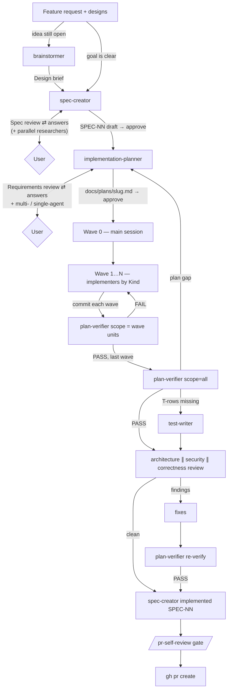

# Spec-Driven Development workflow

How a feature travels from an idea to a merged pull request in DevDigest: which
agent does what, what each step produces, where the user decides, and how
failures are routed back. The agent definitions are the source of truth — this
document explains how they fit together. Agent catalog and design notes:
[`.claude/agents/README.md`](../.claude/agents/README.md).

## Contents

1. [The big picture](#1-the-big-picture)
2. [Roles](#2-roles)
3. [Stage 1 — Brainstorm (optional)](#3-stage-1--brainstorm-optional)
4. [Stage 2 — Specification](#4-stage-2--specification)
5. [Stage 3 — Implementation plan](#5-stage-3--implementation-plan)
6. [Stage 4 — Waves](#6-stage-4--waves)
7. [Stage 5 — Final verification, tests and reviews](#7-stage-5--final-verification-tests-and-reviews)
8. [Stage 6 — Close the spec and open the PR](#8-stage-6--close-the-spec-and-open-the-pr)
9. [Verification rows and IDs](#9-verification-rows-and-ids)
10. [Where a failure goes](#10-where-a-failure-goes)
11. [Lifecycles](#11-lifecycles)
12. [Worked example](#12-worked-example)
13. [Artifacts map](#13-artifacts-map)
14. [Cost and when to skip steps](#14-cost-and-when-to-skip-steps)
15. [Guard rails](#15-guard-rails)

---

## 1. The big picture



Three ideas carry the whole process:

- **What before how.** The spec fixes *what* the system must do (EARS
  requirements); the plan decides *how* (files, units, waves). Neither agent does
  the other's job.
- **Parallel by construction.** The plan splits work into units with disjoint
  file ownership, so several implementers can edit one checkout at the same time.
- **Nothing is trusted, everything is verified.** Each wave is checked against
  the plan; the finished feature is checked against the spec; the PR is gated by
  the repo's own checks.

## 2. Roles

| Who | Model | Does | Writes |
|---|---|---|---|
| **Main session** (orchestrator) | — | Runs every agent, relays questions to the user, does Wave 0, commits each wave, routes failures | git commits, Wave 0 files |
| **User** | — | Answers questions, approves the spec and the plan, decides on overrides | — |
| `brainstormer` | opus | Raw idea → Design brief with 2–3 approaches | nothing |
| `researcher` | sonnet | Finds facts in the repo or on the web, with evidence | nothing |
| `spec-creator` | opus | Designs → EARS spec `SPEC-NN` | `specs/*.md`, `<pkg>/specs/*.md` only |
| `implementation-planner` | opus | Spec → implementation plan of units and waves | `docs/plans/*.md` only |
| `implementer-backend` | sonnet | One `backend` unit (server) | the unit's *Owns* files |
| `implementer-ui` | sonnet | One `ui` unit (client) | the unit's *Owns* files |
| `implementer` | sonnet | One `engine` / `e2e` / `mcp` unit | the unit's *Owns* files |
| `plan-verifier` | opus | Code vs plan (and spec), item by item | nothing |
| `test-writer` | sonnet | Missing tests from the plan's §6 | test files only |
| `architecture-reviewer` | sonnet | File placement and import direction | nothing |
| `security-reviewer` | opus | Exploitable vulnerabilities in the diff | nothing |
| correctness review | — | Logic bugs: `/code-review high` or `pr-review-toolkit:code-reviewer` + `silent-failure-hunter` | nothing |
| `doc-writer` | sonnet | Permanent docs for what was built | READMEs, `<pkg>/docs/**`, ADRs |

Agents never talk to each other. Every hand-off goes through the main session,
and **subagents cannot start subagents** — when an agent needs another one (for
example `spec-creator` needs research), it returns a request and the main
session runs it.

## 3. Stage 1 — Brainstorm (optional)

**Use when** the request is still an idea ("we need something like X", a
screenshot, a lesson brief) and goal, behaviour or approach are open.
**Skip when** the goal and the user-visible behaviour are already clear.

1. `brainstormer` reads the code and asks focused questions, up to 3 rounds.
2. It proposes 2–3 approaches grounded in existing code (`path:line`), with
   cost and risk, and recommends one.
3. The user picks an approach → the **Design brief** is the input for the spec.

## 4. Stage 2 — Specification

**Agent:** `spec-creator` · **Skills:** `ears-requirements`, `security`,
`mermaid-diagram` · **Output:** a spec file with status `draft`.

### 4.1 Input

- The feature (request text or Design brief).
- **Design sources** supplied by the user: a text description, a Figma link
  **plus exported PNG frames** (the agent cannot render Figma), existing code
  paths or screens, a repository (local path or URL).
- A mode: `create` (default) · `revise <spec>` · `approve SPEC-NN` ·
  `implemented SPEC-NN` · `supersede <old spec>`.

### 4.2 Analysis

The agent reads root `AGENTS.md`, the `AGENTS.md` and `INSIGHTS.md` **only of the
modules the feature touches**, the existing specs, the code being extended and
every design source. It then analyses the design through five lenses, recording
findings `F-n`:

| Lens | Looks for |
|---|---|
| **A. Gaps** | states the design does not show (empty, loading, partial, error, offline, first run), content limits, permissions, keyboard/a11y/i18n, missing copy |
| **B. Corner cases** | concurrency (double submit, PR updated mid-review), determinism, malformed LLM output, timeouts, rate limits, cost, old data |
| **C. Module interactions** | the call chain (web app → API → review engine → LLM/GitHub, MCP → API, API → Postgres): contract per hop, source of truth, failure and stale-data behaviour |
| **D. UX improvements** | fewer steps, better defaults, inline errors with a next action, consistency with existing screens — small and optional |
| **E. NFR and verifiability** | performance, LLM cost, determinism, a11y, i18n, observability, security — and whether every requirement can be tested |

### 4.3 Spec review — questions before any file

The first reply is always a **Spec review**, never a file:

- target folder, proposed file name and `SPEC-NN`, sources read, INSIGHTS read;
- the findings table;
- UX proposals for the user to accept or reject;
- **research requests** (optional, ≤ 4): self-contained questions with scope
  `CODEBASE` / `WEB` / `HYBRID`. The main session runs one `researcher` per
  request **in parallel** and passes the reports back to `spec-creator`
  (`revise`);
- ≤ 8 questions per round, each with options and a default; at most 3 rounds.

### 4.4 Writing the spec

After the answers, the agent writes the file from
[`specs/_TEMPLATE.md`](../specs/_TEMPLATE.md):

- **Where:** one module → `<pkg>/specs/` (`client`, `server`, `reviewer-core`,
  `mcp`); two or more modules → root [`specs/`](../specs/README.md).
- **Name:** `YYYY-MM-DD-<feature-slug>.md`.
- **ID:** `SPEC-NN`, global across every spec folder (highest existing + 1),
  never reused.
- **Sections:** problem and user · goals (with success measures) / non-goals ·
  user stories `US-n` · acceptance criteria `AC-n` (EARS, with **Priority**
  Must/Should/Could and **Verify by**) · edge cases `EC-n` · module interactions
  (sequence diagram + hop table) · data and state · compatibility and rollout ·
  design review (sources, gaps `F-n`, UX decisions) · NFR `NFR-n` · inputs and
  provenance · untrusted inputs `UT-n` · assumptions · traceability · open
  questions `Q-n` · revision history · self-check.
- The new spec is added to its folder's `README.md` index.

EARS shapes used for every requirement (keywords in English, `shall` = mandatory):

| Pattern | Shape |
|---|---|
| Ubiquitous | The `<system>` shall `<response>`. |
| Event-driven | WHEN `<trigger>`, the `<system>` shall `<response>`. |
| State-driven | WHILE `<state>`, the `<system>` shall `<response>`. |
| Unwanted behaviour | IF `<condition>`, THEN the `<system>` shall `<response>`. |
| Optional feature | WHERE `<feature enabled>`, the `<system>` shall `<response>`. |

Subjects: *the web app* · *the API* · *the review engine* · *the MCP server* ·
*DevDigest* (cross-module). Rules and examples:
[`ears-requirements`](../.claude/skills/ears-requirements/SKILL.md).

### 4.5 Final self-check and approval

The agent re-reads the file, ticks the in-file *Self-check* only for true items
and reports anything left open. The spec stays `draft` until **the user** says
"approve SPEC-NN"; then `spec-creator approve SPEC-NN` sets `Status: approved`
and the `Approved:` date.

## 5. Stage 3 — Implementation plan

**Agent:** `implementation-planner` · **Skills:** `ears-requirements` + the 11
coding skills · **Output:** `docs/plans/<slug>.md` from
[`docs/plans/_TEMPLATE.md`](plans/_TEMPLATE.md).

### 5.1 Requirements review

The planner reads the spec and the code, then checks the requirements for
clarity, consistency, feasibility and testability.

- **Approved-spec fast path:** when the source is an `approved` SPEC-NN and the
  execution mode is given, it re-checks only feasibility against the code and
  testability, and plans directly if nothing blocks.
- Otherwise it returns a **Requirements review** (≤ 4 questions) and always asks
  the **execution mode**:

| Mode | Use when | Shape |
|---|---|---|
| `single-agent` | ≤ 2–3 units, one package, or a chain where each unit needs the previous | one unit per wave, strictly sequential |
| `multi-agent` | ≥ 3 genuinely independent units with disjoint files | Wave 0 + parallel waves; costs many times more tokens |

The planner never writes or edits specs. A spec problem becomes a finding for the
spec owner or a §9 *Spec follow-up*.

### 5.2 What the plan contains

| Section | Content |
|---|---|
| Header | Goal, **Requirements source** (`SPEC-NN`), **Execution mode**, packages |
| §1 Context | today's code with `path:line`, requirements review, decisions, open questions |
| §2 Affected modules | per package, with the architecture rule that applies |
| §3 **Contracts** | exact Zod schemas, types, endpoints, tables — written as code |
| §4 **Work units** | `U1…Un`, each with Kind, Wave, Depends on, **Owns**, Must not touch, Consumes, Produces, Checks, Steps, Acceptance criteria (citing `SPEC-NN AC-k`) |
| §5 **Waves** | execution order and which units run in parallel |
| §6 Test plan · §7 Verification | tests per unit; commands that prove it works |
| §8 Risks · §9 Out of scope | including spec follow-ups |

Planning rules that make waves possible:

- **One unit = one Kind = one package.** Kind picks the implementer.
- **Disjoint ownership:** within one wave no file belongs to two units.
- **Contracts first:** anything two units share is in §3 and produced in Wave 0.
- **Traceability:** every spec `AC` / `EC` / `NFR` is cited by at least one unit
  criterion, and every unit criterion traces back to a requirement.
- **Size budget:** unit block ≤ ~60 lines, plan ≤ ~30 KB — every implementer and
  the verifier read it.

The user approves the plan before any code is written.

## 6. Stage 4 — Waves

A **wave** is a group of units that can be built **at the same time**: they do
not depend on each other and do not touch the same files. Waves run in order;
units inside a wave run in parallel.

### 6.1 Wave 0 — the main session

Wave 0 holds everything other units depend on and that implementers are not
allowed to do:

- the §3 contracts, including identical edits in every vendored
  `src/vendor/shared` copy;
- new dependencies (`package.json` + lockfile, via the package manager);
- the database migration (`NNNN_name.sql`, append-only);
- **serialized files** many units would want to edit:
  `server/src/modules/index.ts`, `client/src/lib/api.ts`,
  `client/messages/<locale>/*.json`.

The main session does Wave 0 itself, sequentially, then commits.

### 6.2 Wave 1…N — implementers

For every unit in the wave the main session starts one agent, chosen by Kind:

| Kind | Agent | Injected skills |
|---|---|---|
| `backend` | `implementer-backend` | onion-architecture, fastify, drizzle, zod, security |
| `ui` | `implementer-ui` | frontend-ui-architecture, react, next, react-testing-library, zod |
| `engine` · `e2e` · `mcp` | `implementer` | onion-architecture, zod, security |

The prompt carries the plan path, the unit id and — to save tokens — the pasted
unit block and the §3 contracts it consumes.

All implementers of a wave work **in the same checkout at the same time**. What
keeps them apart:

- each edits **only** its unit's *Owns* files and never "fixes" anyone else's;
- git is read-only for them; they never install dependencies or touch
  `INSIGHTS.md` / `AGENTS.md` / `.claude/**` (Bash is limited by a hook);
- a unit consumes only what **earlier** waves produced, never a sibling in the
  same wave — so its tests pass with its own files plus earlier waves.

Each implementer checks its work with
[`scripts/agent-check.mjs`](../scripts/agent-check.mjs):

```bash
node scripts/agent-check.mjs <package> <owned files>
```

It runs the package typecheck (errors split into *your files* / *other files*)
plus `vitest related <owned files>` — exactly the tests the change can break —
with a short summary. At most 3 fix rounds. If something it needs is missing or
wrong (a contract, a file from an earlier wave, a dependency), it stops with
`BLOCKED:` instead of working around it. It returns an *Implementer result*:
Changed · Skills applied · Verification · Out of scope.

### 6.3 After every wave

1. **Commit** — by the main session only (one writer to git; one restore point
   per wave).
2. **`plan-verifier`** — mandatory, only once no implementer is still running.
   - `scope` = the wave's units (`U2,U3,U5`), compact report (only rows that are
     not MET).
   - It does not trust implementer reports: it reads the diff and re-runs the
     checks itself. In multi-agent mode it is the **only full-suite run** of the
     wave.
   - Verdict: **PASS** / **FAIL** (any NOT MET or PARTIAL) / **INCOMPLETE** (only
     NOT VERIFIABLE left).
3. **FAIL** → the owning unit's implementer fixes it → `plan-verifier` in
   **re-verify mode** (`previous` = the last report) re-checks only what failed
   plus what the fix touched. **PASS** → next wave.

### 6.4 Single-agent mode

Same loop, but every wave is a single unit and everything is sequential; a later
unit may modify a file an earlier unit created. Cheaper and without coordination
risk — the default for small changes.

## 7. Stage 5 — Final verification, tests and reviews

Order: **verify → tests → review → re-verify.** Reviewing code the verifier would
still reject wastes tokens on "this is missing" noise, and review fixes can break
plan items.

1. **`plan-verifier scope=all`** — the full table, including the spec's
   `S<NN>-*` rows (see [§9](#9-verification-rows-and-ids)).
2. **`test-writer`** (`plan` + `unit`) for every NOT MET `T-*` row — the
   verifier names exactly which tests are missing.
3. **Reviews in parallel:**
   - `architecture-reviewer` — where code lives, import direction (depcruise first);
   - `security-reviewer` — can an attacker exploit the diff (source → sink);
   - correctness — `/code-review high`, or `pr-review-toolkit:code-reviewer` +
     `pr-review-toolkit:silent-failure-hunter`.
   Each reviewer reports only findings with confidence ≥ 80; `request_changes`
   goes back to the owning implementer.
4. **Fixes → `plan-verifier` re-verify.**
5. **`doc-writer`** (optional) — permanent docs for what was actually built.

## 8. Stage 6 — Close the spec and open the PR

1. **Close the spec.** When every `S<NN>-*` row is MET, the main session asks the
   user and runs `spec-creator implemented SPEC-NN`. This happens **before** the
   PR, so the status change merges together with the code; a rejected PR leaves
   the spec `approved`. Rows that are NOT VERIFIABLE (for example an e2e flow
   that needs Docker) are named to the user, who decides.
2. **`/pr-self-review`** — the mandatory gate:
   - Phase 1: repo invariants (`DET-*` rules);
   - Phase 2: typecheck and tests of the touched packages;
   - Phase 3: skill review — one subagent per bundle of changed files;
   - Phase 4: seal. A `PreToolUse` hook blocks `gh pr create` until the gate is
     green. A false positive is retired with `pr-self-review.mjs accept "<key>"
     --reason "…"`, never with a habitual bypass.
3. **`gh pr create`** — with the drafted body from
   `.claude/.pr-self-review/pr-body.md`.

## 9. Verification rows and IDs

`plan-verifier` turns the plan (and the spec) into a list of **rows** before it
reads any code; every row gets exactly one verdict with `file:line` or
`command → result` as evidence.

| Row ID | Source | Meaning |
|---|---|---|
| `C-<name>` | plan §3 | a contract matches the code character for character |
| `U<n>-OWN-<k>` | unit *Owns* | the owned file exists and was changed |
| `U<n>-MNT-<k>` | unit *Must not touch* | the forbidden file is untouched |
| `U<n>-AC-<k>` | unit *Acceptance criteria* | the unit's criterion holds |
| `U<n>-CHK-<k>` | unit *Checks* | the check command passes |
| `T-<k>` / `V-<k>` | plan §6 / §7 | the planned test exists and passes / the verification step holds |
| **`S<NN>-AC\|EC\|NFR-<k>`** | **the spec** named in the plan header | **the spec's requirement holds in code or a test** |

**`S<NN>-*` rows close the Spec-Driven loop.** `S07-AC-3` means "acceptance
criterion AC-3 of SPEC-07". `U*` rows check that the *plan* was built; `S*` rows
check that what the *user approved in the spec* was built — they catch a
requirement the plan forgot. They exist only with `scope=all`, because during
intermediate waves part of the spec is legitimately not built yet.

An `S` row is judged by its EARS pattern (`ears-requirements`): WHEN needs
trigger → response; WHILE needs the response inside the state *and* gone after
it; IF … THEN needs the failure actually exercised; WHERE needs feature on *and*
off. Evidence for only half the shape → PARTIAL.

## 10. Where a failure goes

| Failure | Goes to | Then |
|---|---|---|
| Implementer cannot proceed (`BLOCKED:`) | main session → user / plan | fix the input, re-run the unit |
| Wave verification FAIL | the owning unit's implementer | re-verify |
| `S<NN>-*` NOT MET, a unit cites the criterion | that unit's implementer (code bug) | re-verify |
| `S<NN>-*` NOT MET, **no unit cites it** (`plan gap: S<NN>-…`) | `implementation-planner` | it adds unit(s) in a **new wave**, finished units untouched; the wave loop runs again |
| `T-*` NOT MET after the last wave | `test-writer` | re-verify |
| Reviewer `request_changes` | the owning implementer | re-verify |
| Spec is wrong or incomplete | the user → `spec-creator` (`revise` a draft, or a new spec that `Supersedes` an approved one) | re-plan the affected units |
| `/pr-self-review` BLOCKED | fix the CRITICAL finding | re-run the gate (the seal is void after any change) |

## 11. Lifecycles

**Spec** (`Status:` line):

```
draft ──(user: approve SPEC-NN)──▶ approved ──(all S-rows MET + user OK)──▶ implemented
  ▲ revise freely                     │ immutable: a change = new spec with Supersedes
                                      └────────────▶ superseded (Superseded by: …)
```

**Plan:** `draft → approved → in-progress → done`; revised by re-writing the
whole file (the planner has no `Edit`).

**Wave:** implement → commit → verify → (fix → re-verify)* → PASS.

## 12. Worked example

*Feature:* "Show per-run severity counters from a new API endpoint, with a
filter on the PR page." Designs: two PNG frames + a text note.

1. **Spec.** `spec-creator` returns a Spec review: the design shows no loading
   or error state (F-1), nothing for a run with zero findings (F-2), the counts
   would need a new endpoint (F-3); UX-1 proposes keeping the selected filter
   when switching tabs; R-1 asks a researcher where findings are rendered today.
   The user answers; the agent writes
   `specs/2026-10-05-severity-counters.md` (two modules → root `specs/`),
   `SPEC-08`, with AC-1…AC-6, EC-1…EC-3, NFR-1 (no extra request on filter
   toggle). The user says "approve SPEC-08".
2. **Plan.** The planner (fast path, mode `multi-agent`) writes
   `docs/plans/severity-counters.md`:

   | Wave | Unit | Kind → agent | Why here |
   |---|---|---|---|
   | 0 | Zod response schema, route registration, i18n keys | main session | everything depends on it |
   | 1 | U1 — endpoint + service | backend → `implementer-backend` | parallel with U2: different files, shared contract from Wave 0 |
   | 1 | U2 — hook + filter bar, tests with mocked `fetch` | ui → `implementer-ui` | does not wait for U1 |
   | 2 | U3 — e2e flow | e2e → `implementer` | needs U1 and U2 |

3. **Waves.** Wave 0 → commit. Wave 1: two implementers in parallel → commit →
   `plan-verifier scope=U1,U2` → U2 FAIL (missing `aria-pressed`) → U2 fixed →
   re-verify PASS. Wave 2 → commit → verify PASS.
4. **Final.** `scope=all` finds `S08-EC-2` NOT MET and no unit cites it →
   `plan gap` → the planner adds U4 (Wave 3) → implemented, verified. All rows
   MET → reviews in parallel → one security fix → re-verify PASS.
5. **Close.** User OK → `spec-creator implemented SPEC-08` →
   `/pr-self-review` green → PR.

## 13. Artifacts map

| Artifact | Path | Written by |
|---|---|---|
| Design brief | chat reply | `brainstormer` |
| Spec (one module) | `<pkg>/specs/YYYY-MM-DD-<slug>.md` | `spec-creator` |
| Spec (cross-module) | `specs/YYYY-MM-DD-<slug>.md` | `spec-creator` |
| Spec template | [`specs/_TEMPLATE.md`](../specs/_TEMPLATE.md) | humans |
| Plan | `docs/plans/<slug>.md` | `implementation-planner` |
| Plan template | [`docs/plans/_TEMPLATE.md`](plans/_TEMPLATE.md) | humans |
| Code + tests | per unit *Owns* | implementers, `test-writer` |
| Reports (verifier, reviewers) | chat replies | the agents |
| Docs, ADRs | `README.md`, `<pkg>/docs/**`, `docs/adr/**` | `doc-writer` |
| PR body draft | `.claude/.pr-self-review/pr-body.md` | `/pr-self-review` |
| Learnings | `<pkg>/INSIGHTS.md` (append-only) | main session via `engineering-insights` |

## 14. Cost and when to skip steps

- **Small internal change** (no user-visible behaviour, one package): skip
  brainstormer and spec, plan in `single-agent` mode — or no plan at all for a
  one-file fix. `/pr-self-review` is never skipped.
- **Multi-agent** pays off only with ≥ 3 genuinely independent units; parallel
  agents cost many times the tokens of one sequential pass.
- Token savers built in: implementers get only their Kind's skills, read the
  plan by heading ranges, check with `agent-check` (short output, related tests
  only); the per-wave verifier report is compact; the spec fast path skips a
  second interview.
- Reviews and `test-writer` are optional for tiny changes but recommended for
  any multi-wave feature.

## 15. Guard rails

Every limit an agent has is enforced by a hook, not only by its prompt:

| Agent | Hook | Allows |
|---|---|---|
| `spec-creator` | `write-scope-guard.mjs spec-creator` | `specs/*.md`, `{client,server,reviewer-core,mcp}/specs/*.md` (not `_TEMPLATE.md`, not `e2e/**`) |
| `implementation-planner` | `implementation-planner-write-guard.mjs` | `docs/plans/*.md` |
| implementers | `bash-scope-guard.mjs implementer` | `cd <package>`, read-only git, `agent-check`, tests, typecheck, depcruise, `pnpm db:generate --name <x>` |
| `test-writer` | `write-scope-guard.mjs test-writer` + `bash-scope-guard.mjs test-writer` | test files and helpers; tests and typecheck |
| `doc-writer` | `write-scope-guard.mjs doc-writer` | READMEs, `<pkg>/docs/**`, `docs/adr/**` |
| `plan-verifier`, reviewers | `bash-scope-guard.mjs <profile>` | read-only git and the allowed checks |
| everyone | `pr-gate.mjs` (settings) | `gh pr create` only after a green `/pr-self-review` |

All guards fail closed: unknown input, a path outside the repository or an
unparsable payload is a deny.
