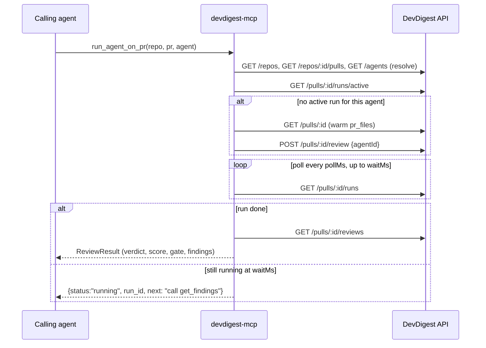

# @devdigest/mcp

A local **stdio** MCP (Model Context Protocol) server for DevDigest. It is a
thin HTTP client over the running DevDigest API (`:3001`) — no database, no
`Container`, no LLM calls of its own. It lets any MCP-capable agent (Claude
Code or another client) list reviewer agents, run a PR review, re-read
findings, and read a repo's conventions, in a handful of token-economical tool
calls instead of hand-rolled REST round-trips.

See [`mcp/AGENTS.md`](./AGENTS.md) for the internal ring layout and
[`docs/plans/devdigest-mcp.md`](../docs/plans/devdigest-mcp.md) for the full
design (contracts, decisions, open questions).

## Prerequisites

The DevDigest API must be running (`./scripts/dev.sh` from the repo root, or
`cd server && pnpm dev`). The MCP server itself starts fine with the API down
— it makes no network call at startup — but every tool call needs it.

## Tools

| Tool | Args (all scalars) | What it returns |
|---|---|---|
| `list_agents` | — | The reviewer agents available (id, name, model, enabled). |
| `run_agent_on_pr` | `repo`, `pr`, `agent`, `min_severity?`, `limit?` | Runs a review, waits up to the wait budget, and returns the verdict, score, gate and top findings — or `status:"running"` with a `run_id` if it is still going. |
| `get_findings` | `repo`, `pr`, `run_id?`, `agent?`, `min_severity?`, `limit?` | The verdict/findings of a finished review: the latest one (by `created_at`), or a specific run/agent. If a newer run of the same agent is still in progress, the result also carries `newer_run: {run_id, status: "running"}` and a `next` hint. Never starts a review. |
| `get_conventions` | `repo`, `status?`, `category?`, `limit?` | The repo's extracted coding conventions, each with `path:line` evidence. |
| `get_blast_radius` | `repo`, `pr` | What else the PR can affect, read from the repo index (no LLM): stats, changed symbols, callers as `name @ file:line` per symbol, affected HTTP endpoints and cron jobs. Carries `degraded`/`reason` and a `next` hint when the index is incomplete. |

Example `run_agent_on_pr` result:

```json
{
  "status": "done",
  "repo": "acme/payments-api",
  "pr": 482,
  "run_id": "6f2b...",
  "agent": "Security",
  "verdict": "request_changes",
  "score": 62,
  "blockers": 2,
  "gate": "block",
  "summary": "Two SQL injection risks in the new query builder...",
  "counts": { "critical": 2, "warning": 3, "suggestion": 1 },
  "findings": [
    { "loc": "src/db/query.ts:41", "severity": "CRITICAL", "category": "security", "title": "Unparameterized query", "message": "User input is concatenated into the SQL string." }
  ],
  "truncated": "Showing 1 of 6 findings; pass limit (max 100) or min_severity to change."
}
```

Example `get_blast_radius` result:

```json
{
  "repo": "acme/payments-api",
  "pr": 482,
  "summary": "1 symbol · 2 callers · 1 endpoint · 0 cron jobs",
  "stats": { "symbols": 1, "callers": 2, "endpoints": 1, "crons": 0 },
  "degraded": false,
  "reason": null,
  "changed_symbols": ["refund (src/refund.ts)"],
  "downstream": [
    { "symbol": "refund", "callers": ["handler @ src/routes.ts:23", "retry @ src/jobs.ts:8"], "endpoints": ["POST /refunds"], "crons": [] }
  ]
}
```

## Registration (`.mcp.json`)

The repo root already ships a project-scope `.mcp.json`:

```json
{
  "mcpServers": {
    "devdigest": {
      "type": "stdio",
      "command": "node",
      "args": ["mcp/bin/devdigest-mcp.mjs"],
      "env": { "DEVDIGEST_API_URL": "${DEVDIGEST_API_URL:-http://127.0.0.1:3001}" }
    }
  }
}
```

`claude`, started at the repo root, picks this up automatically (approve it
once); `/mcp` then lists `devdigest` with 5 tools.

To run it from another MCP client, point it at the same launcher with an
absolute path: `node /abs/path/to/devdigest/mcp/bin/devdigest-mcp.mjs`, with
`DEVDIGEST_API_URL` in its own env if the API is not on the default port.

## Environment variables

| Var | Default | Meaning |
|---|---|---|
| `DEVDIGEST_API_URL` | `http://127.0.0.1:3001` | Base URL of the DevDigest API |
| `DEVDIGEST_MCP_WAIT_MS` | `55000` | `run_agent_on_pr` wait budget before it returns `status:"running"` (clamped 5 000–600 000) |
| `DEVDIGEST_MCP_POLL_MS` | `3000` | How often `run_agent_on_pr`/the wait loop polls run status |

### Raising the wait budget

`DEVDIGEST_MCP_WAIT_MS` only changes how long **this server** polls before
giving up and returning `status:"running"`. If you raise it above ~60 s, the
**calling client's own tool-call timeout** must be raised too, or the client
will abort the call first and you will never see the longer wait take effect.

For Claude Code, that timeout is `MCP_TOOL_TIMEOUT` (default 300 000 ms per the
official docs) — set it as a plain environment variable for the Claude Code
process itself, in `.claude/settings.json` → `env`, **not** in `.mcp.json`'s
`env` (that block only reaches the spawned `devdigest-mcp` server process, not
the client calling it):

```json
{
  "env": { "MCP_TOOL_TIMEOUT": "600000" }
}
```

## Sequence — `run_agent_on_pr`


