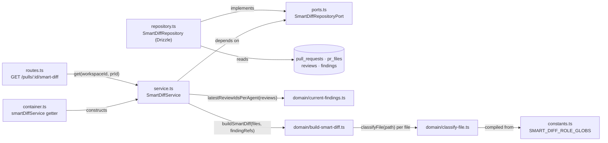

# Smart Diff — grouping a PR's files by reviewer role

How `modules/smart-diff/` turns a PR's changed files and current findings into
the role-grouped response the client's "Files changed" tab renders. Read
alongside [`architecture.md`](./architecture.md) for the onion-architecture
conventions this module follows.

## What it does

`GET /pulls/:id/smart-diff` (`src/modules/smart-diff/routes.ts:14`) returns a
`SmartDiffResponse`: the PR's `pr_files` bucketed into `core / tests / wiring /
docs / boilerplate` groups (empty groups omitted), each file annotated with
the line numbers of its "current" review findings. The endpoint is read-only —
it never calls a model and never writes (`service.ts:12-32`).

## Module layout (onion rings)

The module mirrors the `intent` module's split:

- `types.ts` and `domain/*.ts` are ring 1 — plain types and pure functions,
  no ORM, no ports import (`types.ts:1-21`, `domain/classify-file.ts`,
  `domain/current-findings.ts`, `domain/build-smart-diff.ts`).
- `ports.ts` declares `SmartDiffRepositoryPort` as a plain interface the
  service depends on instead of the `Container` (`ports.ts:15-27`).
- `repository.ts` is the only file in the module that imports Drizzle
  (`repository.ts:1-4`); it reads `pull_requests`, `pr_files`, `reviews` and
  `findings` without owning any of them.
- `service.ts`'s `SmartDiffService.get()` composes the port and the domain
  functions (`service.ts:12-32`).
- `routes.ts` is a thin Fastify handler: resolve the workspace context, call
  the service (`routes.ts:10-18`).
- `index.ts` re-exports only pure symbols — `classifyFile`,
  `SMART_DIFF_ROLE_ORDER`, `SMART_DIFF_ROLE_GLOBS`, `buildSmartDiff`,
  `latestReviewIdsPerAgent` and the ring-1 types — never routes, service or
  repository (`index.ts:5-9`). That makes the classifier usable by any future
  consumer (e.g. a prompt pre-filter) without pulling in Fastify or Drizzle.
- `platform/container.ts` wires the real repository behind
  `ContainerOverrides.smartDiffRepo` and exposes a lazy `container.smartDiffService`
  getter (`container.ts:204-208`); `modules/index.ts` registers the plugin
  (`modules/index.ts:13,40`).

## Classification: first match wins

`classifyFile(path)` (`domain/classify-file.ts:17-23`) normalizes the path
(backslashes → `/`, strip a leading `./` or `/`, `domain/path-glob.ts:7-12`)
and tests it against `SMART_DIFF_ROLE_GLOBS` in array order — the first role
whose glob list matches wins; no match falls back to `core`
(`constants.ts:12-59`, `DEFAULT_SMART_DIFF_ROLE`). The array order is
`boilerplate → tests → wiring → docs`, which resolves overlaps deliberately:

| Path | Role | Why (first match) |
|---|---|---|
| `__tests__/__snapshots__/x.snap` | `boilerplate` | snapshots are listed under `boilerplate` before the `tests` block matches `__tests__/**` (`server/test/smart-diff-classify.test.ts:12-14`) |
| `e2e/README.md` | `tests` | `**/e2e/**` (tests) is checked before `**/*.md` (docs) (`smart-diff-classify.test.ts:16-18`) |
| `.claude/skills/security/SKILL.md` | `wiring` | `**/.claude/**` (wiring) is checked before the docs globs (`smart-diff-classify.test.ts:20-22`) |
| `dist/index.js` | `boilerplate` | `**/dist/**` beats the `**/index.js` barrel glob in `wiring` |
| `src/index.tsx` | `core` | only `index.ts`/`index.js` count as barrels — `.tsx` is not in the `wiring` glob list |

Each glob without a `/` matches the file's basename at any depth (so `*.lock`
matches `Cargo.lock` and `server/Cargo.lock`); a glob with `/` is anchored at
the repo root, where a leading `**/` means "zero or more directories" and a
trailing `/**` means "anything below this directory" — so `**/dist/**` and
`**/docs/**` match nested package directories like `client/dist/` or
`server/docs/`, not just root-level ones (`domain/path-glob.ts:30-54`). Regexes
are case-insensitive and compiled once at module load
(`domain/classify-file.ts:11-14`). The full first-match table, including these
and other edge cases (case-insensitivity, backslash paths, `config.ts` vs
`*.config.*`), is exercised by `server/test/smart-diff-classify.test.ts`.

## "Current findings" — which findings count

A file's `finding_lines` come from the **latest `kind='review'` review per
agent** (an agent-less review is its own bucket, keyed by an empty string),
union across agents, ties on `createdAt` broken by the larger review id
(`domain/current-findings.ts:9-24`). The service then drops any finding whose
`dismissedAt` is set before building the response (`service.ts:26-29`) — this
is the same "latest review per agent, excluding dismissed" rule the PR list
uses, applied here to line numbers instead of full finding records.
`buildSmartDiff` dedupes and sorts each file's `finding_lines` ascending
(`domain/build-smart-diff.ts:11-28`).

## Endpoint shape (summary)

- `IdParams` validates `id` as a uuid before the handler runs (422 on a
  non-uuid; `routes.ts:14`, `_shared/schemas.ts`).
- `SmartDiffService.get` throws `NotFoundError` when the PR is not in the
  caller's workspace, mapped to 404 by the global error handler
  (`service.ts:16-18`).
- Groups are emitted in `SMART_DIFF_ROLE_ORDER` (`SmartDiffRole.options`),
  skipping empty groups; files keep the repository's read order inside a
  group, which has no `ORDER BY` — the same shape as the pulls module's
  offline file read (`domain/build-smart-diff.ts:34-37`, `repository.ts:24-29`).
- `split_suggestion` is currently minimal: `too_big` is always `false`,
  `total_lines` sums `additions + deletions` over all `pr_files`, and
  `proposed_splits` is always empty (`domain/build-smart-diff.ts:39-44`).

Full request/response contract and error cases belong in `server/specs/` —
see *Follow-ups* below for the drift this doc surfaces.
