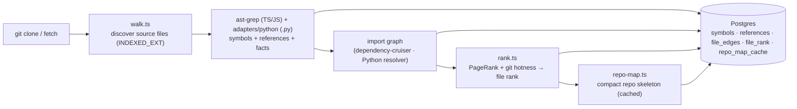

# `repo-intel` — the codebase indexer

`repo-intel` reads a cloned repository **once on clone** (and incrementally on
fetch, keyed by file content hash) and turns it into queryable facts: symbols,
the import graph, a PageRank-based file importance score, and a compact **repo
map** (the project skeleton). On a review it is only **read** — the index is
already computed, so adding context to a prompt costs no analysis at request time.

This is **starter infrastructure**: it works from day 1 (the **Indexed** badge),
but you don't write it. Course lessons build features _on top_ of its facade —
Blast Radius (L04), Conventions samples (L02), Onboarding reading-path (L05),
the Phantom-API gate (L06) — by calling `repoIntel.*`, not by re-indexing.

## Pipeline

Full vs incremental indexing lives in `pipeline/{full,incremental}.ts`; an
unindexed or partially-indexed repo degrades gracefully (the facade returns empty
results rather than throwing).

## Languages

- **TS/JS** — parsed by ast-grep, import edges from dependency-cruiser. The
  parsed set is `SUPPORTED_EXT` (`.ts .tsx .js .jsx .mjs .cjs`).
- **Python** — `.py` files are handled in-process by `adapters/python`: a scanner
  (symbols + references), an import resolver (`file_edges`) and a facts extractor
  (endpoints and crons). No external binary is needed.
- The **walk scope** is `INDEXED_EXT` (`SUPPORTED_EXT` + `.py`). Never widen
  `SUPPORTED_EXT` for a new language: that would send its files to ast-grep.

### Python facts (`file_facts`)

- **Endpoints** are `METHOD /path` strings from Django (`urls.py`, DRF routers and
  `@action`), Flask and FastAPI routes. `ANY` means the method is not known
  (for example, a plain Django `path()`).
  - Django path converters are kept verbatim (`/contacts/<int:pk>/`).
  - `{pk}` appears only in DRF router routes (`ANY /api/contacts/{pk}/`).
  - `include()` prefixes are normalised and joined with `/`.
- **Crons** are strings of the form `"<schedule> (<label>)"`. The schedule is:
  - a 5-field cron expression, from Celery `crontab(...)`, APScheduler
    `add_job(..., 'cron')` / `@scheduled_job('cron', ...)`, or django-crontab
    `CRONJOBS`;
  - `every N<s|m|h|d>` for a number, a single-unit `timedelta` or an APScheduler
    `'interval'`; `every ?` for any other `timedelta`;
  - `schedule` for anything else.

  They come from Celery beat dicts (`*beat_schedule`, `*.update(beat_schedule=...)`),
  `add_periodic_task`, `@periodic_task(run_every=...)`, APScheduler and `CRONJOBS`.
- **Jobs**: `job:<label>` is used only for Celery `@shared_task` / `@<x>.task` on
  a module-level function.
- Arrays are sorted with the default JS string sort.

### Per-handler attribution (`endpoint_handlers` / `cron_handlers`)

Blast radius no longer lists every endpoint of a caller's file. `file_facts` has two
jsonb columns, `endpoint_handlers` and `cron_handlers`, shaped
`{ "<fact string>": ["<handler>", ...] }` (default `{}`). A handler is a symbol name
(function, class or Celery task), or `Class.method` for a DRF `@action`.

- **TS/JS** captures only a trailing plain identifier on a single-line registration
  (`router.get('/x', listOrders);`, `cron.schedule('0 2 * * *', runNightlyReport);`).
  Inline arrows, member expressions, wrapped handlers and multi-line calls are unknown.
- **Python** stores the resolved view, viewset or task name. The fact is recorded in the
  registering file and in the handler's file.
- A fact whose handler is unknown for any registration has **no key**; it stays file-level.
- For a changed symbol `S` and a caller in file `F` the kept facts are: the unknown ones,
  those whose handler is `S` (or `S` is its head before the first `.`), and those of the
  handlers the caller sits in (from symbol ranges). If the caller is in no handler and
  nothing points directly at `S`, all of `F`'s facts are kept (file-level fallback).
- DRF viewsets are attributed at class level: any reference inside `class X` matches `X`
  and `X.m`.
- Rows written before `INDEXER_VERSION` 5 have `{}` and behave as file-level until reindexed.

### Exclusions and source roots

- `.py` files with a `migrations` path segment are skipped. This rule is
  Python-only: TS/JS files under a `migrations/` directory stay indexed.
- Virtualenvs (a non-root directory with `pyvenv.cfg`), `__pycache__`, `.venv`,
  `venv`, `.tox`, `site-packages` and the other `EXCLUDED_DIRS` are skipped.
- Import resolution tries source roots in order: the directory of each
  `manage.py` (shallowest first), then `src/` when present, then the repo root.
  An import that resolves to no indexed file creates no edge.

### Limitations

- Files **added by a PR** are invisible. The index is built from the clone of
  the **default branch**, so a file that exists only on the PR branch has no
  symbols or edges. A resync does not change that until the file is merged into
  the default branch.
- Incremental reindex patches Python facts only for `.py` files still in the
  tree, so the facts of a deleted `.py` file linger until a full reindex.
- `INDEXER_VERSION` is **5** (v4 added Python indexing, v5 per-handler attribution).
  Repos indexed at an older version are only rebuilt on the **next refresh/resync**
  (the version check runs before the "sha unchanged" exit); until then they keep
  0 Python files and file-level attribution.
- Attribution limits: indirect impact (hop >= 2) stays file-level, and a caller that is a
  helper or module-level code falls back to all facts of its file, because there is no
  intra-file call graph.

## Facade (`repoIntel.*`)

Everything downstream reads through one facade (`service.ts`) so consumers never
touch the pipeline internals:

- `getRepoMap(repoId)` → the cached repo skeleton (fed into the **review prompt**).
- `getFileRank(repoId, files)` → importance percentile per changed file.
- `getCallerSignatures(repoId, files, limit)` → callers of changed symbols.
- `getBlastRadius(repoId, files)` → impacted symbols / callers (used by L04).
- `getUnresolvedReferences(repoId, …)` → phantom-symbol detection (used by L06).
- `getConventionSamples(repoId)` → top-ranked files for convention extraction (L02).

In the starter, only `getRepoMap` / `getFileRank` / `getCallerSignatures` are
wired — into `modules/reviews/run-executor.ts`, which adds the repo map and a
high-blast-radius note to the prompt. Toggled by `REPO_INTEL_ENABLED` (global)
and a per-agent `repo_intel` flag.

## Routes

- `GET /repos/:id/index-state` — index status (drives the **Indexed** badge).
- `POST /repos/:id/resync` — enqueue a re-index.
