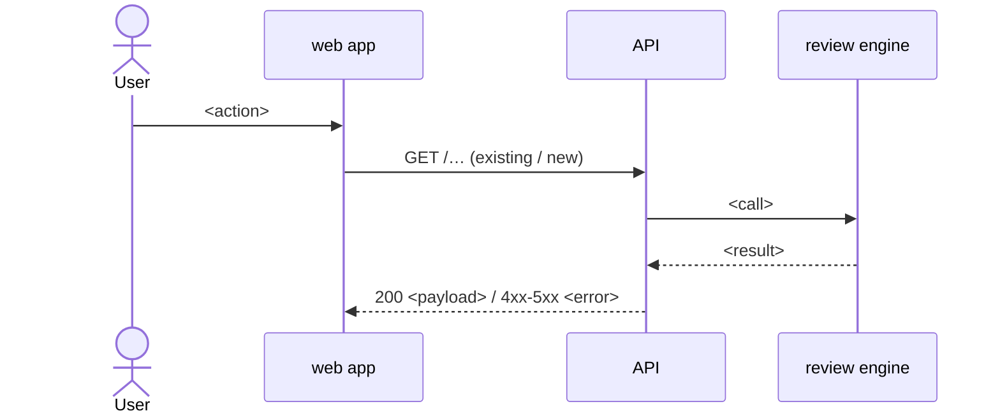

# Spec: <feature name>

> Template for the `spec-creator` agent. Copy to `<pkg>/specs/YYYY-MM-DD-<feature-slug>.md`
> (one module) or `specs/YYYY-MM-DD-<feature-slug>.md` (two or more modules) and fill
> every section; write "none" instead of deleting a section. A spec says **what** the
> system must do, never **how** — file layout, work units and waves belong to
> `implementation-planner`. Requirements follow the `ears-requirements` skill.

Spec ID: SPEC-NN
Status: draft | approved | implemented | superseded
Created: YYYY-MM-DD
Approved: <YYYY-MM-DD by user, or "none">
Modules: client · server · reviewer-core · mcp (only the touched ones)
Supersedes: <relative link to the spec this one replaces, or "none">
Superseded by: <relative link — filled only when Status is superseded, else "none">

## Problem and user
Who has the problem, what they are trying to do, and why today's behaviour is not
enough (with `path:line` evidence for "today").

## Goals / Non-goals
**Goals** — each with a success measure.
| ID | Goal | Success measure |
|---|---|---|
| G-1 | <observable outcome> | <how we know: a number, a state, a removed step> |

**Non-goals**
- <explicitly out of scope, so nobody builds it>

## User stories
- **US-1** — As a <role>, I want <capability>, so that <benefit>.

## Acceptance criteria (EARS)
One requirement per row, one EARS pattern per requirement, `shall` in every row.
Subjects: the web app · the API · the review engine · the MCP server · DevDigest.
**Priority** — Must / Should / Could. **Verify by** — unit · integration
(`*.it.test.ts`) · e2e flow · manual · inspection, plus the test shape in a few words.

| ID | Pattern | Requirement | Story | Priority | Verify by |
|---|---|---|---|---|---|
| AC-1 | Ubiquitous | The <system> shall <response>. | US-1 | Must | unit — invariant over … |
| AC-2 | Event-driven | WHEN <trigger>, the <system> shall <response>. | US-1 | Must | e2e — click … → assert … |
| AC-3 | State-driven | WHILE <state>, the <system> shall <response>. | US-1 | Should | unit — enter/leave state |
| AC-4 | Unwanted behaviour | IF <unwanted condition>, THEN the <system> shall <response>. | US-1 | Must | integration — stubbed failure |
| AC-5 | Optional feature | WHERE <feature is enabled>, the <system> shall <response>. | US-1 | Could | unit — on and off |

## Edge cases
| ID | Case | Expected behaviour (EARS, or "→ AC-n") | Verify by |
|---|---|---|---|
| EC-1 | empty / loading / error / partial data / long text / no permission / concurrent change … | IF …, THEN the <system> shall … | … |

## Module interactions
Who calls whom for this feature, over which contract, and what happens when the
other side fails. "none" for a feature that stays inside one module.

| From → To | Contract (endpoint / function / tool / table) | Data | Source of truth | On failure / timeout / stale data |
|---|---|---|---|---|
| web app → API | `GET /…` (existing `path:line` or "new") | … | … | … |

## Data and state
Entities and fields that appear or change (as behaviour, not table design), who
owns them, what happens to existing data (defaults for old rows, backfill or
"shown as unknown"), retention and deletion. "none" if the feature is stateless.

## Compatibility and rollout
Backwards compatibility of HTTP routes, MCP tools and vendored `shared`
contracts; behaviour for old clients/data; feature flag or setting (→ WHERE
requirement); what stays unchanged for users who do not use the feature.

## Design review
**Sources analysed** — every design input with its provenance (text brief, Figma
link + exported frame path, existing screen `path:line`, external repository URL,
researcher reports).

**Gaps found**
| ID | Lens | Gap | Resolution (→ AC-n / EC-n / NFR-n / Q-n) |
|---|---|---|---|
| F-1 | Gap / Corner case / Module interaction / Conflict | … | … |

**UX improvements**
| # | Proposal | Decision (accepted → AC-n · rejected — reason · open → Q-n) |
|---|---|---|
| UX-1 | … | … |

## Non-functional requirements
Each measurable, with units and the measurement condition, EARS-phrased.

| ID | Category | Requirement | Verify by |
|---|---|---|---|
| NFR-1 | Performance · Cost (LLM calls/tokens) · Determinism · A11y · I18n · Observability · Security · Reliability | WHEN …, the <system> shall … within … on … | e.g. timed e2e on seeded data · unit counting LLM calls · axe check |

## Inputs and provenance
| Input | Source | Trust |
|---|---|---|
| <data the feature reads> | GitHub API · LLM output · user form · DB · design file · … | trusted / untrusted |

## Untrusted inputs
For every untrusted input above, one EARS rule per threat (prompt injection,
HTML/Markdown rendering, path escape, SSRF, oversized payload, secret leakage):

| ID | Input | Threat | Requirement | Verify by |
|---|---|---|---|---|
| UT-1 | PR body | prompt injection | IF …, THEN the <system> shall … | unit — hostile fixture |

## Assumptions and dependencies
What this spec takes as given (existing features, tokens/secrets configured,
external API limits) and what it depends on (other specs `SPEC-NN`, open PRs).
An assumption that turns out false reopens the spec.

## Traceability
Every story → criteria; every finding, accepted UX proposal and answered question
→ the requirement that resolves it. No orphan rows in either direction.

| Source (US / F / UX / answered question) | Requirements |
|---|---|
| US-1 | AC-1, AC-2, EC-1, NFR-1 |
| F-1 | EC-1 |

## Open questions
- **Q-1** — <question> · default if unanswered: <option> · owner: <user / module>

## Revision history
| Date | Change | By |
|---|---|---|
| YYYY-MM-DD | created (draft) | spec-creator |

## Self-check
- [ ] every AC / EC / NFR / UT rule: one EARS pattern, one `shall`, observable response, no vague words
- [ ] no requirement names implementation (new files, components, libraries, SQL)
- [ ] every requirement has Priority (ACs) and a concrete Verify by
- [ ] every user story has ≥ 1 AC; every AC names its story
- [ ] every finding F-n and UX proposal is resolved (requirement / rejected / Q-n)
- [ ] Module interactions: every hop has a contract, a source of truth and failure behaviour (or "none")
- [ ] every untrusted input has ≥ 1 IF … THEN rule
- [ ] Traceability has no orphans in either direction
- [ ] SPEC-NN unique across all spec folders; index line added; Status matches the user's decision
